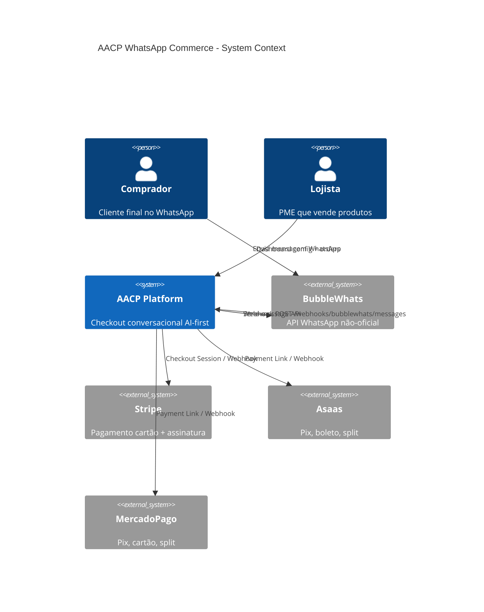
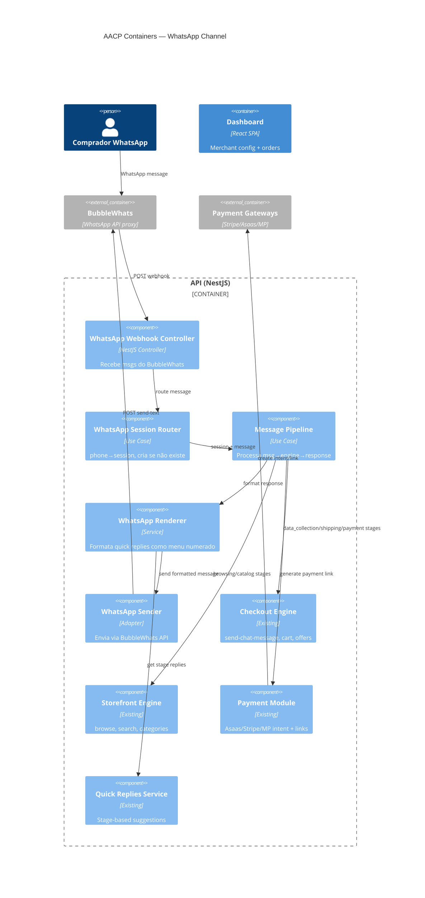
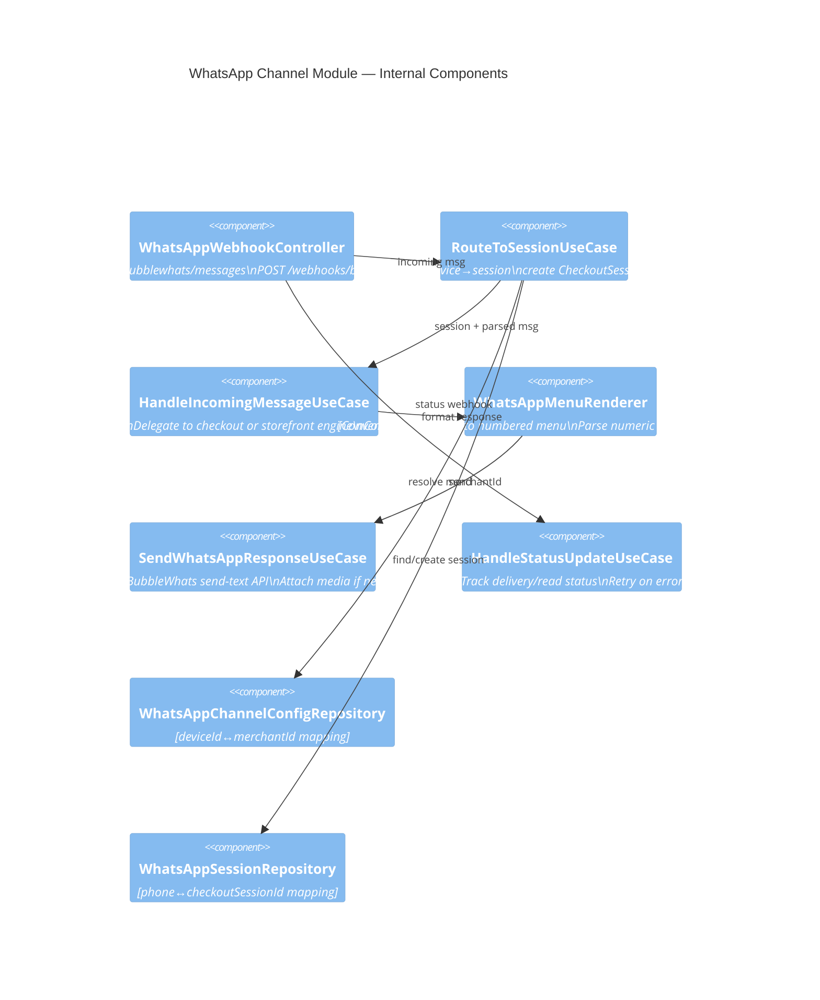

# WhatsApp Commerce — Architecture Design (C4 + Event Storming)

**Created:** 2026-08-21
**Decisions:** Q1=A (chat collection), Q2=B (numbered menus), Q3=A (external links), Quick replies as numbered options

---

## Decisões Registradas

| # | Decisão | Rationale |
|---|---------|-----------|
| D1 | Coleta de dados (nome, email, CPF) por chat | Phone já vem do WhatsApp. Asaas precisa name+email+cpf. Birthday default "2000-01-01" |
| D2 | Categorias → produtos numerados (1-10), "1" carrega mais, "0" volta | Determinístico, funciona em feature phone |
| D3 | Produto selecionado → "[1] Adicionar ao carrinho" → confirmação → "[1] Finalizar [2] Continuar" | Ação com consequência sempre confirma por número |
| D4 | Pagamento sempre link externo (Stripe, Asaas, MercadoPago) | Buyer abre link no browser, paga, webhook confirma |
| D5 | Quick replies do banco = opções numeradas em cada renderização | `StoreQuickRepliesConfig.stages[].replies[]` → cada reply vira `[N] texto` |
| D6 | Asaas customerId criado no momento do payment (já existe no code: `create-payment-intent.use-case.ts:206`) | Usa name+email+cpf coletados por chat |
| D7 | Fee de plataforma cobrado via split (Asaas split ou Stripe application_fee) | Você (app owner) recebe fee em todo pedido |

---

## C4 — Context Diagram



---

## C4 — Container Diagram



---

## C4 — Component Diagram (WhatsApp Channel Module)



---

## Event Storming — WhatsApp Commerce Flow

### Commands (ações que o buyer dispara)

```
┌─────────────────────────────────────────────────────────────┐
│ BUYER ENVIA MENSAGEM NO WHATSAPP                            │
├─────────────────────────────────────────────────────────────┤
│ [Command] SendWhatsAppMessage                                │
│   trigger: BubbleWhats webhook                               │
│   data: fromNumber, body, messageType, deviceID              │
└─────────────────────────────────────────────────────────────┘
```

### Domain Events (o que acontece)

```
Timeline →
────────────────────────────────────────────────────────────────────────

1. WhatsAppMessageReceived
   │  payload: { fromNumber, toNumber, body, messageType, deviceID, timestamp }
   │
   ├─ [Policy] RouteToSession
   │    IF session exists → use it
   │    IF not → CreateNewCheckoutSession
   │
   ▼
2. WhatsAppSessionStarted  (if new)
   │  payload: { sessionId, merchantId, buyerPhone, deviceId }
   │
   ▼
3. BuyerMessageProcessed
   │  payload: { sessionId, inputText, detectedIntent, stage }
   │
   ├─ [Policy] DetermineStage
   │    IF stage=browsing → use storefront engine
   │    IF stage=data_collection → deterministic extraction
   │    IF stage=shipping/payment → checkout engine
   │
   ├─ [Policy] NumberedInputResolver
   │    IF input is "1"-"10" → resolve to quick_reply text at that index
   │    IF input is "0" → go back (previous menu)
   │    IF input is free text → pass to LLM
   │
   ▼
4. AgentResponseGenerated
   │  payload: { sessionId, responseText, quickReplies[], stage, toolsUsed[] }
   │
   ├─ [Policy] FormatForWhatsApp
   │    Convert quickReplies to numbered menu:
   │    "[1] Ver Produtos\n[2] Categorias\n[3] Meu Carrinho\n..."
   │
   ▼
5. WhatsAppMessageSent
   │  payload: { toNumber, body, messageId }
   │
   ▼
6. (optional) WhatsAppMessageDelivered / WhatsAppMessageRead
      payload: { messageId, status: DELIVERY-ACK|READ }
```

---

### Event Storming — Cart + Checkout Flow (WhatsApp-specific)

```
────────────────────────────────────────────────────────────────────────
BROWSING STAGE
────────────────────────────────────────────────────────────────────────

Buyer: "1" (Ver Produtos)
  → NumberedInputResolver maps "1" → "Ver Produtos"
  → StorefrontEngine.search_products()
  → Response: lista de categorias numeradas

Buyer: "2" (seleciona categoria "Pizzas")
  → NumberedInputResolver maps "2" → categoria selecionada
  → StorefrontEngine.list_category_products(categoryId)
  → WhatsAppMenuRenderer:
      "🍕 *Pizzas*
       1. Calabresa - R$45,00
       2. Margherita - R$42,00
       3. Frango c/ Catupiry - R$48,00

       [1] Carregar mais  [0] Voltar"

Buyer: "2" (seleciona Margherita)
  → NumberedInputResolver maps "2" → product "Margherita"
  → Response:
      "🍕 *Pizza Margherita* — R$42,00
       Molho de tomate, mussarela, manjericão

       [1] Adicionar ao carrinho
       [2] Ver detalhes
       [0] Voltar"

────────────────────────────────────────────────────────────────────────
CART STAGE
────────────────────────────────────────────────────────────────────────

Buyer: "1" (Adicionar ao carrinho)
  → Event: checkout.cart.updated
  → Response:
      "✅ *Margherita* adicionada!
       Seu carrinho: 1 item — R$42,00

       [1] Finalizar pedido
       [2] Continuar comprando"

────────────────────────────────────────────────────────────────────────
DATA COLLECTION STAGE
────────────────────────────────────────────────────────────────────────

Buyer: "1" (Finalizar pedido)
  → Stage transitions to data_collection
  → Phone already known (fromNumber) ✓
  → Response: "Para finalizar, preciso de alguns dados:
               Qual seu *nome completo*?"

Buyer: "João da Silva"
  → customer-extraction.service extracts fullName ✓
  → Response: "E seu *email*?"

Buyer: "joao@email.com"
  → Extracted + stored ✓
  → Response: "E o *CPF*?"

Buyer: "123.456.789-00"
  → Validated + stored ✓
  → All identity fields complete → advance to shipping

────────────────────────────────────────────────────────────────────────
SHIPPING STAGE
────────────────────────────────────────────────────────────────────────

  → Response: "Qual o *CEP* para entrega?"

Buyer: "01310-100"
  → check_shipping(cep) → carriers returned
  → WhatsAppMenuRenderer:
      "📦 Opções de envio:
       1. Correios PAC (5 dias) — R$15,90
       2. Correios SEDEX (2 dias) — R$28,50
       3. Retirar na loja — Grátis"

Buyer: "1"
  → Shipping selected ✓ → advance to payment

────────────────────────────────────────────────────────────────────────
PAYMENT STAGE
────────────────────────────────────────────────────────────────────────

  → Response:
      "💳 *Resumo do pedido:*
       • Pizza Margherita — R$42,00
       • Envio PAC — R$15,90
       • *Total: R$57,90*

       Como deseja pagar?
       [1] Pix
       [2] Cartão de crédito
       [3] Boleto"

Buyer: "1" (Pix)
  → CreatePaymentIntentUseCase executes
  → Asaas createCustomer (name+email+cpf) → asaasCustomerId stored
  → Generate payment link
  → Response:
      "✅ Pagamento Pix gerado!
       Clique para pagar: https://asaas.com/pay/xyz123
       ⏱️ Link válido por 30 minutos.

       Após pagar, envio a confirmação aqui!"

────────────────────────────────────────────────────────────────────────
COMPLETED
────────────────────────────────────────────────────────────────────────

  [Webhook: payment confirmed]
  → Event: order.completed
  → WhatsApp message sent:
      "🎉 *Pagamento confirmado!*
       Pedido #12345 — R$57,90
       Previsão de entrega: 5 dias úteis
       Código de rastreio será enviado aqui.

       Obrigado, João! 💚"
```

---

## Quick Replies → Numbered Options (Mapping Engine)

### Como funciona

```typescript
// WhatsAppMenuRenderer transforms quick replies into numbered text

interface WhatsAppMenuState {
  sessionId: string;
  currentOptions: string[];   // The quick replies active right now
  previousOptions: string[];  // For "0 = voltar"
  page: number;              // For pagination (products listing)
}

function renderMenu(replies: string[], context?: { title?: string }): string {
  const lines = replies.map((r, i) => `[${i + 1}] ${r}`);
  if (context?.title) return `*${context.title}*\n\n${lines.join("\n")}`;
  return lines.join("\n");
}

function resolveNumberedInput(
  input: string,
  state: WhatsAppMenuState
): { resolved: string; action: "select" | "back" | "more" | "freetext" } {
  const num = parseInt(input.trim(), 10);

  if (input.trim() === "0") {
    return { resolved: state.previousOptions[0] ?? "Voltar", action: "back" };
  }

  if (num === 1 && state.page > 0 && /* in product list context */) {
    return { resolved: "__LOAD_MORE__", action: "more" };
  }

  if (num >= 1 && num <= state.currentOptions.length) {
    return { resolved: state.currentOptions[num - 1], action: "select" };
  }

  // Not a number → free text → pass to LLM
  return { resolved: input, action: "freetext" };
}
```

### Regra

| Input | Ação |
|-------|------|
| `"0"` | Voltar ao menu anterior |
| `"1"` em lista de produtos | Carregar mais (se paginado) |
| `"1"-"10"` em menu | Seleciona opção correspondente |
| `"1"` após adicionar | "Finalizar pedido" |
| `"2"` após adicionar | "Continuar comprando" |
| Texto livre | Passa para LLM (NLU) |

### Quick Replies do Banco → Opções Numeradas

Cada renderização de resposta do agent:
1. Engine gera `quickReplies[]` via `storefrontQuickReplies()` ou checkout equivalente
2. `WhatsAppMenuRenderer` converte cada item em `[N] texto`
3. Estado salvo no `WhatsAppSession.currentOptions`
4. Próxima mensagem do buyer: se é número → resolve para texto da opção → injeta como se buyer tivesse digitado aquele texto

---

## Asaas Customer Creation — Validação

**Já implementado** em `create-payment-intent.use-case.ts:196-221`:

```typescript
// Se não tem asaasCustomerId e precisa Asaas:
asaasCustomer = await this.provider.createCustomer({
  merchantId,
  name: customer.fullName,
  email: customer.email,
  cpfCnpj: customer.cpf,
  phone: customer.phone ?? undefined
});
// Salva no session
session.customer.asaasCustomerId = asaasCustomer;
```

**No WhatsApp:**
- `fullName` → coletado por chat (D1)
- `email` → coletado por chat (D1)
- `cpf` → coletado por chat (D1)
- `phone` → já temos (fromNumber)
- `birthday` → default "2000-01-01" (não perguntar)

O Asaas customer é criado automaticamente no momento do pagamento. Nenhuma mudança necessária.

---

## Fee Collection — Split Payment

**Para garantir que você (app owner) recebe fee de todo pedido:**

| Gateway | Mecanismo | Config |
|---------|-----------|--------|
| **Asaas** | Split payment com `walletId` | Merchant split como receiver, você como `fixedValue` ou `percentualValue` |
| **Stripe** | `application_fee_amount` no PaymentIntent | Stripe Connect — merchant é Connected Account, você é Platform |
| **MercadoPago** | `marketplace_fee` | Similar ao Stripe Connect |

**Verificar no código:** `create-payment-intent.use-case.ts` precisa incluir fee split. Se não existe, é task de implementação.

---

## Data Model Additions

```prisma
model WhatsAppChannelConfig {
  id            String   @id @default(uuid())
  merchantId    String   @unique
  enabled       Boolean  @default(false)
  deviceId      String
  phoneNumber   String
  webhookSecret String   // Per-merchant webhook auth
  createdAt     DateTime @default(now())
  updatedAt     DateTime @updatedAt
  merchant      Merchant @relation(fields: [merchantId], references: [id])
}

model WhatsAppSession {
  id                String   @id @default(uuid())
  merchantId        String
  buyerPhone        String
  buyerAlias        String?
  checkoutSessionId String
  deviceId          String
  currentOptions    Json     @default("[]")  // Active numbered menu
  previousOptions   Json     @default("[]")  // For "0=voltar"
  currentPage       Int      @default(0)     // Product list pagination
  lastActivityAt    DateTime @default(now())
  status            String   @default("active") // active|expired|handoff
  createdAt         DateTime @default(now())

  @@unique([merchantId, buyerPhone])
  @@index([merchantId, status])
  @@index([lastActivityAt])
}
```

---

## Differences: Widget vs WhatsApp

| Aspecto | Widget/Storefront | WhatsApp |
|---------|-------------------|----------|
| **Input** | Click button, form field, free text | Free text OR numbered option |
| **Output** | Rich components, cards, images | Plain text + numbered menu + link |
| **Quick Replies** | Rendered as clickable chips | Rendered as `[1] text\n[2] text\n...` |
| **Cart view** | Visual list with +/- buttons | Text summary with totals |
| **Payment** | Inline (Stripe Elements, Pix QR) | External link |
| **Identity** | Form fields | Chat questions (sequential) |
| **Session** | Browser cookie/token | Phone number persistence |
| **Media** | Inline images, cards | Send as separate message (image URL) |
| **Timeout** | No expiry (token refresh) | 24h inactivity expiry |

---

## What Changes in Existing Code

| Layer | Change | Risk |
|-------|--------|------|
| **Conversation Engine** | None — receives text, returns text | Zero |
| **Quick Replies Service** | None — already returns `string[]` | Zero |
| **send-chat-message** | None — channel-agnostic | Zero |
| **Cart/Offers/Payment** | None — session-based | Zero |
| **New: WhatsApp Channel module** | New bounded context (webhook+router+renderer) | Isolated |
| **New: WhatsApp Session repo** | New Prisma model | Additive |
| **New: Numbered Menu Renderer** | Converts replies→numbered text, resolves numbers→text | New code |
| **New: Dashboard config page** | WhatsApp channel toggle + device config | UI only |

**Total impact on existing code: ZERO.** Everything new is additive (new module).

---

## Implementation Priority

| Phase | Scope | What |
|-------|-------|------|
| **P0** | Webhook + Router | Receive message, create/find session, pass to engine |
| **P1** | Menu Renderer + Sender | Format responses, send back via BubbleWhats |
| **P2** | Payment links | Generate external links, send in chat |
| **P3** | Dashboard config | Merchant configures WhatsApp channel |
| **P4** | Status tracking | Read receipts, delivery confirmation |

---

## Open Questions for Review

1. **Rate limiting:** 1 response/second é suficiente? Ou batch com 3s window?
2. **Multi-device:** Se merchant tem 2 números WhatsApp (vendas + suporte), suportamos?
3. **Group messages:** Ignorar 100% ou permitir opt-in para merchant groups?
4. **Audio:** Phase 2 com Whisper transcription, ou descarta por agora?
5. **Template messages:** Para cart recovery proativo (merchant→buyer), precisamos template aprovado pelo Meta/WhatsApp?
