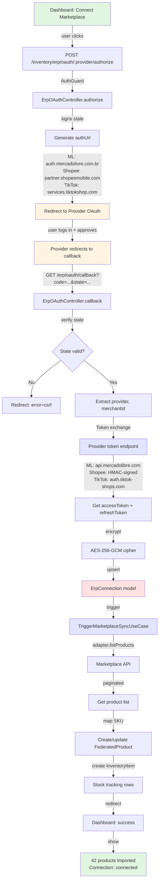

```mermaid
graph TD
    A["Dashboard: Connect Marketplace"] -->|user clicks| B["POST /inventory/erp/oauth/:provider/authorize"]
    B -->|AuthGuard| C["ErpOAuthController.authorize"]
    C -->|signs state| D["Generate authUrl"]
    D -->|ML: auth.mercadolivre.com.br<br/>Shopee: partner.shopeemobile.com<br/>TikTok: services.tiktokshop.com| E["Redirect to Provider OAuth"]
    E -->|user logs in + approves| F["Provider redirects to callback"]
    F -->|GET /erp/oauth/callback?code=...&state=...| G["ErpOAuthController.callback"]
    G -->|verify state| H{State valid?}
    H -->|No| I["Redirect: error=csrf"]
    H -->|Yes| J["Extract provider, merchantId"]
    J -->|Token exchange| K["Provider token endpoint"]
    K -->|ML: api.mercadolibre.com<br/>Shopee: HMAC-signed<br/>TikTok: auth.tiktok-shops.com| L["Get accessToken + refreshToken"]
    L -->|encrypt| M["AES-256-GCM cipher"]
    M -->|upsert| N["ErpConnection model"]
    N -->|trigger| O["TriggerMarketplaceSyncUseCase"]
    O -->|adapter.listProducts| P["Marketplace API"]
    P -->|paginated| Q["Get product list"]
    Q -->|map SKU| R["Create/update FederatedProduct"]
    R -->|create InventoryItem| S["Stock tracking rows"]
    S -->|redirect| T["Dashboard: success"]
    T -->|show| U["42 products imported<br/>Connection: connected"]

    style A fill:#e1f5e1
    style E fill:#fff4e1
    style F fill:#fff4e1
    style K fill:#e1e5ff
    style N fill:#ffe1e1
    style O fill:#e1e5ff
    style U fill:#e1f5e1
```
