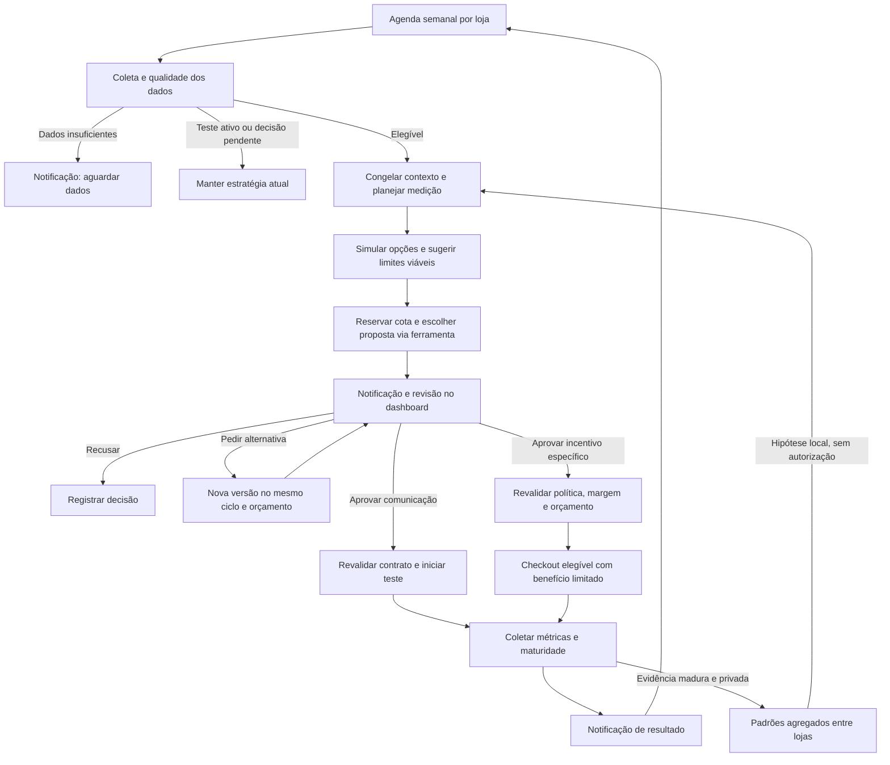

# Revenue Intelligence: arquitetura e operação

Referência do código atualizada em 05/10/2026. Abrange Revenue Manager, experimentos de comunicação, incentivos, integração com checkout, Revenue Lift e aprendizado entre lojas.

Este documento descreve a implementação. A revisão implantada, as flags efetivas e a verificação pública de produção devem ser registradas na seção de publicação abaixo. Um teste local, uma migration aplicada ou um build concluído não comprovam sozinhos o funcionamento em produção.

### Exibição dos benefícios no checkout e no hub

O checkout apresenta o valor realmente concedido pela autoridade financeira. Um percentual e um teto são condições combinadas: 40% com teto de R$15 gera R$8 em produtos de R$20, desde que o percentual e a margem sejam permitidos pela loja. A Athom mantém seu limite de 10%; o exemplo não altera sua configuração. Descontos fixos não são descritos como uma oferta percentual. Etapas progressivas mostram somente a etapa já concedida, com seu valor e teto atuais.

`GET /v1/buyer/me/benefits?merchant_id=...` requer autenticação do comprador. Um token vinculado à loja não pode selecionar outra loja; um login global pode selecionar explicitamente uma loja, mas o servidor exige consentimento, sessão e concessão pertencentes a esse comprador e tenant. Sem tenant explícito, nenhuma oferta personalizada é inferida. A resposta usa `Cache-Control: private, no-store`.

`readBuyerIncentiveBenefits` usa uma transação PostgreSQL somente leitura e uma visão consistente dos registros existentes. Não admite compradores em experimentos, não altera carrinhos e não cria reservas. Confere execução vigente, aprovação e versão congeladas, política, orçamento, reserva, grupo de tratamento, consentimento, catálogo e custos atuais, condições de frete e ausência de pagamento ou outro benefício. Falta de validade produz uma lista vazia; falha de infraestrutura é um erro de leitura. A exibição nunca substitui a revalidação do checkout e pagamento.

O hub separa “Cupons da loja” de “Oferta para este pedido”, esta última exibida apenas quando há concessão válida. Reabrir o hub atualiza os benefícios; expiração remove a oferta, e respostas antigas são descartadas ao trocar comprador ou loja. Não há promessa de benefício futuro no estado vazio. O cupom de uma estratégia não é incluído nos cupons públicos, em `list_promotions` ou no contexto de geração de nudges gerais. A listagem administrativa do merchant continua apresentando esses cupons. O nudge comercial é exibido no checkout; o carrinho anterior à criação dessa sessão não recebe uma oferta inferida.

A apresentação de Fidelidade prioriza benefício, condições, código e validade. O catálogo público recebe `storeSlug`; APIs privadas recebem `merchantId`. Progresso numérico usa somente um snapshot de carrinho recebido do servidor para o merchant atual, sem erro ou atualização em andamento. `nextNudge` preserva a mensagem determinística do motor e distingue valores em reais de quantidade de itens. Para cupons comuns e mínimo de frete, a interface compara o subtotal dos produtos confirmado com a condição publicada, sem anunciar aplicação automática. Ausência de snapshot apresenta somente a condição mínima; atingir esse mínimo não dispensa as demais condições do checkout. O resumo de compras é secundário e não produz níveis, pontos ou saldo inferidos.

`BuyerBenefits.conditions` descreve regras avançadas habilitadas da loja mesmo quando suas condições ainda não foram atingidas. Essa projeção preserva consentimento e isolamento por comprador/merchant e compartilha a leitura de regras com `available`, cuja qualificação permanece existente. Não cria elegibilidade, concessão ou progresso de carrinho: mostra condições legíveis, percentuais e tetos válidos, sem revelar códigos de cupons. O Hub apresenta esses termos em “Condições das ofertas”, separado dos benefícios já aplicados. Faixas progressivas por valor podem ser configuradas como regras avançadas com prioridades; o checkout continua usando a primeira regra compatível, sem somar descontos automaticamente. Isso é distinto das duas etapas de um incentivo progressivo aprovado, acionadas pela matrícula e pela preparação de pagamento.

O histórico de compras mantém todos os itens e acrescenta uma projeção explícita de rastreamento: `has_tracking` e `tracking_items`. A API confirma o tipo de produto pelo snapshot da compra ou, para registros antigos, pelo catálogo da mesma loja; classificação desconhecida não autoriza rastreio. Produtos digitais, serviços, retirada e códigos `pending:`/UUID não produzem dados de rastreamento. Em pedidos mistos, `items` continua completo para Pedidos e `tracking_items` contém somente os itens físicos da entrega. A storefront solicita todas as páginas com `merchant_id`, descarta respostas após troca de loja/comprador e apresenta loading, falha com nova tentativa e ausência de entregas como estados distintos. Essa consulta não cria envios nem consulta provedores de transporte.

A entrega do Hub foi promovida em `29ebd92` após o ensaio autenticado de sandbox e confirmada por fontes/compilados e prontidão da API, revisão Git da storefront e artefatos no domínio público da Athom em celular/desktop. Os exemplos de regras para revisão visual permanecem na loja sintética de sandbox; a publicação de código não transporta essas configurações para produção. O [registro do Buyer Hub](../product/revenue-buyer-hub-sandbox-2026-10-05.md) distingue ensaios financeiros/autenticados de sandbox, projeção de condições e inspeção pública de produção.

## 1. Objetivo e experiência do merchant

O motor transforma dados medidos da loja em uma proposta que o merchant consegue entender e decidir. A IA apresenta o motivo, a mudança sugerida, o público, os limites e a forma de medir. O merchant aprova, recusa ou pede outra proposta; ele não precisa escrever prompts nem configurar um experimento técnico.

O fluxo também produz resultados válidos sem uma proposta nova: aguardar mais dados, manter um teste em andamento ou esperar disponibilidade do orçamento. Não há obrigação de gerar uma estratégia por loja toda semana, nem promessa de aumento de vendas.

As regras comerciais continuam sendo a autoridade sobre preço, desconto, margem e entrega. O motor não altera essas regras por inferência da LLM. O planejador escolhe um tipo de teste por proposta, com uma decisão correspondente no painel: comunicação ou incentivo. Cada caminho conserva seu registro e validação de aprovação. Um teste comercial usa a conversa existente para explicar o benefício confirmado; não executa simultaneamente um segundo experimento de comunicação.



## 2. Cadência, distribuição e persistência

`WeeklyAnalysisService` mantém uma agenda por merchant em `revenue_analysis_schedules`. Para entrar, a loja precisa estar na lista permitida, ter um plano com Revenue Manager e `autonomousEngineEnabled=true`. O plano vem do catálogo de planos e do faturamento efetivo da loja.

- A inscrição inicial usa um hash do merchant para distribuir as lojas em sete grupos de dia da semana.
- A agenda usa fuso IANA; o padrão é `America/Sao_Paulo`. A janela de trabalho é das **03h às 06h no fuso da agenda**.
- A fila BullMQ `revenue-weekly-analysis` consulta pendências a cada 15 minutos e tem concorrência de worker igual a 2. Redis é necessário para esse caminho durável.
- Cada análise observa os sete dias anteriores ao instante `asOf`, congelado na primeira execução. Repetir o processamento não muda silenciosamente a janela de dados.
- Após uma conclusão, a próxima análise fica para a primeira madrugada a partir de sete dias depois. Atrasos por capacidade podem deslocar o dia; não há recuperação por uma rajada de análises duplicadas.
- Um teto global de primeiras execuções por dia UTC impede iniciar todas as lojas de uma vez. Pendências antigas têm prioridade na recuperação.
- Locks no PostgreSQL, uma execução corrente por agenda, lease de dez minutos e um token crescente impedem que workers concorrentes publiquem o mesmo ciclo. Falhas transitórias têm até três tentativas; adiamentos por configuração ou orçamento preservam a pendência.
- Um pedido manual respeita agenda, janela, elegibilidade e limites. Ele não compra uma análise adicional fora do ciclo.

O ciclo termina como `recommendations`, `keep_current` ou `insufficient_data`. O processamento usa `queued`, `running`, `retry_wait`, `deferred_budget`, `completed` e `failed`. A notificação `analysis:<runId>` é atualizada conforme o estado, evitando criar uma notificação nova a cada poll.

Uma falha terminal preserva o ciclo como `failed`, suas tentativas, custos e histórico, e agenda a próxima análise para a semana seguinte. O ciclo falhado não é reaberto nem tem seus contadores zerados. A loja pode iniciar outro ciclo quando voltar a ser elegível; falhas antigas com agenda atrasada também respeitam o intervalo semanal, evitando tanto bloqueio permanente quanto repetição imediata a cada poll.

A permissão da loja (`autonomousEngineEnabled`) e a disponibilidade de geração da plataforma são controles distintos. `analysis-status.generation_enabled` informa o segundo: uma loja pode permitir sugestões enquanto a geração está pausada pela Zyon. O dashboard exibe a pausa no resumo, sem prometer uma proposta na fila. Atualizações de agendamento, espera ou falta de dados explicam que não há uma nova proposta para aprovar. Repetir o mesmo estado e motivo preserva a leitura da notificação; uma mudança de resultado, motivo ou proposta volta a sinalizá-la como não lida.

O job diário legado permanece no repositório para lojas não migradas. A existência de uma agenda semanal impede a loja de voltar ao caminho diário mesmo após desligar a flag semanal. Não apagar agendas como forma de rollback.

Fontes: [política de agenda](../../apps/api/src/modules/revenue-manager/domain/weekly-analysis-policy.ts), [serviço semanal](../../apps/api/src/modules/revenue-manager/infrastructure/weekly-analysis.service.ts), [job semanal](../../apps/api/src/modules/revenue-manager/infrastructure/jobs/weekly-analysis.job.ts).

## 3. Qualidade dos dados e contexto da proposta

`ObserveMetricsUseCase` agrega sessões de checkout, eventos e pedidos aprovados em uma leitura consistente. Conta cada sessão uma vez antes de calcular taxas, respeita merchant e janela temporal e separa conversões provisórias das sessões que já completaram sua janela de conversão. A observação semanal usa, por padrão, maturidade de 24 horas.

Uma observação precisa de pelo menos 30 sessões maduras, eventos de checkout, registro de início do checkout e ausência de mistura de moedas nos pedidos observados. Isso permite analisar o funil, mas **não significa que a amostra já sustente um teste A/B**. O planejamento do experimento aplica requisitos adicionais de baseline, tráfego, tamanho de amostra e duração.

Antes de chamar a LLM, o servidor captura os artefatos aplicáveis: observação, regras comerciais, contrato do checkout, planejamento de medição, estudo de desconto, política financeira e aprendizado agregado. Os artefatos têm identidade, versão ou hash; revisões reutilizam o contexto congelado do ciclo. O planejador apresenta o resultado como **a medir**, sem inventar uma previsão percentual. Estimativas de lift nas propostas legadas continuam identificadas como estimativas não medidas.

Os seis campos narrativos do planejador exigem texto qualitativo, sem números, valores monetários ou percentuais. A mesma validação se aplica ao reaproveitamento de respostas em cache. Desconto, orçamento, quantidade e demais valores exatos vêm dos dados estruturados calculados pelo servidor, sem depender da interpretação textual da LLM. Uma proibição explícita e restrita, como “Não prometa frete grátis”, é aceita; promessas afirmativas ou condicionais de concessão continuam bloqueadas pela validação comercial.

Se o checkout, o modelo, as regras ou outro componente relevante do contrato mudou, a aprovação não reaproveita silenciosamente uma proposta antiga. Os bloqueios de ativação indicam a necessidade de nova análise ou de completar a configuração.

Fontes: [observação](../../apps/api/src/modules/revenue-manager/application/use-cases/observe-metrics.use-case.ts), [proposta versionada](../../apps/api/src/modules/revenue-manager/domain/strategy-proposal.ts), [prontidão de ativação](../../apps/api/src/modules/revenue-manager/infrastructure/strategy-activation-readiness.ts).

## 4. Orçamento de IA

Há dois controles diferentes: quantidade de análises iniciadas e dinheiro/capacidade de chamadas de IA. O orçamento de IA cobre geração, revisões e chamadas experimentais do chat contabilizadas pelo motor. Ele não substitui limites de todos os outros recursos de IA da plataforma nem o limite da conta no provedor.

**O teto diário protege contra consumo excessivo das APIs LLM. Não é uma cobrança fixa por loja, não é uma cobrança diária ao merchant e não obriga consumir todo o valor.** O consumo variável surge das chamadas efetivamente despachadas, conforme tokens, modelo e tarifa vigente. Reservar capacidade antes de uma chamada é um controle interno; não é uma cobrança adicional. Este documento não define preço, provedor ativo ou repasse comercial ao merchant.

Por exemplo, se uma análise encontra dados insuficientes antes da geração, ela termina sem chamar a LLM. Consultar o dashboard, coletar uma métrica ou verificar a margem também não gera uma chamada à LLM por essa operação. Essas atividades usam banco e infraestrutura normal, que continuam tendo custos operacionais próprios.

As reservas são admitidas antes da chamada ao provedor, em transação curta e serializada no PostgreSQL. Os tetos de geração e execução compartilham a visão `revenue_ai_budget_reservations`. A chamada externa acontece fora da transação.

| Controle | Comportamento |
| --- | --- |
| Dia, mês e ciclo | Tetos em inteiros de micros na moeda configurada; 1.000.000 micros = uma unidade dessa moeda. Os períodos contábeis são UTC. |
| Preço | Versão vigente em `ai_price_versions`, com origem `revenue-upper-bound-v1`, provider, modelo, moeda e tarifas máximas de entrada/saída. Sem tarifa válida, não despacha. |
| Tamanho e quantidade | Limites de contexto, saída, chamadas por ciclo e revisões por ciclo. Alternativas consomem o ciclo original. |
| Reserva para revisão | Uma fração da cota diária fica protegida para revisões; gerar uma alternativa não abre outro orçamento. |
| Capacidade | RPM, TPM e concorrência por provider/modelo; chamadas experimentais têm ainda limites por execução e sessão. |
| Resultado conhecido | Registra tokens e custo estimado pela tarifa versionada em `ai_usage_events`; não equivale à fatura conciliada do provedor. |
| Resultado desconhecido | Mantém a reserva financeira e a capacidade em aberto, inclusive entre períodos. Timeout não prova que a chamada não ocorreu. |
| Excesso observado | Bloqueia novas admissões até conciliação; não transforma o excesso em zero. |
| Retomada | Checkpoints reaproveitam uma resposta já persistida somente quando o contexto corresponde; nova tentativa não deve pagar novamente por um artefato já válido. |

Coleta de métricas, monitoramento, seleção de alternativas financeiras e agregação entre lojas são determinísticos. Eles não criam uma chamada extra à LLM por conta própria; a explicação textual de uma nova proposta pode usar a reserva de revisão.

Fontes: [orçamento de geração](../../apps/api/src/modules/revenue-manager/infrastructure/revenue-ai-budget.service.ts), [orçamento do chat experimental](../../apps/api/src/modules/revenue-manager/infrastructure/strategy-ai-budget.ts).

## 5. Aprovação, recusa e alternativas

O dashboard apresenta o ciclo e a proposta em Revenue Manager. Notificações abrem os detalhes da estratégia. O merchant vê a versão, o objetivo, a mudança de comunicação, a medição planejada e os bloqueios que impedem a ativação.

As decisões usam merchant autenticado, versão, hash da proposta e chave idempotente. O backend revalida tudo sob lock; abrir duas abas ou repetir uma requisição não deve ativar duas vezes. Uma proposta expirada ou uma versão anterior não pode ser aprovada no lugar da atual.

A proposta inicial e as versões de revisão são gravadas com `JSON.stringify` enviado como parâmetro textual e convertido por `::jsonb` no PostgreSQL. Isso preserva a representação numérica usada no hash dos artefatos congelados, evitando arredondamentos pelo transporte JSON do ORM. A gravação permanece na transação da aplicação, com os mesmos hashes, constraints e triggers SQL; não contorna a validação do catálogo. O contrato está em [strategy-version.writer.ts](../../apps/api/src/modules/revenue-manager/infrastructure/strategy-version.writer.ts).

Pedir uma alternativa enfileira uma revisão no mesmo ciclo, com os mesmos limites e dados congelados. O feedback orienta a redação e a hipótese; não autoriza a LLM a mudar preço, público ou orçamento. A nova proposta volta para revisão humana. Não há promoção automática de vencedor nem aplicação permanente por ter obtido um resultado positivo.

Para incentivos, a alternativa conservadora mantém público, duração e exposição do estudo original, reduz percentual e teto por comprador e recalcula o orçamento máximo. O servidor admite até três sequências conservadoras, além dos limites gerais de revisão; ele pode não encontrar uma alternativa segura. Uma versão nova exige consentimento comercial específico novo.

Fontes: [revisão de estratégias](../../apps/api/src/modules/revenue-manager/application/strategy-review.service.ts), [alternativa financeira](../../apps/api/src/modules/revenue-manager/domain/strategy-incentive-recommendation.ts), [interface de revisão](../../apps/dashboard/src/pages/revenue-manager/StrategyReviewPage.tsx).

## 6. Dois tipos de execução

### Comunicação no checkout

O teste de comunicação compara o contrato capturado do chat atual com um acréscimo de comunicação validado. Provider, modelo, configuração, versão de comportamento e referências relevantes ficam presos ao contrato aprovado. A atribuição entre controle e tratamento é persistida; grupos de holdout e testes concorrentes são protegidos.

O caminho separa admissão da mensagem, chamada de IA, conclusão, publicação e confirmação de exibição. O cliente usa identificadores estáveis em retries. Uma resposta gerada não é automaticamente uma resposta publicada; uma publicação não prova atenção do comprador. O relatório de exibição é autenticado e vinculado à publicação exata.

Na integração de release com o checkout atual, o contrato de roteamento é `checkout-payment-routing-v3-signed-visual`: mencionar Pix ou cartão na conversa encaminha o comprador para a escolha visual; não autoriza criar a cobrança por texto. O pagamento depende da ação explícita na interface, autenticada pela sessão assinada do comprador. O widget mantém as etapas controladas pelo servidor no protocolo durável de chat. A mudança de versão invalida a compatibilidade de propostas capturadas com o roteamento anterior; não é prova de publicação dessa release.

Recuperação usa recibos persistidos e prova do resultado. Um efeito externo desconhecido não permite reenviar automaticamente a IA ou o pagamento. Alterar flags não apaga as obrigações de uma sessão que já entrou nesse protocolo.

Este caminho implementa comunicação no checkout. A proposta não dispara automaticamente campanhas de e-mail/WhatsApp, alterações globais de preço ou frete grátis.

### Incentivo comercial protegido

O estudo semanal simula candidatos de desconto sobre dados históricos e custos configurados. A política financeira do merchant define habilitação, orçamento máximo, desconto máximo por comprador e quantidade máxima de usos. O servidor escolhe termos compatíveis com essa política e com a margem mínima; o estudo não reserva dinheiro nem demonstra causalidade.

Com `REVENUE_STRATEGY_PLANNER_ENABLED` e a loja permitida nas modalidades comerciais, o estudo `weekly-discount-study-v3` congela múltiplos candidatos. `revenue_analysis_runs.incentive_options_json` contém somente recomendações v4 com custo, margem, tráfego e amostra considerados viáveis. A ferramenta `submit_revenue_strategy` recebe os dados agregados e escolhe um ID desse catálogo, ou `communication_only`, junto com a justificativa. Ela não aceita valores financeiros livres, comandos de aprovação ou criação de cupom. A chamada continua usando a reserva de tokens, o teto do ciclo e o cache ligados ao contexto exato; não existe uma chamada adicional da LLM por cálculo ou validação de margem.

As preferências financeiras têm três modos: `automatic`, `manual` e `disabled`. Lojas sem política usam sugestões automáticas; uma configuração manual existente nunca é substituída por inferência. No automático, o orçamento sugerido cobre o maior desconto seguro multiplicado pela amostra necessária do grupo de tratamento, desde que o tráfego observado permita essa amostra. Os termos carregam `policyProposal` com versão/hash da política anterior. Só a aprovação comercial cria uma política durável `origin=automatic`, vinculada ao recibo humano por uma chave estrangeira e uma validação diferida no banco, na mesma transação de orçamento e execução. Uma proposta recusada não habilita verba. Manual mantém os tetos explícitos; disabled exclui opções financeiras.

A proposta contém `orchestration`, com ferramenta, hash do catálogo, opção e justificativa. API e banco exigem que o benefício exibido seja exatamente a opção escolhida. Pedir alternativa usa o mesmo catálogo congelado, consome a cota de revisão e publica uma nova versão, sem reaproveitar uma aprovação anterior. Cada proposta apresenta um único caminho de aprovação; versões antigas conservam seus contratos. O planejador não fabrica percentual de ganho previsto, e o painel informa que o resultado será medido.

Os incentivos incluem **desconto percentual com teto em reais, desconto de valor fixo, cupom personalizado e desconto no frete**, limitados a um público elegível. Têm teste de sete dias, alocação 50/50 e no máximo um benefício por comprador. Usam consentimento de memória de intenção válido, primeira sessão elegível do comprador e exclusão do holdout; não acumulam com outro cupom ou incentivo.

O formato v4 acrescenta `capped_progressive_discount`: uma etapa inicial na admissão elegível e uma etapa maior quando o backend prepara o pagamento. Percentuais e tetos de ambas ficam explícitos antes da aprovação. A atribuição do comprador e a reserva pelo desconto máximo permanecem únicas; concessões de etapa são registradas em `strategy_incentive_stage_grants`. Eventos enviados pelo browser não autorizam a progressão. O pagamento revalida o desconto concedido e liquida somente o valor efetivo, sem somar os dois patamares. Mudança do total exige confirmação atualizada do comprador. Nenhuma etapa reescreve as regras globais da loja.

O formato `weekly-incentive-recommendation-v3` conserva os termos aprovados e a evidência comercial do estudo `weekly-discount-study-v2`. O motor escolhe valor fixo quando o público sensível a preço tem carrinhos semelhantes; escolhe frete somente com cotações e custos conhecidos que sustentem a simulação. Os limites de frete, região, gratuidade e margem continuam sob a autoridade de `shipping-engine` e `rules-engine`. A cotação original da transportadora fica preservada; o benefício de frete é identificado e abatido uma única vez do total do pedido. Os formatos antigos v1/v2 permanecem legíveis e verificáveis.

Quando a proposta prevê cupom, sua aprovação cria o código e a execução na mesma transação. O cupom é aplicado automaticamente aos compradores elegíveis do grupo de tratamento e aparece no checkout. Digitar o código não cria uma nova atribuição, não duplica o desconto e não permite que compradores fora do público ou do grupo recebam o benefício. O cadastro de cupons mostra a origem na estratégia; edição, pausa e arquivamento pelo fluxo comum não podem alterar os termos aprovados. Interromper o benefício ocorre pela própria estratégia. Reservas, pagamentos e resultados usam o mesmo controle financeiro; o código não cria um segundo orçamento.

O plano de medição exige histórico completo e maduro, pelo menos 100 compradores de baseline e viabilidade de tráfego e orçamento para a amostra calculada. O baseline usa 28 dias encerrados sete dias antes da captura, permitindo maturidade. O limiar de planejamento é uma diferença absoluta de 1 ponto percentual, com confiança de 95% e poder planejado de 80%; isso não é previsão de ganho.

Aprovar o teste de comunicação não aprova o incentivo. A revisão do incentivo é específica à versão e aos termos recomendados, com aprovação, recusa e retirada. A ativação exige flags próprias, política válida, amostra viável, orçamento e ausência de experimento incompatível em andamento.

Na admissão ao checkout, o servidor consulta catálogo, preço, estoque/custos relevantes, consentimento, política, margem e orçamento atuais sob proteção transacional. A reserva é por sessão/comprador e não pode gastar além do limite por concorrência. A criação do pagamento revalida a autorização e o carrinho; a LLM não fornece o valor final a cobrar.

Pagamento aprovado com evidência compatível transforma a reserva em gasto. Reembolso fica registrado e não recompõe automaticamente o orçamento para oferecer um segundo benefício. Uma tentativa pendente ou desconhecida não é liberada por simples passagem do tempo.

Se o desconto expirar ou perder autorização antes do pagamento e não existir cobrança pendente, a API remove somente o benefício inválido e retorna `409 checkout_review_required`, com carrinho, frete, total do pedido, taxa de serviço, total a pagar e `confirmation_fingerprint`. Os widgets exibem o novo total e **somente um novo clique de confirmação** envia `confirmed_cart_fingerprint`. O fingerprint está ligado também à taxa e ao total. Se o total mudar de novo, exige nova revisão; não existe retry automático que cobre um preço maior. Se não houver revisão utilizável ou houver pagamento pendente, a interface não inventa um total autorizado.

Fontes: [execução do incentivo](../../apps/api/src/modules/revenue-manager/infrastructure/incentive-execution-ledger.ts), [planejamento financeiro](../../apps/api/src/modules/revenue-manager/domain/incentive-measurement.ts), [checkout widget](../../apps/widget_v2/src/store/checkout-store.ts), [checkout Pulse](../../apps/widget/src/features/pulse/viewmodels/CheckoutViewModel.ts).

## 7. Medição: o que os números significam

| Superfície | O que mede | Limitação que permanece explícita |
| --- | --- | --- |
| Observação semanal | Funil, conversão de sessões maduras, abandono observado, pedidos e receita. | Sinais ausentes não viram objeções inventadas; mínimo para análise não é mínimo para inferência. |
| Teste de comunicação | Conversão de pedido aprovado por sessão atribuída, controle/tratamento, amostra planejada e maturidade. | Avaliação de horizonte fixo; não escolher vencedor antecipadamente olhando resultados parciais. |
| Entrega da comunicação | Sessões atribuídas, turnos admitidos, publicados e com exibição reportada; falhas, supressões e pendências. | Exibição reportada pelo cliente não comprova leitura ou atenção. |
| Custos da estratégia | Custos de catálogo capturados no pedido, uso de IA registrado e taxas de pagamento confirmadas, com cobertura por grupo. | Cobertura incompleta produz valores indisponíveis/parciais; custo de catálogo não é contabilidade completa de lucro. |
| Teste de incentivo | Todos os compradores atribuídos, inclusive sem compra ou com oferta revogada; conversão madura, receita, descontos confirmados, reservas, gastos e reembolsos. | Mede desconto confirmado, não lucro incremental. Não filtra a amostra somente por quem recebeu ou usou desconto. |
| Revenue Lift | Receita por sessão e diferença estimada entre holdout e tratamento, com qualidade dos dados. | Exige ao menos 30 sessões por grupo e baseline de receita; atribuição é parcial. ROI, lift líquido e contribuição permanecem indisponíveis sem custos completos. |

O teste de comunicação registra o plano antes de executar: duração de 7 a 28 dias, janela de conversão configurada de 1 a 168 horas e efeito mínimo de 10 a 2.000 pontos-base. O incentivo atual tem duração de sete dias e janela de conversão de 168 horas. Por isso, o resultado final pode precisar de **até mais sete dias após a última entrada** para amadurecer. Uma semana de operação não garante amostra ou conclusão.

Os estados incluem `not_started`, `collecting`, `awaiting_maturity`, `positive`, `negative`, `inconclusive` e `invalid`. Um teste inconclusivo não vira sucesso e um teste inválido não alimenta aprendizado de sucesso.

O monitor `revenue-strategy-monitor` consulta a cada 15 minutos sem LLM, limita o lote e mantém no máximo um snapshot horário por execução, com captura adicional após parada. Interrompe a comunicação no horizonte e diante de evidência inválida ou excesso de IA; continua permitindo maturidade das conversões já atribuídas. Resultados terminais geram notificações deduplicadas mesmo com o dashboard fechado. Incentivos têm leitura determinística e notificação após maturidade.

Fontes: [monitor](../../apps/api/src/modules/revenue-manager/infrastructure/strategy-monitor.service.ts), [medição de experimentos](../../apps/api/src/modules/experiments/application/experiment-measurement.service.ts), [métricas de incentivos](../../apps/api/src/modules/revenue-manager/application/incentive-metrics.service.ts), [Revenue Lift](../../apps/api/src/modules/revenue-lift/application/use-cases/get-revenue-lift.use-case.ts).

## 8. Aprendizado privado entre lojas

`SharedStrategyLearningService` agrega evidência de comunicação madura e validada; não transfere conversas, identidade de compradores, nomes/IDs de lojas, textos de prompts nem métricas individuais para outra loja. Não faz treinamento ou fine-tuning do modelo. Produz um pequeno contexto de padrões classificados para a geração semanal já prevista.

O recurso vem desligado e exige adesão explícita de fontes e destino pela lista de merchants. O mínimo configurável nunca pode ser inferior a **cinco lojas independentes**. Lojas relacionadas pelos mesmos proprietários contam como um grupo, reduzindo a possibilidade de uma operação com várias lojas simular apoio independente.

A compatibilidade considera categoria, gargalo, faixas de tráfego/conversão e contrato de execução/medição. Usa evidências de até 90 dias e leitura limitada; se a consulta excede a capacidade segura, mantém análise apenas local. O snapshot é congelado por ciclo, imutável no banco e reutilizado nas revisões.

Os padrões permitidos são categorias fixas de clareza de entrega, orientação de pagamento e próximo passo conciso. Resultados negativos e inconclusivos participam da agregação; a seleção não considera apenas vencedores. Para recomendar um teste local, são necessários ao menos cinco apoios positivos independentes, pelo menos 80% de apoio e nenhuma evidência negativa no grupo considerado. Evidência negativa também pode recomendar evitar repetir um padrão. Outros conjuntos ficam como não estabelecidos.

Mesmo um padrão apoiado é somente **hipótese para a loja de destino**: exige dados locais, planejamento, limites e aprovação. Melhora de conversão em outras lojas não comprova contribuição ou lucro e não autoriza desconto. O aprendizado compartilhado atual não transfere resultados de incentivos financeiros.

Com apenas a Athom, o comportamento esperado é continuar a análise local, sem aprendizado transferível. Criar lojas fictícias ou repetir a mesma operação não deve preencher artificialmente o requisito de independência.

Fontes: [política de agregação](../../apps/api/src/modules/revenue-manager/domain/shared-strategy-learning.ts), [captura e privacidade](../../apps/api/src/modules/revenue-manager/infrastructure/shared-strategy-learning.service.ts).

## 9. Módulos e persistência

| Componente | Responsabilidade |
| --- | --- |
| `revenue-manager` | Agenda, observação, geração, orçamento, propostas, decisões, incentivos, monitor e aprendizado agregado. |
| `experiments` | Variantes, plano pré-registrado, atribuição e avaliação estatística dos testes. |
| `checkout` | Sessão/carrinho, contrato do chat, recibos, exposição, validação do incentivo e recuperação. |
| `payment` | Intenção e estado do pagamento, evidência do provedor, reconciliação e taxas. |
| `revenue-lift` | Comparação holdout/tratamento e qualidade da leitura de receita. |
| `rules-engine` / `shipping-engine` | Autoridade determinística das regras e condições comerciais. |
| Dashboard | Agenda, notificações, revisão, política financeira, decisões e métricas por versão. |
| Widget v2 / Pulse | Exibição da experiência, recibos aplicáveis e confirmação explícita do novo total. |

Principais grupos no [schema Prisma](../../apps/api/prisma/schema.prisma):

| Tabelas / visão | Uso |
| --- | --- |
| `revenue_analysis_schedules`, `revenue_analysis_runs` | Agenda, lease, checkpoints e contexto congelado, incluindo `shared_learning_json`. |
| `revenue_manager_observations`, `revenue_manager_hypotheses`, `revenue_manager_strategy_lessons` | Observações, hipóteses e histórico de lições locais. |
| `revenue_strategies`, `revenue_strategy_versions`, `revenue_strategy_actions`, `revenue_strategy_revisions` | Propostas imutáveis por versão, decisões e trabalhos de revisão. |
| `revenue_ai_reservations`, `strategy_ai_reservations`, visão `revenue_ai_budget_reservations`, `ai_usage_events`, `ai_price_versions` | Reserva e rastreabilidade financeira/capacidade de IA. |
| `prompt_experiments`, `prompt_variants`, `experiment_measurement_plans`, `experiment_measurement_reviews` | Experimentos, planos e evidência medida. |
| `strategy_executions`, `strategy_assignments`, `strategy_assignment_stops`, `strategy_execution_events` | Execução, população atribuída, paradas e auditoria. |
| `strategy_turns`, `strategy_turn_outcomes`, `strategy_turn_completions`, `strategy_turn_publications`, `strategy_message_displays` | Etapas da chamada e entrega da comunicação. |
| `strategy_order_cost_snapshots` | Custo de catálogo congelado ao registrar o pedido. |
| `merchant_incentive_policies`, `merchant_incentive_policy_heads` | Política financeira versionada e versão atual. |
| `strategy_incentive_reviews`, `strategy_incentive_review_heads`, `strategy_incentive_budgets`, `strategy_incentive_reservations` | Consentimento específico, orçamento e compromissos comerciais. |
| `strategy_incentive_executions`, `strategy_incentive_assignments`, `strategy_incentive_payment_evidence` | Público controle/tratamento, aplicação e evidência de pagamento do incentivo. |
| `merchant_notifications` | Avisos de análise, revisão e resultados, com referências da estratégia. |

O motor também lê sessões/eventos de checkout, pedidos concluídos, catálogo, regras, consentimentos, pagamentos e atribuições de holdout existentes. Triggers, chaves únicas e locks reforçam isolamento e imutabilidade; não substituir os comandos da aplicação por updates manuais em versões, orçamentos ou recibos.

## 10. Configuração e ativação

A referência de nomes e comentários é [apps/api/.env.example](../../apps/api/.env.example). Todas as flags do novo fluxo abaixo vêm desligadas no exemplo; valores de orçamento e limites não preenchidos impedem o despacho correspondente. Uma flag isolada não remove os demais bloqueios.

| Grupo | Variáveis principais e condição |
| --- | --- |
| Agenda | `REVENUE_WEEKLY_ENABLED`, `REVENUE_WEEKLY_MERCHANT_IDS`, `REVENUE_ANALYSIS_DAILY_LIMIT`; plano elegível, motor da loja habilitado e Redis disponível. A lista semanal aceita `*`; as listas de execução sensível não. |
| Geração | `REVENUE_WEEKLY_GENERATION_ENABLED`; orçamento, tarifa, contexto e dados válidos. |
| Revisões | `REVENUE_STRATEGY_REVISIONS_ENABLED`, `REVENUE_AI_MAX_REVISIONS_PER_CYCLE`; usa a reserva e o limite de chamadas do ciclo original. |
| Contrato | `REVENUE_CHECKOUT_CONTRACT_ENABLED`, `CHECKOUT_BEHAVIOR_REVISION` e provider explícito de checkout. A revisão deve identificar o código implantado, não um valor fictício para passar o gate. |
| Medição | `REVENUE_STRATEGY_MEASUREMENT_ENABLED`, `REVENUE_EXPERIMENT_DURATION_DAYS`, `REVENUE_EXPERIMENT_CONVERSION_WINDOW_HOURS`, `REVENUE_EXPERIMENT_MINIMUM_EFFECT_BPS`. |
| Aprovação/execução | `REVENUE_STRATEGY_APPROVAL_ENABLED`, `REVENUE_STRATEGY_EXECUTION_ENABLED`, `REVENUE_STRATEGY_EXECUTION_MERCHANT_IDS`; lista explícita, proposta atual, contrato igual e ausência de teste concorrente. |
| Chat experimental | `REVENUE_STRATEGY_CHAT_DISPATCH_ENABLED`, `REVENUE_STRATEGY_CHAT_PUBLICATION_ENABLED`, `REVENUE_STRATEGY_MAIN_CHAT_ENABLED`. |
| Recibos/recuperação | `CHECKOUT_CHAT_REQUESTS_ENABLED`, `CHECKOUT_CHAT_REQUEST_MERCHANT_IDS`, `CHECKOUT_CHAT_RECOVERY_ENABLED`, `CHECKOUT_CHAT_SUPPRESSION_RECOVERY_ENABLED`, `CHECKOUT_CHAT_PAYMENT_RECOVERY_ENABLED`, `CHECKOUT_CHAT_RECOVERY_MERCHANT_IDS`; callers atualizados e lista explícita. |
| Monitor | `REVENUE_STRATEGY_MONITOR_ENABLED`, `REVENUE_STRATEGY_MONITOR_BATCH_LIMIT` (padrão 100, permitido 1–500), `REDIS_URL`, `REDIS_ENABLED`. |
| Estudo financeiro | `REVENUE_DISCOUNT_STUDY_ENABLED`, `REVENUE_DISCOUNT_STUDY_MERCHANT_IDS`. |
| Orçamento comercial | `REVENUE_INCENTIVE_BUDGET_ENABLED`, `REVENUE_INCENTIVE_BUDGET_MERCHANT_IDS`; política financeira válida do merchant. Desligar impede novas reservas, sem bloquear conciliação. |
| Decisão comercial | `REVENUE_INCENTIVE_REVIEW_ENABLED`, `REVENUE_INCENTIVE_REVIEW_MERCHANT_IDS`. |
| Aplicação comercial | `REVENUE_INCENTIVE_EXECUTION_ENABLED`, `REVENUE_INCENTIVE_EXECUTION_MERCHANT_IDS`; exige gates de orçamento/revisão e aprovação específica. |
| Modalidades comerciais | `REVENUE_COMMERCIAL_MODES_ENABLED`, `REVENUE_COMMERCIAL_MODES_MERCHANT_IDS`; habilita novas propostas v3 de valor fixo, cupom e frete. Exige as migrations de vínculo/autoridade comercial e todos os gates financeiros anteriores. |
| Planejador com ferramentas | `REVENUE_STRATEGY_PLANNER_ENABLED`; exige também as modalidades comerciais e sua lista de lojas. Novos ciclos capturam estudo v3, catálogo imutável e recomendações v4, incluindo limites sugeridos e desconto progressivo. Não converte ciclos ou aprovações antigos. |
| Aprendizado privado | `REVENUE_SHARED_LEARNING_ENABLED`, `REVENUE_SHARED_LEARNING_MERCHANT_IDS`, `REVENUE_SHARED_LEARNING_MIN_MERCHANTS` (padrão e mínimo 5). Sem adesão por wildcard. |

Orçamento de IA obrigatório: `REVENUE_AI_BUDGET_CURRENCY`, `REVENUE_AI_DAILY_LIMIT_MICROS`, `REVENUE_AI_MONTHLY_LIMIT_MICROS`, `REVENUE_AI_CYCLE_LIMIT_MICROS`, `REVENUE_AI_MAX_INPUT_TOKENS`, `REVENUE_AI_MAX_OUTPUT_TOKENS`, `REVENUE_AI_MAX_CALLS_PER_CYCLE`, `REVENUE_AI_REVISION_RESERVE_PERCENT`, `REVENUE_AI_PROVIDER_RPM`, `REVENUE_AI_PROVIDER_TPM`, `REVENUE_AI_PROVIDER_CONCURRENCY`. O chat experimental também exige `REVENUE_STRATEGY_AI_EXECUTION_LIMIT_MICROS` e `REVENUE_STRATEGY_AI_SESSION_MAX_CALLS`.

Os orçamentos comerciais usam **centavos de BRL**; os orçamentos de IA usam **micros na moeda da tarifa**. Não converter um para o outro sem uma política cambial explícita.

O checkout pode fixar `CHECKOUT_LLM_MODEL` para o provider escolhido em `CHECKOUT_LLM_PROVIDER`, sem trocar o modelo dos adaptadores de catálogo, suporte ou storefront que compartilham as credenciais. A geração semanal também aceita `REVENUE_DEEPSEEK_MODEL` para seu fallback. Modelo, endpoint e revisão implantada integram o contrato congelado; uma troca exige nova análise antes de aprovar uma proposta antiga. Os modelos atuais da API oficial DeepSeek recebem `thinking: { type: "disabled" }` no checkout e no gerador para manter o protocolo de ferramentas e os limites de saída validados. A tarifa deve corresponder ao modelo e à rota efetivamente usados; a reserva usa o preço de pico sem desconto de cache, não presume economia promocional.

Para o lojista, análises, sugestões e simulações não geram cobrança adicional. Os limites de consumo do provedor de IA são controles operacionais internos da Zyon, configurados pela plataforma; não são créditos que o merchant precisa comprar ou preencher no dashboard. Os limites de desconto da loja orientam as propostas comerciais, são opcionais para receber sugestões e não destravam uma análise pausada pela plataforma. Salvar esses limites não cobra valores nem inicia um teste. Quando o merchant aprova especificamente um teste de desconto, os limites passam a restringir descontos reais nas vendas; por isso não devem ser descritos como valores apenas fictícios após a aprovação.

## 11. Impacto no sistema e comportamento sem dados

O desenho acrescenta jobs BullMQ, registros de auditoria, agregações SQL e verificações transacionais nos pontos de execução. Não exige outro serviço de treinamento ou chamadas de IA para cada coleta de métrica. A análise cara é semanal e limitada globalmente; revisões e chat experimental continuam sujeitos a cotas próprias.

No checkout elegível, o custo operacional adicional está nas leituras/locks de autorização, atribuição, reserva e gravação de evidência. Não se chama a LLM dentro dessas transações. As agregações e o monitor são limitados por lote; mais lojas e mais sessões exigem acompanhar duração de queries, backlog e contenção antes de aumentar tetos.

As configurações sensíveis e allowlists limitam a ativação às lojas selecionadas. O deploy muda o código compartilhado; por isso API, dashboard e clientes de checkout precisam permanecer compatíveis mesmo para lojas fora do piloto.

Na Athom sem histórico suficiente, é esperado ver análise aguardando dados, medição indisponível e nenhuma estratégia ativa. Isso não deve disparar dados artificiais, reduzir os mínimos estatísticos, ativar descontos para produzir métricas ou habilitar chamadas pagas fora do ciclo. O merchant pode preparar suas regras e limites antes de haver uma proposta elegível.

Não existe ganho comercial comprovado apenas por implantar o motor. Os benefícios observáveis primeiro são controle de custo, recomendações auditáveis, decisão explícita e atribuição confiável. Conversão e retorno financeiro dependem de dados reais e maturidade posterior.

## 12. Operação, observabilidade e diagnóstico

Use os identificadores internos de ciclo, estratégia/versão, execução, mensagem/publicação e chave idempotente para correlacionar logs e registros. Não colocar prompts, mensagens de compradores, credenciais ou respostas brutas de provedores nos avisos de operação.

| Sinal | Verificação e ação |
| --- | --- |
| Análise atrasada | `analysis-status`: agenda, `next_eligible_at`, estado e motivo; verificar janela local, Redis, elegibilidade, leases e fila semanal. `queue_available` informa configuração, não é um teste ativo de saúde do Redis. |
| `deferred_budget` | Ler `reason`: limite diário, cota de IA, preço ausente, capacidade ou configuração. Não repetir manualmente para contornar o limite. |
| Lease vencido / `retry_wait` | Confirmar recuperação pelo poll e ausência de worker antigo ainda publicando; o token deve impedir gravação vencida. |
| Reserva `unknown` / `overrun` | Conciliar com evidência real do provedor e uso registrado. Não liberar ou apagar para destravar artificialmente. |
| Proposta sem aprovação habilitada | Consultar bloqueios de ativação: contrato, versão, validade, plano de medição, tráfego, orçamento, outro teste ou gates do checkout. |
| Publicação sem exibição | Distinguir geração, publicação e recibo do cliente; conferir callers implantados e referências assinadas antes de atribuir resultado. |
| Monitor atrasado | Verificar fila, última coleta, lote, erros de medição e execuções no horizonte; não depende de abrir o dashboard. |
| Reserva comercial presa | Investigar pagamento e evidência; cobrança pendente/desconhecida deve continuar protegida contra segundo benefício. |
| `checkout_review_required` | Confirmar total/taxa exibidos e fingerprint enviado somente depois de nova confirmação; não fazer retry automático do POST. |
| Sem aprendizado entre lojas | Conferir adesão, independência, compatibilidade, maturidade e quantidade; com uma loja é o resultado normal. |

Consultas agregadas de diagnóstico, somente leitura, sem dados de compradores:

```sql
SELECT status, reason, count(*)
FROM revenue_analysis_runs
GROUP BY status, reason;

SELECT state, currency, count(*), sum(amount_micros) AS reserved_micros
FROM revenue_ai_budget_reservations
GROUP BY state, currency;

SELECT count(*) AS expired_running_leases
FROM revenue_analysis_runs
WHERE status = 'running' AND lease_until < now();
```

Principais rotas internas do dashboard, sob autenticação e isolamento do merchant (prefixo global da API omitido):

| Rota | Uso |
| --- | --- |
| `GET /revenue-manager/analysis-status`, `POST /revenue-manager/trigger` | Estado e pedido de análise respeitando a agenda. |
| `GET /revenue-manager/strategies`, `GET /revenue-manager/strategies/:id` | Lista e detalhe versionado. |
| `POST /revenue-manager/strategies/:id/approve`, `/reject`, `/revisions` | Decisão e alternativa de comunicação. |
| `GET` / `POST /revenue-manager/strategies/:id/metrics` | Ler/coletar evidência da execução, sem geração de IA. |
| `GET` / `PUT /revenue-manager/incentive-policy` | Ler/alterar limites financeiros versionados. |
| `GET /revenue-manager/strategies/:id/incentive` | Recomendação e prontidão financeira. |
| `POST /revenue-manager/strategies/:id/incentive/approve`, `/reject`, `/withdraw`, `/alternatives` | Decisão financeira específica e alternativa conservadora. |
| `GET /revenue-manager/strategies/:id/incentive/metrics?version=...` | Resultado do incentivo por versão. |

### Histórico de conversas do comprador

A API do hub restringe a listagem, leitura e avaliação ao comprador autenticado e, quando informado, ao merchant solicitado. O nome da loja e o estado da conversa vêm de leituras em lote de carrinhos, checkouts e pedidos pertencentes ao contexto consultado. Pedido concluído prevalece; carrinho válido indica `in_progress`, carrinho vencido indica `expired`, e ausência de evidência operacional indica `history`, sem inventar um estado ativo.

A storefront usa um título derivado da primeira mensagem do comprador, com nome da loja como alternativa, e apresenta os estados **Em andamento**, **Finalizada** e **Histórico**. Todas as conversas permitem ver mensagens. **Continuar conversa** aparece somente na conversa atual em andamento: a ação revalida comprador, merchant, estado e capability da sessão antes de fechar o hub e voltar ao chat existente. O retorno encerra a voz e a narração para manter a continuidade pelo chat. Histórico não cria tokens, muda de sessão ou retoma um checkout antigo. Leituras assíncronas são descartadas quando comprador ou loja mudam.

## 13. Publicação, verificação e rollback

Alterações seguem **sandbox publicado → validação real → produção**, para a revisão e o escopo efetivamente testados. O [registro de sandbox de 05/10](../product/revenue-intelligence-sandbox-2026-10-05.md) documenta o PASS do candidato integrado `cb50ba9`: geração e revisão reais em `61ae5669`, aprovação em `5eff7d12`, proveniência dos arquivos do planejador confirmada no integrado e checkout repetido em `d6517882`, além do dashboard corrigido em 1440 e 390 pixels. Não houve nova chamada paga para repetir código de geração inalterado nem pagamentos no ensaio. As fixtures foram encerradas com histórico preservado.

Após esse PASS, a publicação em produção foi confirmada: API `e65d0a01` em `SUCCESS` às 21:10:33.656, 16 fontes com hashes exatos e nove verificações de compilados, `/ready` HTTP 200; dashboard `dpl_BzDLwUtrDk888CyTmixJU1dFKybe` em `READY`, com artefatos estáticos e configuração conferidos. A revisão `cb50ba948cd1fb5c838bd05489371c8fdf34ccf1` preserva a política automática, desconto máximo de 10% e margem mínima de 38% da Athom. A inspeção de produção foi somente leitura, sem gerar propostas, aprovar estratégias ou executar checkout; não substitui a evidência comercial de sandbox nem demonstra ganho financeiro.

Antes de ativar o recurso, aplicar as migrations revisadas pelo caminho usado pelo deploy da API: **`apps/api/prisma/deploy-migrations`**. O repositório também mantém `prisma/migrations`; ter a mudança somente nessa segunda árvore não publica o schema. As migrations preservam dados e histórico; não usar reset do banco como correção.

A publicação precisa coordenar API, dashboard e o cliente efetivamente servido pela storefront/widget. A versão do contrato deve corresponder ao código implantado. Publicar a API sem o cliente que confirma o novo total impede completar corretamente a recuperação de checkout.

Sequência de verificação:

1. Confirmar migrations e revisão implantada da API, saúde HTTP, conexão com PostgreSQL/Redis e ausência de falha de inicialização dos jobs.
2. Confirmar artefatos públicos do dashboard e widget/storefront, incluindo rotas de revisão e recuperação de checkout; não inferir publicação apenas pelo git ou CI.
3. Conferir configuração efetiva sem imprimir segredos: limites, tarifa, allowlists, plano e configuração da Athom. Gates habilitados não significam que existe uma estratégia aprovada.
4. Verificar estado da agenda e o comportamento sem dados. Não simular vendas em produção para forçar uma proposta.
5. Com tráfego e proposta elegíveis, verificar notificação, detalhes e bloqueios; qualquer ativação comercial exige a decisão específica registrada do merchant.
6. Registrar separadamente evidência de entrega pelo provedor, efeito no checkout, recebimento de pagamento e resultado estatístico. Nenhuma dessas etapas prova automaticamente as demais.

Para interromper novas ações, desligar primeiro a geração/novas aprovações e os gates de nova execução/dispatch pertinentes. Manter monitoramento, conciliação de pagamentos e recuperação de sessões já admitidas enquanto existirem efeitos pendentes. Desligar uma flag não desfaz uma cobrança aprovada nem apaga uma reserva.

Preservar agendas, propostas, versões, atribuições, recibos e snapshots. Não reabrir o caminho legado apagando agenda semanal; não remover schema aditivo para reverter um deploy; não liberar reserva desconhecida por timeout. Voltar a uma imagem antiga exige verificar compatibilidade com registros e sessões já criados. Após o rollback, confirmar que nenhum novo teste/benefício entra e que pagamentos/recibos existentes continuam reconciliando.

### Registro histórico de publicação em 29/09

O estado atual de ativação e as modalidades comerciais v3 estão no [registro de 05/10/2026](../product/revenue-intelligence-activation-2026-10-05.md). A tabela abaixo preserva a situação da publicação anterior.

| Evidência | Estado desta documentação |
| --- | --- |
| Implementação e contratos | Descritos a partir do código de 29/09/2026. |
| Validação local | Suítes focadas de agenda/orçamento/revisão/execução/medição/aprendizado e checkout; browser de confirmação de preço em 390 e 1440 px com provedor controlado. Consultar relatório da release para a rodada consolidada. |
| Revisão API / migrations em produção | `b76f7ec`, API saudável, 66 migrations aplicadas e nenhuma falha pendente; ver [registro de publicação](../product/revenue-intelligence-production-2026-09-29.md). |
| Dashboard e widget/storefront públicos | Revisão `b76f7ec` publicada nas três superfícies; endpoints e bundles públicos conferidos. |
| Flags e limites efetivos da Athom | Agenda semanal e monitor ligados apenas para Athom, teto de uma análise iniciada/dia; primeira agenda 03/10/2026 às 03h em São Paulo. Geração paga e novas execuções comerciais desligadas. |
| Ciclo semanal e entrega real de recomendação | Não inferidos da publicação; verificar depois na agenda e nos registros reais. |
| Resultado comercial / aprendizado entre lojas | Não demonstrado; depende de dados, maturidade e quantidade de lojas independentes. |

Testes relevantes ficam junto ao domínio e serviços em `apps/api/src/modules/revenue-manager`, à medição em `apps/api/src/modules/experiments`, ao Revenue Lift e aos clientes. Para o fluxo de revisão de preço, a verificação focada sem provedor real é:

```bash
node --loader ./apps/widget_v2/tests/checkout-test-loader.mjs --test --test-concurrency=1 \
  ./apps/widget_v2/tests/checkout-price-review.spec.ts \
  ./apps/widget_v2/tests/checkout-session.spec.ts \
  ./apps/widget/src/__tests__/pulse-price-review.node.spec.ts
```

As integrações PostgreSQL exigem banco isolado com migrations e Prisma Client correspondentes. Não apontar suites destrutivas ou fixtures para produção.
