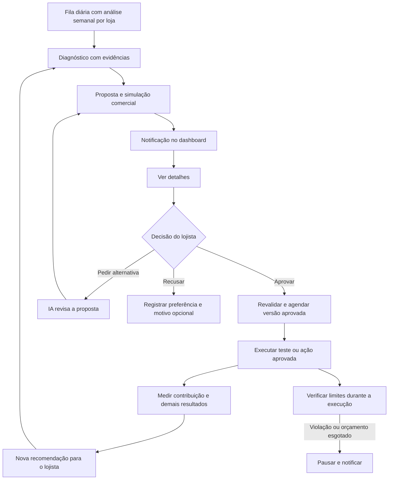

**Plano de evolução do motor de IA do Zyon/AACP**, elaborado em 24/09/2026 a partir do código e do fluxo solicitado pelo produto.

A proposta é transformar o Revenue Manager em um gestor de estratégias assistido por IA: analisa a loja, identifica oportunidades, prepara ações completas, pede aprovação, executa dentro dos limites comerciais e mede o resultado. O lojista decide; a IA assume o trabalho de diagnóstico, elaboração e revisão. A métrica principal deve ser contribuição incremental para o negócio, acompanhada de receita, conversão e qualidade da experiência.

Este documento é uma proposta de produto e implementação. As funcionalidades descritas como futuras não foram implementadas nesta análise.

O [plano técnico de implementação](revenue-intelligence-implementation-plan-2026-09-24.md) detalha os contratos, 13 pacotes de entrega, dependências, testes, migração e primeiro lote de trabalho. Foi preparado como continuação deste diagnóstico, antes de iniciar mudanças no produto.

Atualização de direção na mesma data, solicitada pelo usuário: uma análise estratégica por loja a cada sete dias, distribuída gradualmente entre os dias da semana; teto diário de consumo de IA; primeira avaliação dos experimentos após uma semana de execução; aprendizado entre lojas por padrões agregados. Essa decisão substitui a cadência diária originalmente proposta. A coleta de métricas e as proteções continuam operando por eventos e regras, sem depender de uma nova análise pela LLM.

**Base da análise.** Repositório confirmado pelo usuário: `C:\Users\Admin\Desktop\AACP`. Consulta ao remoto atualizada nesta sessão: `origin/master` em `d8b03f3`, de 22/09/2026. O checkout local está em `e82acb4`, com alterações anteriores preservadas. Os módulos centrais `revenue-manager`, `revenue-lift`, `experiments`, `intent-memory`, `coupons`, `decision-engine`, `rules-engine` e as páginas de Revenue Manager/Lift não apresentaram diferenças entre os dois commits nem alterações locais nesses caminhos na verificação inicial. Os componentes adjacentes de storefront possuem trabalho local e exigem reconciliação antes da implementação.

Foram executados 55 testes locais existentes, todos aprovados, em oito arquivos de governança, observação, geração de regras, feedback, Revenue Lift e significância. São testes com dados controlados e dependências substituídas onde aplicável. Não houve validação de produção, banco real, navegador, envio por provedor ou ganho comercial real nesta análise. Evidência: `.audit/revenue-ai-plan-20260924/focused-tests.log`.

**O que já existe deve ser aproveitado.** Há uma base relevante, mas o ciclo comercial ainda está incompleto.

| Área | Evidência no código atual | Evolução necessária |
| --- | --- | --- |
| Decisão durante o checkout | `packages/decision-engine/src/index.ts`: pesos por evento e limiares de intervenção | Calibrar decisões com resultados e contexto; incluir a decisão de não intervir |
| Conversação e storefront | Agentes, ferramentas, classificação de intenção e roteamento de modelos em `storefront` e `conversation-engine` | Compartilhar contexto e resultados com o planejador; avaliar qualidade e custo por tarefa |
| Memória de intenção | Repositórios Prisma em `intent-memory.module.ts`; conclusão de pedido carrega eventos da sessão | Enriquecer sinais anteriores à decisão e avaliar classificações; ampliar cobertura de abandonos sem enviesar o aprendizado para compradores |
| Revenue Manager | Observação, geração por LLM, baseline preservado, políticas da loja, aprovação manual e lições | Estratégias estruturadas, revisão com o lojista e coordenação de ações em vários módulos |
| Notificações | Hipótese e aviso persistidos na mesma transação; atalho e `StrategyReviewModal` | Estado de cada análise, revisões, execução, pausas, resultados e recomendações posteriores |
| Descontos | Gerador de `AdvancedRule`, aplicação direta ou A/B; autorização pelo motor de regras | Simulação real da distribuição de carrinhos, custo completo e orçamento por estratégia |
| Cupons | Criação, elegibilidade, reservas e limites; descontos de produto passam pelo motor de regras | Cupons gerados e rastreados como ações de uma estratégia aprovada |
| Recuperação e cross-sell | Seleção de recuperação por regras; recomendações por promoções, histórico e outros adaptadores | Testar momento, canal, mensagem e incentivo; coordenar contatos e otimizar contribuição |
| Experimentos | Controle/tratamento, resultados, expiração de sessões e seleção de vencedor | Inferência estatística corrigida, métricas econômicas, ativação real do vencedor e reversão |
| Revenue Lift | Holdout determinístico de 5%, receita aprovada por sessão e custo de IA | Efeito por estratégia, contribuição, incerteza e reconciliação de custos e estornos |
| Aprendizado | `experiment.completed` registra lição; próximas propostas recebem histórico | Distinguir resultado medido, preferência comercial e hipótese explicativa |

A cobertura aprofundada desta análise está no ciclo receita/estratégia/experimentos. Voz, suporte e todos os handlers dos agentes não passaram por auditoria funcional completa; entram no plano como superfícies que compartilham ações, contexto e telemetria.

**As limitações atuais definem a ordem do trabalho.** Os pontos abaixo foram observados no código; efeitos em produção ainda precisam ser medidos.

| Prioridade | Achado e referência | Consequência para o plano |
| --- | --- | --- |
| P0 | `packages/rules-engine/src/index.ts:23`: taxa padrão de 4%; linha 29: custo ausente assume 50% do preço | Não afirmar margem protegida com custo inventado; bloquear benefícios monetários sem dados confiáveis ou política conservadora explicitamente configurada |
| P0 | `discount-rule-hypothesis.service.ts:50`: tolerância de 5 pontos abaixo da margem média mínima; referências fixas de 15% de conversão e R$ 250 | Substituir aproximações por avaliação dos carrinhos elegíveis. A tolerância na proposta não demonstra violação em venda, pois existe validação posterior, mas tampouco prova segurança |
| P0 | `observe-metrics.use-case.ts:138`: pedidos concluídos no período divididos por sessões iniciadas no período | Definir população e janela de conversão coerentes; pedidos de sessões anteriores podem distorcer a taxa |
| P0 | Mesmo arquivo, linha 139: abandono usa eventos de objeção de frete e falha de pagamento; preço/confiança ficam em zero | Falha ou objeção não é abandono definitivo; deduplicar eventos e separar motivo conhecido de ausência de informação |
| P0 | `significance-calculator.service.ts`: ordena variantes pelo resultado, usa CDF unilateral e limiar 0,95; `auto-promote.job.ts` reavalia a cada seis horas | Corrigir interpretação de confiança, escolha posterior da direção e múltiplas consultas; 100 sessões não são garantia de poder estatístico |
| P0 | `revenue-lift-calculator.service.ts:65`: receita incremental menos custo de IA | O indicador atual não é lucro incremental; faltam custos de mercadoria, frete, pagamento, comunicação, devoluções e outros custos configurados |
| P1 | `daily-observation.job.ts:20`: cron em 02h UTC; linha 204: lote limitado a 100 lojistas sem paginação nesse ciclo | Agendar por fuso da loja e processar todos os lojistas elegíveis em lotes paginados |
| P1 | Mesmo job: fallback de 24h desde a inicialização do processo; geração depende de uma observação nova | Persistir cada etapa e recuperar falhas após observação salva; restart e retry não podem perder a recomendação ou duplicá-la |
| P1 | Controller oferece listar, aprovar, rejeitar e disparar análise, sem fluxo de revisão por comentário | Acrescentar versão da proposta, pedido de alternativa e nova aprovação |
| P1 | `approve-hypothesis.use-case.ts`: aprovação é salva antes dos efeitos posteriores | Separar aprovação de ativação; tratar falha parcial e retry com idempotência |
| P1 | `promote-winner.use-case.ts`: grava vencedor, conclui experimento e emite evento; nos consumidores pesquisados não há ativação correspondente da nova política/prompt | Implementar publicação versionada do vencedor e rollback. Marcar um vencedor no banco não basta para mudar as próximas sessões |
| P1 | `hypothesis-generator.adapter.ts:129`: escopo orientado ao checkout; linha 135 solicita palpite de lift; linha 182 utiliza três lições | Expandir contexto comercial, recuperar lições relevantes e separar estimativa de resultado medido |
| P1 | `record-strategy-lesson.use-case.ts:83`: hipótese correta se lift positivo; linha 104 produz texto de velocidade com sessões divididas por dez | Remover conclusões sem medida correspondente; registrar resultado inconclusivo, negativo e inválido |
| P1 | `discount-rule-hypothesis.service.ts:59`: deduplicação em memória | Persistir identidade por loja, público, ação e versão; controlar repetição entre processos e após restart |
| P2 | `cross-sell-recommender.service.ts`: um dos caminhos ordena promoções por maior desconto; `RecoveryStrategySelector` usa cascata fixa | Evoluir seleção por relevância e contribuição incremental, preservando os demais caminhos existentes |

No fluxo inspecionado de cupons de frete, `apply-coupon.use-case.ts` verifica permissão e cotação, enquanto a autorização de margem aparece explicitamente no ramo de desconto de produto. O plano inclui verificar toda a cadeia de frete/checkout e unificar o cálculo antes de liberar novas estratégias; este achado isolado não prova uma venda abaixo da margem em produção.

**O contrato do produto será: a IA propõe; o lojista decide; o sistema protege e mede.** O usuário não deverá editar prompts, condições técnicas ou parâmetros do experimento para obter valor.



A plataforma distribui o trabalho todos os dias, mas cada loja recebe no máximo uma análise estratégica agendada bem-sucedida a cada sete dias. Aprovação, atendimento, execução, coleta de métricas e proteção operam conforme os eventos. A revisão semanal pode recomendar manter a estratégia existente; não obriga criar uma nova proposta ou reiniciar o experimento.

**A análise semanal terá execução durável e distribuição diária.** Distribuir as lojas por sete grupos estáveis e balanceados, com dia preferencial e janela noturna no fuso IANA da loja. Horário inicial de referência: a partir de 03h, usando `America/Sao_Paulo` como padrão enquanto não houver preferência cadastrada. Espalhar o início das tarefas dentro da janela, respeitando os limites do provedor. O horário é de análise; envio ao consumidor respeita sua janela de contato.

1. Selecionar lojas com `next_analysis_at` vencido, sem ciclo concluído nos últimos sete dias e sem outra execução em andamento. Criar `AnalysisRun` único por loja e ciclo; a versão do planejador é metadado e não permite uma segunda análise do mesmo ciclo. Usar fila individual, paginação, lock, retries e retomada por etapa. A conclusão atualiza `last_successful_analysis_at` e agenda o próximo vencimento para pelo menos sete dias depois. Atrasos não geram vários ciclos retroativos em sequência.
2. Consolidar os últimos sete dias encerrados, tendências de 28/90 dias e comparação com semanas equivalentes. Identificar atrasos de integração, dados ausentes, promoções, estoque e mudanças de configuração.
3. Atualizar os resultados de estratégias em andamento e conferir limites. Experimentos inválidos não alimentam conclusões positivas.
4. Detectar oportunidades e gargalos com agregações reproduzíveis. Oportunidades podem ser melhorar comunicação, resolver atrito ou não oferecer desconto.
5. Consultar histórico da loja, experimentos relevantes, recusas e políticas atuais. Usar dados minimizados e separar informação observada de inferência.
6. Produzir até três novas propostas úteis por ciclo, como limite inicial ajustável. Classificar por contribuição possível, força da evidência, risco e esforço operacional.
7. Simular elegibilidade, margem, orçamento, estoque, conflitos e disponibilidade do canal. Propostas inviáveis ficam bloqueadas com explicação.
8. Salvar proposta, versão, evidências e notificação atomicamente. Uma revisão posterior gera novo registro de versão sem apagar o anterior.
9. Concluir o ciclo com um resumo persistente: recomendações, estratégias mantidas, dados insuficientes ou falha. Sempre haverá visibilidade da tentativa de melhoria; avisos do mesmo ciclo serão agrupados para evitar poluição do sino.

Lojas com pouco tráfego entram na checagem semanal, usando janelas maiores quando adequado. Uma verificação determinística de prontidão antecede a chamada à LLM: dados insuficientes ou ausência de mudanças relevantes podem encerrar o ciclo com diagnóstico persistido, sem consumir uma geração. O sistema informa a limitação, prioriza ações sem incentivo quando houver base e não produz uma promessa numérica de ganho.

**O teto diário protege o custo total do planejador.** Contar somente lojas é insuficiente, pois análises e revisões têm tamanhos diferentes. Aplicar limites simultâneos e configuráveis:

| Limite | Comportamento proposto |
| --- | --- |
| Orçamento financeiro diário e mensal | Reservar atomicamente o custo máximo previsto antes de admitir a chamada; conciliar com uso real e liberar sobra |
| Tokens de entrada e saída | Limitar contexto e resposta por chamada; agregar dados antes de enviar à LLM |
| Requisições/tokens por minuto e concorrência | Respeitar cotas por provedor/modelo e espaçar a fila; retentativas contam no consumo |
| Quantidade de análises por dia | Teto operacional adicional para controlar filas e carga de banco |
| Consumo por loja/ciclo | Impedir que uma loja concentre o orçamento; limitar tentativas e revisões |
| Reserva para revisão interativa | Separar uma parcela dentro do mesmo orçamento total para pedidos do lojista; revisão não dispara outra análise completa |

Usar ledger durável de uso e reservas compartilhado entre instâncias. A janela de gasto tem fuso único e explícito para a plataforma, independente dos fusos das lojas. Antes de cada chamada, conferir todos os limites; se o orçamento se esgotar, manter a tarefa na fila e exibir adiamento. Falha, fallback de modelo e retry não zeram o gasto já realizado. Resposta incerta do provedor exige reconciliação, sem repetição ilimitada.

Uma revisão solicitada pelo lojista reutiliza o snapshot e as evidências do ciclo. Pode produzir uma nova versão durante a semana, dentro da reserva interativa e dos limites da loja, sem burlar o teto global. Aplicar cooldown e chave de idempotência também ao botão de análise manual; ele não autoriza nova análise completa antes do próximo vencimento.

Distribuir capacidade com prioridade para ciclos mais atrasados e regras de equidade, reservando espaço para a primeira análise de novas lojas. Nenhuma loja deve ser esquecida por ter menos tráfego. Se o teto financeiro não sustentar a cobertura semanal, sinalizar déficit de capacidade e atraso; não prometer cobertura nem aumentar gasto silenciosamente.

Exemplo apenas de dimensionamento: 700 lojas elegíveis exigem em média 100 análises concluídas por dia para cobertura semanal, além da capacidade para retries e revisões. Em geral, a capacidade mínima média é `lojas elegíveis / 7`; o custo depende do uso medido por análise. Medir custo p50/p95 e definir os tetos após esse levantamento, sem fixar valores comerciais neste documento. A frequência programada cai de sete análises para uma por loja por semana, redução aproximada de 86% no número de análises, não uma garantia da mesma redução no custo total de IA do produto.

**Uma semana é o primeiro período de teste, contado da ativação efetiva.** Aprovação pendente não conta como tempo experimental. A avaliação usa pelo menos sete dias de exposição para cobrir os dias da semana, além de verificar amostra, janela de conversão e maturidade dos resultados. Na revisão semanal, classificar como positivo, negativo, inconclusivo ou inválido. Sete dias não garantem evidência suficiente.

Quando faltarem dados, manter a coleta até o prazo já aprovado. Se for necessário estender duração ou orçamento, propor extensão para aprovação. Sem extensão aprovada, parar novas exposições na expiração e manter apenas a coleta de resultados pendentes. Não reiniciar a contagem nem mudar o tratamento em andamento. Pausas por margem, orçamento, erro ou outra proteção continuam imediatas.

O dashboard mostrará última análise, próxima análise prevista, fase do teste, pendências e eventual atraso por limite de consumo. O relatório de métricas pode atualizar sem LLM. A notificação de recomendação acompanha o ciclo semanal; mudanças de versão, falhas e pausas geram seus próprios avisos persistidos.

**Cada proposta será um plano executável.** A entidade precisa conter, no mínimo:

| Campo | O que o lojista ou executor precisa saber |
| --- | --- |
| Diagnóstico | O problema observado, período, tamanho da amostra, fonte e qualidade dos dados |
| Hipótese | Por que a ação pode ajudar, com fatos e inferências claramente separados |
| Público | Critérios de inclusão/exclusão, tamanho estimado e identidade usada para impedir repetição |
| Ações | Mensagem, canal, momento, sequência, benefício, produtos e condições |
| Limites | Margem mínima, desconto máximo, teto por pedido/cliente, orçamento total e diário |
| Disponibilidade | Estoque, integrações, template aprovado e demais dependências reais |
| Experimento | Controle, tratamento, métrica principal, alocação, duração e tamanho de amostra planejados |
| Resultado esperado | Intervalo e origem da estimativa quando houver base; caso contrário, “Ainda sem estimativa confiável” |
| Interrupção | Regras econômicas, operacionais e de qualidade que suspendem a ação |
| Validade | Prazo para aprovar, início/fim da execução e momento de revalidar a proposta |
| Auditoria | Versão, política utilizada, autor da aprovação, execuções e motivo das decisões |

**O dashboard deve permitir decidir em poucos passos.** Cena de uso: um lojista abre o dashboard no início do expediente, no computador ou no celular, e precisa entender em poucos minutos o que a IA encontrou e o que ocorrerá se aprovar. Reutilizar os componentes e temas do dashboard; a entrega proposta é de fluxo e informação, sem impor ao lojista a linguagem técnica dos agentes.

A notificação abre uma página de detalhes com URL estável, utilizável por link direto e após recarregar. O resumo mostra o problema, a ação, o público, o limite de gasto, a proteção de margem e o prazo. Detalhes técnicos ficam em divulgação progressiva.

As três ações principais serão **Aprovar estratégia**, **Pedir outra proposta** e **Recusar**. Em “Pedir outra proposta”, o lojista pode escrever “prefiro tentar sem desconto” ou escolher uma preferência sugerida. A IA apresenta uma nova versão, explica o que mudou e recalcula custos e limites. Recusar pode ter motivo opcional; não deve obrigar uma conversa nem disparar campanha.

A aprovação vale para a versão exata exibida. Alterar mensagem, benefício, orçamento, público, canal ou duração exige nova aprovação. Se a política, os custos ou o estoque tornarem a versão inviável, ela é bloqueada ou retorna para revisão. O usuário pode pausar uma estratégia ativa a qualquer momento. Pausas de proteção são automáticas e visíveis; retomada após mudança material exige aprovação.

Testes que indicarem uma estratégia vencedora geram recomendação para ampliar ou adotar a ação. A ampliação não será silenciosa. Não implantar modo de publicação automática de novas estratégias neste escopo.

O painel reúne pendências, estratégias em teste, ações ativas e histórico de resultados. Cada item mostra sua última atualização e abre a mesma página de detalhe. Uma proposta lida continua pendente até ser decidida. Leitura da notificação e estado da estratégia são independentes.

Prever também: loja sem dados, custo não cadastrado, nenhuma nova oportunidade, análise atrasada, LLM indisponível, canal indisponível, template pendente, revisão sendo gerada, conflito de versão, falha ao ativar, orçamento esgotado e resultado inconclusivo. Foco, teclado, leitores de tela e mobile fazem parte do aceite. Não mostrar “ativa” quando existe apenas aprovação salva.

**O primeiro catálogo de estratégias deve resolver problemas concretos.** As ações serão combináveis, mas o primeiro piloto testa uma mudança principal por vez.

| Estratégia | Exemplo de decisão da IA | O que será medido |
| --- | --- | --- |
| Comunicação no checkout | Explicar custo/prazo real de frete no ponto em que aparecem dúvidas | Conversão, contribuição por elegível, tempo e abandono |
| Recuperação sem incentivo | Recontatar um abandono elegível com ajuda e link de retomada | Recuperação incremental, custo de contato, descadastro e reclamações |
| Cupom condicionado | Testar o menor benefício plausível em público com evidência de objeção de preço | Contribuição incremental, resgates, custo do benefício e compras que ocorreriam sem ele |
| Benefício de frete | Subsidiar frete apenas quando cotação, região, orçamento e margem permitirem | Contribuição após logística, conversão e custo por pedido |
| Produtos complementares | Sugerir item relevante com estoque e contribuição positiva, sem exigir desconto | Contribuição por carrinho e conversão, além do ticket |
| Recompra/reativação | Sugerir contato no período de recompra observado para a categoria | Recompra incremental, frequência de contato e retenção |
| Proteção do negócio | Propor reduzir incentivo onde não há ganho, ou manter uma estratégia atual | Desconto evitado, contribuição e estabilidade da conversão |

“Cupom inteligente” significa escolher público, momento, benefício, validade e orçamento com evidência. Identificar alguém como sensível a preço não basta para concluir que um cupom causará uma compra adicional. A resposta causal ao incentivo depende dos experimentos.

Cupons devem ser vinculados à estratégia/versão e, quando a proposta assim exigir, ao comprador ou sessão elegível. Aplicar validade, limites de uso, regras de combinação e reserva atômica de orçamento. Usar identificadores opacos; não codificar dados pessoais. Revalidar no resgate, na mudança do carrinho e na transação, com política explícita para ofertas já reservadas.

**A proteção comercial será uma autoridade única no backend.** A LLM pode propor ações dentro do contrato; não pode criar permissões, ampliar limites ou contornar o motor de regras por texto. Comentários do lojista orientam a proposta, sem alterar implicitamente sua configuração de margem.

O cálculo deve considerar receita efetivamente cobrada, custo conhecido do produto, taxas aplicáveis, tributos configurados, subsídio de frete, comissão, incentivo e custos relevantes da ação. Não descontar o cupom duas vezes quando o total pago já estiver líquido do benefício. Registrar a base da margem percentual e eventual piso em reais.

Aplicar a validação na simulação, na aprovação, antes da exposição/envio, no resgate e na confirmação da compra. Os valores, estoque e políticas podem mudar entre esses momentos. Conferir limites por item e carrinho segundo a política da loja, além da combinação de cupom, desconto, frete e promoção já existente.

Custos essenciais ausentes bloqueiam incentivos monetários até regularização ou uso de uma política conservadora explicitamente aprovada na configuração. A IA ainda pode propor comunicação e melhorias sem incentivo. Estimativas contábeis, quando utilizadas em relatórios, têm origem e incerteza visíveis.

O executor reserva orçamento antes de criar o efeito, confirma o gasto quando ele ocorre e libera reservas expiradas com idempotência. Reenvio de job ou webhook não cria segundo cupom, segundo desconto, segunda mensagem ou dupla contabilização. Uma falha de resposta do provedor exige reconciliação antes de repetir a ação.

Mensagens exigem elegibilidade e consentimento de canal, integração disponível, janela de contato, limite de frequência e supressão após compra, opt-out ou outra condição prevista. Aprovar estratégia no Zyon não substitui aprovação de template por provedor. Atribuição deve distinguir tentativa, aceitação pelo provedor, entrega, clique e compra.

**O Revenue Lift terá dois níveis complementares.** O holdout global existente acompanha o efeito do conjunto de recursos elegíveis da IA; o controle de cada experimento mede o efeito específico daquela estratégia. Preservar a separação e verificar que os canais outbound também respeitam a população excluída. Definir exatamente quais funcionalidades o holdout desativa antes de rotular o grupo como “sem IA”.

A alocação global já usa identidade do comprador por loja. Para testes de comunicação e cupons, manter também atribuição estável por comprador dentro da loja; testes estritamente de sessão só podem usar sessão como unidade quando isso não causar contaminação. Pessoas não convertidas e tratamentos que falharam na entrega continuam no denominador da análise principal por atribuição. Exposição efetiva serve como diagnóstico adicional.

Métrica principal proposta: **contribuição incremental por comprador elegível**, ou por sessão elegível quando essa for a unidade pré-definida do teste. A política de custos e o período de atribuição são versionados antes do início.

```text
Contribuição do braço = receita paga líquida de estornos
                       - custo de mercadoria e demais custos comerciais
                       - subsídios, taxas e custos de comunicação/IA pertinentes

Contribuição por elegível = contribuição do braço / todos os elegíveis atribuídos

Efeito incremental = média do tratamento - média do controle

Contribuição incremental estimada no tratamento = efeito incremental
                                                 × elegíveis do tratamento
```

Distribuir custos compartilhados por regra previamente definida; mostrar o custo da análise semanal e de suas revisões separadamente e conciliá-lo no resultado econômico total. Se os custos não permitirem um cálculo completo, não exibir o resultado como lucro comprovado. Usar “contribuição” quando custos fixos não estiverem incluídos.

| Grupo de métricas por estratégia | Indicadores |
| --- | --- |
| População | Elegíveis, atribuídos, expostos, não convertidos e cobertura de dados |
| Execução | Aprovações, ativações, ações tentadas, aceitas, entregues e falhas |
| Comércio | Pedidos pagos, conversão, receita por elegível, ticket e recompra |
| Economia | Contribuição incremental, descontos, subsídios, mensagens, IA, estornos e orçamento restante |
| Proteções | Bloqueios de margem, estoque, frequência, descadastro, reclamações e erros |
| Experimento | Controle/tratamento, intervalo de incerteza, duração, amostra planejada, maturidade e validade |
| Aprendizado | Resultado positivo, negativo, inconclusivo ou inválido; evidências e próxima proposta |

Dados de “receita associada” a uma funcionalidade não são automaticamente “receita causada” por ela. O `CASE` atual do breakdown atribui prioridade a uma única funcionalidade quando várias estão presentes. Preservar a trilha de todas as exposições, deixar a regra de atribuição explícita e evitar somar lifts de estratégias sobrepostas como se fossem independentes.

**A medição precisa corrigir os problemas antes de automatizar decisões.** Usar inicialmente dois braços e uma métrica principal, com unidade de randomização, efeito mínimo de interesse, amostra/poder, duração, janela de conversão e critérios de interrupção definidos antes do teste. Volume insuficiente resulta em “inconclusivo”, sem vencedor forçado.

Para o primeiro piloto, recomendo horizonte fixo para a decisão de sucesso, com monitoramento contínuo dos limites de segurança. Se a decisão de sucesso precisar ocorrer a qualquer momento, adotar um método sequencial validado. Corrigir o cálculo unilateral com direção escolhida após observar os dados. Um limiar exibido como 95% não representa, por si, probabilidade de lucro ou chance de a hipótese ser verdadeira.

Antes de declarar vencedor, validar divisão observada da amostra, perdas de eventos, população comparável, maturidade de pagamentos/estornos e ausência de degradações relevantes. Calcular incerteza para a métrica econômica na unidade randomizada. Não reutilizar automaticamente o teste de proporções de conversão para valores monetários.

Essas recomendações seguem os princípios de qualidade de dados, métricas de proteção e acompanhamento de experimentos da [Microsoft Research](https://www.microsoft.com/en-us/research/articles/patterns-of-trustworthy-experimentation-during-experiment-stage/). O tratamento de consultas repetidas aos resultados é explicado na [documentação técnica de testes sequenciais da Statsig](https://docs.statsig.com/experiments/advanced-setup/sequential-testing). Não há proposta de contratação dessas ferramentas.

**A inteligência deve evoluir em camadas.** O ganho inicial virá da conexão entre dados, decisão e execução, junto com avaliações objetivas da LLM.

1. **Diagnóstico verificável:** agregações determinísticas, tendências, comparação com histórico da própria loja, decomposição por produto/canal e identificação de dados insuficientes.
2. **Planejamento pela LLM:** interpretar o diagnóstico, formular hipóteses, produzir mensagens no tom da loja e escolher ações de um catálogo permitido. Toda afirmação numérica aponta para a evidência usada.
3. **Validação e simulação:** saída com esquema tipado, regras determinísticas, replay em dados históricos e teste de cenários adversos. Replay estima elegibilidade e risco; não prova lift causal.
4. **Memória de estratégias:** recuperar casos da própria loja por público, categoria, canal e contexto, complementados por padrões agregados de lojas comparáveis. Registrar sucesso, fracasso, inconclusão e recusa com política de validade temporal; preferências e recusas ficam no contexto privado da loja.
5. **Personalização aprendida:** quando houver dados randomizados suficientes, avaliar modelos de resposta incremental para evitar descontos a quem compraria de qualquer forma. Comparar com a política simples antes de ampliar.

Recusa do lojista é sinal de preferência comercial, não evidência de que a estratégia reduziria vendas. Aprovação é autorização, não rótulo de sucesso. Explicações geradas sobre por que um teste venceu continuam hipóteses, a menos que tenham medição correspondente. Não iniciar fine-tuning como requisito; primeiro melhorar contexto, recuperação de casos e avaliações.

**O aprendizado entre lojas será uma biblioteca de padrões, com validação local.** A IA poderá sugerir uma abordagem promissora observada em contextos comparáveis. Um resultado de outra loja não autoriza ativação nem demonstra que o mesmo ganho ocorrerá na loja de destino.

| Camada | Dados e uso permitido no desenho proposto |
| --- | --- |
| Memória privada da loja | Políticas, custos, estratégias, conversas autorizadas e preferências; acesso restrito ao próprio tenant |
| Biblioteca compartilhada | Padrões abstratos, contexto agregado, suporte em lojas independentes, efeito e incerteza, resultados negativos/inconclusivos e validade temporal |
| Proposta para a loja de destino | Padrão compatível transformado em hipótese local; recalcular público, mensagem, benefício, custo e margem com os dados dessa loja |

A biblioteca não expõe compradores, identidades de lojas, conversas, prompts privados, cupons ou condições comerciais identificáveis das lojas de origem. Criar uma projeção agregada específica com política explícita de participação e uso de dados; não conceder ao planejador acesso cruzado às tabelas dos tenants. Suprimir grupos pequenos e combinações que permitam reconhecer uma loja, com mínimo configurado de lojas independentes. Agregação sozinha não deve ser apresentada como garantia de anonimato.

Fluxo de construção e uso:

1. Registrar resultados maduros e válidos por estratégia, com definição da métrica, unidade experimental, controle, período, tamanho da amostra e incerteza. Preservar também fracassos e inconclusões para evitar aprender apenas com vencedores.
2. Classificar o contexto em características agregadas, como categoria, faixa de ticket, tipo de público, canal, restrições de margem e sazonalidade. Não inferir atributos sensíveis de compradores.
3. Consolidar padrões em um job compartilhado incremental, sob orçamento próprio dentro do teto global. Usar processamento determinístico para estatísticas; chamar a LLM somente para sintetizar mudanças relevantes e reutilizar a síntese em múltiplas lojas.
4. Exigir replicação em lojas independentes, suporte mínimo, ausência de degradação relevante e análise da variação entre lojas antes de elevar a força de evidência de um padrão. Um grande lojista não pode, sozinho, representar todo um segmento.
5. Versionar padrão, proveniência, limites de aplicabilidade e data de validade. Avaliar em lojas e períodos não usados na seleção do padrão; enfraquecer evidências antigas ou contraditórias. Não copiar diretamente um percentual de lift externo para a previsão local.
6. Na análise semanal, recuperar poucos padrões compatíveis, aplicar as regras da loja e simular elegibilidade e contribuição. Na ausência de compatibilidade, usar apenas o diagnóstico local.
7. Apresentar a proposta no dashboard: “Essa abordagem apresentou resultados promissores em contextos semelhantes; sugerimos um teste na sua loja”. Mostrar força de evidência sem revelar dados de origem ou prometer o mesmo resultado.
8. Exigir aprovação da loja de destino e teste local com controle. Congelar a versão do padrão na estratégia aprovada; atualização da biblioteca não modifica experimentos ativos.

Exemplo hipotético: se explicar frete antes de oferecer cupom melhorar contribuição em várias lojas comparáveis, o motor pode recomendar testar a mesma sequência em outra loja. A mensagem, o público, o momento e qualquer benefício são gerados para a nova loja. Não copiar valores de cupom ou margens da origem.

A cautela com transporte de resultados e com conclusões após apenas uma semana é consistente com a análise de [validade externa de experimentos da Microsoft Research](https://www.microsoft.com/en-us/research/articles/external-validity-of-online-experiments-can-we-predict-the-future/). A biblioteca proposta é uma decisão de arquitetura para o Zyon; não foi validada com dados reais de múltiplas lojas nesta análise.

Catálogo, conversas e comentários entram como dados não confiáveis para instruções. O planejador tem acesso apenas às ferramentas necessárias e escopo de loja imposto pelo backend. Não fornecer segredos ou permitir que texto de produto altere política comercial. Comparar modelos com conjunto de avaliações em português e orçamento por execução, sem trocar os modelos de voz como parte deste trabalho.

**A implementação pode evoluir os módulos existentes.** Evitar um segundo motor paralelo com regras e métricas divergentes.

| Componente proposto | Responsabilidade e conexão |
| --- | --- |
| `AnalysisRun` / `MerchantAnalysisSchedule` | Ciclo semanal por loja, distribuição diária, próximo vencimento, snapshots, estado, custos e retomada |
| Registro de consumo de IA / `AiBudgetReservation` | Reaproveitar o contrato local `AiUsageEvent` / `AiPriceVersion` após integrar e validar essa dependência; acrescentar admissão atômica, reservas e limites de revisões sem duplicar a contabilização |
| `Strategy` / `StrategyVersion` | Evolução das hipóteses existentes; plano estruturado e versões imutáveis |
| `StrategyReview` | Aprovação/recusa/revisão, motivo, ator autenticado e versão exata |
| `StrategyAction` / `Execution` | Mensagens, cupons, regras e dependências; estado de cada efeito |
| `StrategyBudgetReservation` | Limites e concorrência de gasto por estratégia/loja |
| `ExperimentAssignment` / `Exposure` | Identidade e elegibilidade estáveis, sem substituir o histórico atual |
| `OutcomeLedger` / `MetricSnapshot` | Pagamentos, custos, estornos e métricas reprocessáveis |
| `StrategyLearning` | Evidências de resultados e preferências em estruturas distintas |
| `SharedStrategyPattern` / `PatternEvidence` | Biblioteca agregada e versionada, contexto, suporte independente, incerteza e regras de participação |

Estados propostos da versão: `draft`, `validating`, `pending_review`, `superseded`, `rejected`, `expired`, `approved`, `activating`, `scheduled`, `running`, `paused`, `completed`, `failed`. O experimento tem seu próprio resultado, inclusive `inconclusive` e `invalid`; execução da estratégia e conclusão estatística não são o mesmo estado.

Usar unicidade por loja/chave de negócio, controle otimista de versão e transações para estado + outbox. Executores externos são idempotentes e reconciliáveis; não manter uma transação de banco aberta durante chamada ao provedor. Uma revisão substitui uma proposta pendente, mas não reescreve a versão em execução. Reinício, pausa ou publicação invalidam caches e impedem novas exposições indevidas.

Contratos de API propostos: consultar execuções de análise, listar estratégias, abrir detalhe/versões/métricas, pedir revisão, aprovar versão, rejeitar, pausar e consultar histórico. Reutilizar endpoints e IDs legados por adaptadores de compatibilidade. O backend deriva a loja da identidade autenticada e verifica permissão de quem aprova; não confiar em `merchantId` ou `approved_by` enviados livremente pelo cliente.

Migrar hipóteses antigas como versão inicial, preservar experimentos ativos e manter os links de notificação existentes. Introduzir flags por loja e executores por tipo de ação. Implantar primeiro em modo de observação, comparar com o comportamento atual e só depois ativar ações aprovadas no piloto.

**A sequência de entrega será orientada por critérios de saída.** Estimativa inicial de 6 a 10 semanas para um piloto completo com equipe dedicada de backend, frontend e QA, condicionada à qualidade dos eventos, custos e integrações. Não é compromisso de prazo. A decomposição em pacotes revisáveis e as dependências conhecidas estão no plano técnico; a implementação deve confirmar a base de integração antes de abrir os primeiros PRs.

| Etapa | Entrega concreta | Critério para avançar |
| --- | --- | --- |
| 0. Dados e limites | Definição de métricas/população, custos, validação comum de benefícios e correção da inferência A/B | Dados insuficientes não viram resultado; cenários de margem e dinheiro conciliam; baseline reproduzível |
| 1. Ciclo semanal com capacidade controlada | Agenda por loja, fila diária, fuso local, paginação, retomada, ledger de IA e resumo no dashboard | Duas instâncias/retry/restart não duplicam análise na semana; teto é respeitado; cobertura e atrasos ficam visíveis |
| 2. Parceria com o lojista | Estratégia versionada, detalhe completo, aprovar/recusar/pedir alternativa | Nenhuma ação antes da aprovação; revisão material exige nova aprovação; falha não aparece como sucesso |
| 3. Execução do primeiro piloto | Comunicação no checkout ou recuperação sem incentivo, com controle | Uma estratégia aprovada percorre toda a jornada e produz métricas por versão |
| 4. Resultados e aprendizado | Contribuição por estratégia, recomendação de continuidade/expansão e memória baseada em evidência | Um teste positivo, um negativo e um inconclusivo percorrem o ciclo corretamente; adoção altera comportamento e rollback restaura a versão anterior |
| 5. Cupons e descontos | Incentivos condicionados, simulação, orçamento, reservas e validação em tempo de execução | Concorrência, mudança de custo e combinação de benefícios não violam limites |
| 6. Aprendizado entre lojas e expansão | Biblioteca de padrões agregados, recuperação por contexto, mais canais e personalização | Isolamento preservado, padrões avaliados em lojas independentes e validação local antes de adoção |

A arquitetura de métricas nasce na etapa 0 e acompanha todas as demais. A etapa 4 completa a experiência de resultados e aprendizado, sem adiar instrumentação até o fim. Etapas 1 e 2 podem evoluir enquanto se concluem contratos de dados; incentivos entram após o aceite econômico e o ciclo completo do piloto de comunicação.

**O primeiro recorte recomendado é pequeno e completo.** Uma loja piloto com tráfego e custos conhecidos; uma estratégia de comunicação; um experimento ativo; resumo semanal; revisão em linguagem natural; aprovação da versão; execução; resultado econômico; nova recomendação. Validar também a fila e o teto com várias lojas de teste. Depois acrescentar uma estratégia de cupom limitado e ampliar o piloto para lojas independentes antes de ativar o aprendizado compartilhado.

**Exemplo ilustrativo da experiência, sem representar dados reais de uma loja:**

> A análise desta madrugada encontrou concentração de dúvidas na etapa de frete. Recomendo testar uma explicação mais clara das opções disponíveis antes de oferecer incentivo. A estratégia usará as cotações reais e manterá a abordagem atual no grupo de controle. Ainda não há estimativa confiável de ganho. Nenhuma mensagem ou condição comercial foi ativada.

O detalhe apresenta a evidência, o texto proposto, o público, o período, o orçamento e a métrica. O lojista pode aprovar ou escrever “quero uma abordagem mais curta”. A IA gera a versão 2, que volta para revisão. Se o teste for inconclusivo, o relatório diz isso; se houver ganho confiável, a IA recomenda ampliar e solicita a aprovação correspondente.

**O aceite exige evidência em quatro níveis.** Os 55 testes desta análise são apenas uma base de comportamento local.

| Nível | Cenários necessários antes de declarar a entrega concluída |
| --- | --- |
| Domínio e avaliações de IA | Saída malformada, dados insuficientes, oferta inventada, instruções maliciosas, custo ausente, margem no limite, arredondamento, estoque e combinação de benefícios |
| Integração com banco/filas reais | Isolamento entre lojas, corrida de aprovação/revisão, reserva de orçamento concorrente, deduplicação após restart, retries e reconciliação de efeitos parciais |
| Cadência e orçamento de IA | Nenhuma duplicação em sete dias, inclusive virada de semana; filas equitativas; teto sob concorrência; retry/fallback/revisão contabilizados; orçamento esgotado adia tarefas; nova loja e backlog não ficam sem atendimento |
| Aprendizado compartilhado | Projeção sem acesso cruzado a dados brutos, supressão de grupos pequenos, participação respeitada, contexto incompatível rejeitado, versão congelada e resultado externo não exibido como ganho local |
| Navegador/API | Notificação → detalhe → revisar → aprovar → executar → métricas; recusa; expiração; erro; pausa; reload/link direto; desktop/mobile e acessibilidade |
| Piloto e provedores | Elegibilidade real, template/canal disponível, estados de envio verificados, atribuição ligada ao pedido pago, custo conciliado, holdout preservado e resultado observado pelo prazo planejado |

Medir também qualidade operacional: cobertura de lojas nos últimos sete dias, atraso p95 e máximo da fila, consumo diário/mensal real e reservado, custo p50/p95 por análise, proporção de ciclos sem chamada à LLM, gastos de revisões/retries, tempo para notificar, falhas de ativação, duplicidades e cobertura de dados. Monitorar replicação e desempenho negativo dos padrões compartilhados. O objetivo do produto é contribuição incremental positiva com limites respeitados; taxa de aprovação e quantidade de propostas são diagnósticos de uso, não provas de valor.

**Decisões assumidas para este plano:** aprovação obrigatória de cada versão; no máximo uma análise estratégica agendada bem-sucedida por loja a cada sete dias; distribuição em fila diária e janela noturna por fuso; teto global de gasto, tokens, requisições e concorrência; revisões dentro do mesmo orçamento; até três propostas novas úteis por ciclo; um experimento por loja no primeiro piloto; primeira avaliação após sete dias de execução efetiva sem promessa de conclusão; extensão material e expansão sujeitas a aprovação; aprendizado compartilhado por padrões agregados com validação local; nenhuma exigência de o lojista ajustar prompts; pausas automáticas por proteção. Margens, orçamento e limites vêm da configuração de cada loja e não serão fixados pela LLM. Valores dos tetos de IA e critérios mínimos de compartilhamento serão definidos com custo medido e política de dados antes da ativação, sem impedir a especificação e implementação dos controles.

O planejamento técnico foi decomposto em RI-01 a RI-13 no documento complementar. O primeiro lote de implementação reúne correção de população/abandono, agenda semanal e orçamento de IA; os contratos de contribuição e de experimento orientam o lote desde o início. Autorizações econômicas, inferência e aprovação versionada são critérios obrigatórios antes de ativar as novas estratégias. A implementação ainda não começou.
