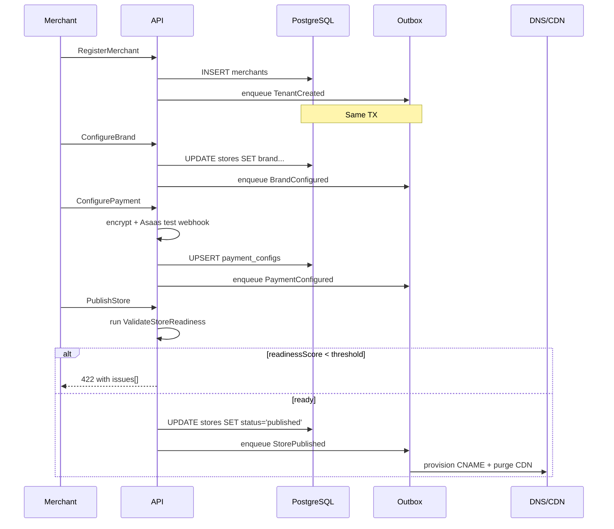
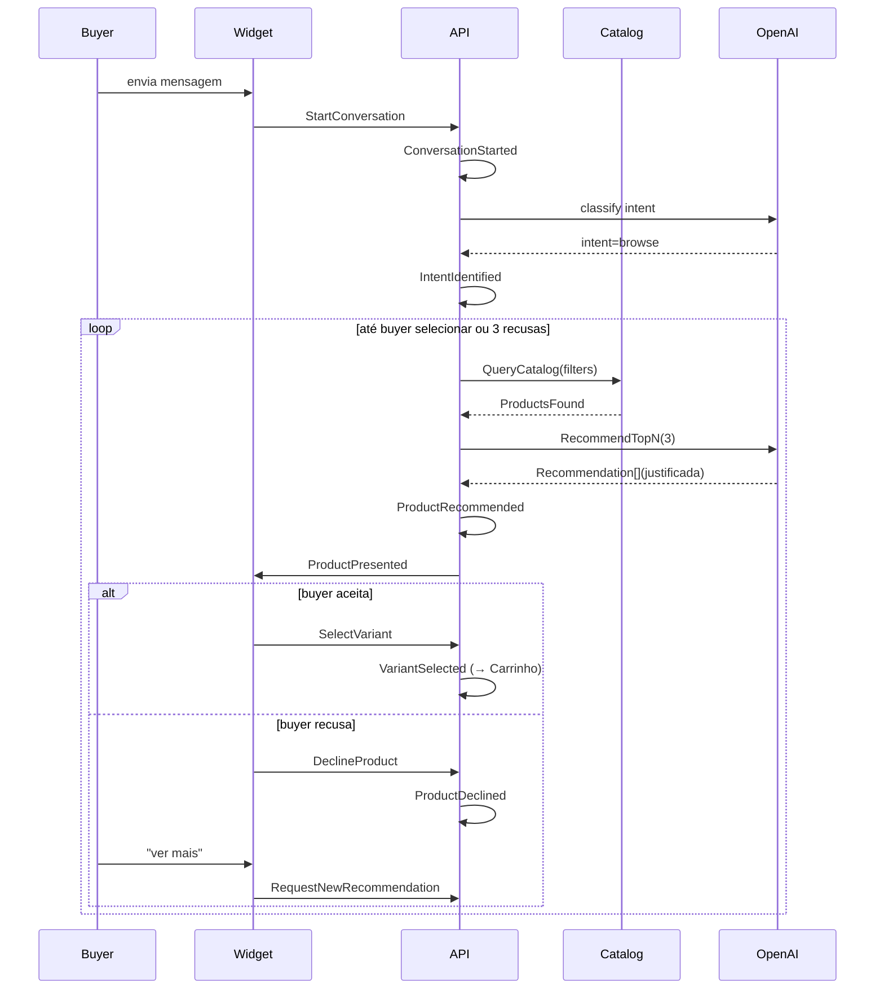
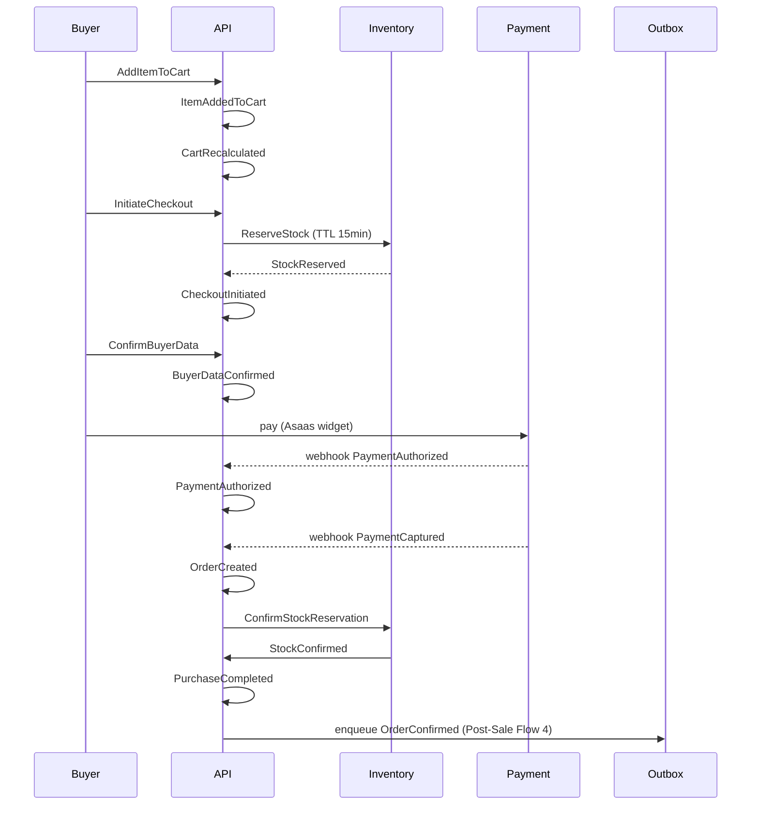
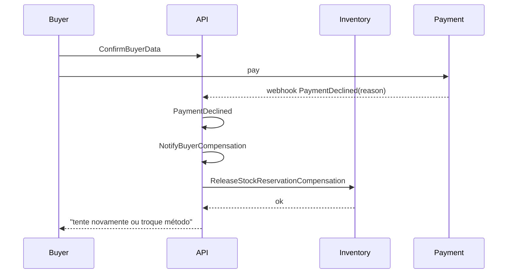
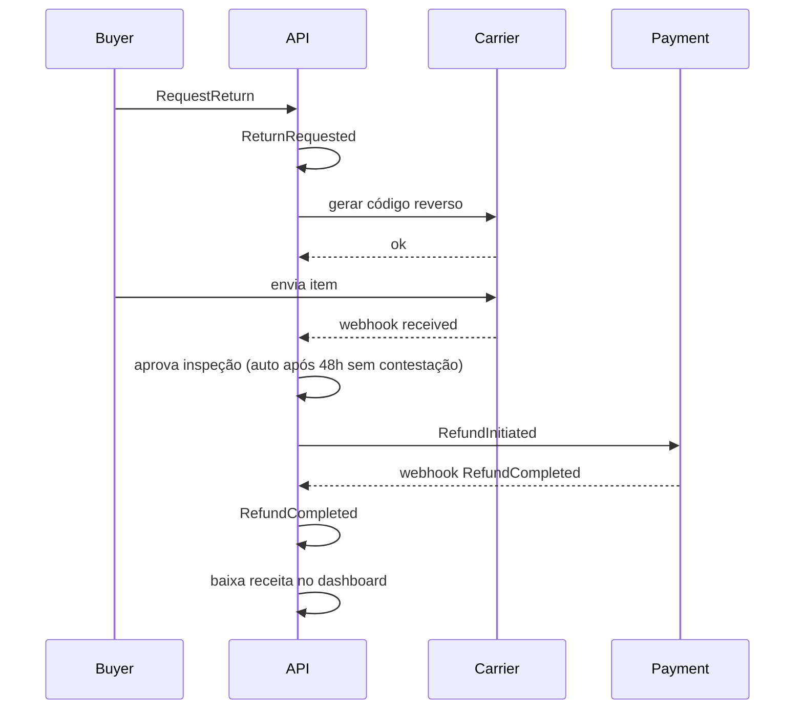

# Event Storming — Zyon Agentic Commerce Platform

- Data: 2026-08-14
- Autor: Diego
- Status: Draft
- Versão: 1.0
- Escopo: Plataforma inteira (Agentic Checkout + Agentic Store Builder)

---

## 1. Sumário Executivo

Este documento é o Event Storming definitivo da Zyon Agentic Commerce Platform. Ele cataloga todos os Domain Events de quatro fluxos críticos:

1. **Criação da Loja** (Agentic Store Builder) — onboarding agentic de merchants
2. **Descoberta Conversacional** (Agentic Storefront) — chat guiado por LLM
3. **Carrinho e Checkout** (Agentic Checkout) — fechamento transacional
4. **Pós-Venda** (Post-Sale) — fulfillment, troca, devolução, reembolso

Cada evento é analisado sob dez lentes: ator, comando, aggregate, políticas, read models, sistemas externos, exceções, hotspots, compensações e necessidades de idempotência.

O padrão transacional já foi decidido (ADR-0003): **Transactional Outbox**. Todo evento deste catálogo é produzido via outbox dentro da mesma transação de banco que mutaciona o aggregate.

---

## 2. Convenções e Glossário

### 2.1. Convenções de nomenclatura

| Elemento     | Convenção                            | Exemplo                          |
| ------------ | ------------------------------------ | -------------------------------- |
| Evento       | PascalCase, tempo passado             | `StorePublished`                 |
| Comando      | PascalCase, imperativo                | `PublishStore`                   |
| Aggregate    | PascalCase, substantivo               | `StoreAggregate`                 |
| Read Model   | kebab-case, projeção                 | `store-dashboard-read-model`     |
| Política     | kebab-case, regra                     | `require-payment-before-publish` |
| Hotspot      | kebab-case, risco                     | `cold-start-llm-cache`           |
| Compensação  | PascalCase, verbo + `Compensation`    | `RefundStockCompensation`        |

### 2.2. Metadados obrigatórios de evento

Todo evento de domínio carrega:

```ts
{
  id: string,                    // ULID, único global
  type: string,                  // ex.: 'store.published.v1'
  merchantId: string,            // boundary tenant
  aggregateId: string,           // id do aggregate raiz
  aggregateVersion: number,      // versão após mutação
  occurredAt: ISO8601,
  causationId?: string,          // id do evento que causou
  correlationId: string,         // rastreio end-to-end
  actor: { type, id },
  payload: Record<string, unknown>,
  idempotencyKey: string,        // hash causante
  schemaVersion: number          // versionamento evolutivo
}
```

### 2.3. Atores canônicos

| Ator              | Identidade       | Responsabilidade                                 |
| ----------------- | ---------------- | ------------------------------------------------ |
| `Merchant`        | humano, dono     | Configura loja, aprova decisões finais            |
| `MerchantAgent`   | persona IA       | Age em nome do merchant para tarefas assíncronas |
| `Buyer`           | humano, comprador| Inicia discovery, fecha pedido                   |
| `BuyerAgent`      | persona IA       | Age em nome do buyer (M2M)                       |
| `Storefront`      | canal            | Renderiza widget, coleta eventos                 |
| `PaymentGateway`  | terceiro (Asaas) | Autoriza, captura, estorna                       |
| `Carrier`         | terceiro         | Rastreia, atualiza status                        |
| `CatalogProvider` | terceiro         | Shopify, WooCommerce, VTEX, Magento              |
| `System`          | agendador/cron   | Jobs, expiração, SLA                             |

---

## 3. Mapa Global de Eventos

### 3.1. Fluxo 1 — Criação da Loja

| # | Evento                  | Aggregate           | Política Reativa                 |
| - | ----------------------- | ------------------- | -------------------------------- |
| 1 | `TenantCreated`         | `Merchant`          | Inicia provisionamento           |
| 2 | `StoreCreated`          | `Store`             | Aloca subdomínio                 |
| 3 | `BrandConfigured`       | `Store`             | Carrega tema                     |
| 4 | `CatalogImported`       | `Catalog`           | Indexa busca                     |
| 5 | `StockConfigured`       | `InventoryPolicy`   | Liga alertas                     |
| 6 | `PaymentConfigured`     | `PaymentConfig`     | Valida credenciais               |
| 7 | `ShippingConfigured`    | `ShippingConfig`    | Testa CEPs                       |
| 8 | `AgentConfigured`       | `AgentConfig`       | Compila guardrails               |
| 9 | `PreviewGenerated`      | `Store`             | Renderiza snapshot               |
| 10| `StoreValidated`        | `Store`             | Aplica checklist                 |
| 11| `StorePublished`        | `Store`             | Sobe DNS, expõe catálogo público |

### 3.2. Fluxo 2 — Descoberta Conversacional

| # | Evento                       | Aggregate         | Política Reativa             |
| - | ---------------------------- | ----------------- | ---------------------------- |
| 1 | `ConversationStarted`        | `Conversation`    | Carrega perfil do buyer      |
| 2 | `IntentIdentified`           | `Conversation`    | Seleciona fluxo              |
| 3 | `PreferencesCollected`       | `Conversation`    | Atualiza vetor               |
| 4 | `CatalogQueried`             | `Catalog`         | Filtra                      |
| 5 | `ProductsFound`              | `Catalog`         | Rankeia                     |
| 6 | `ProductRecommended`         | `Recommendation` | Justifica                   |
| 7 | `ProductPresented`           | `Conversation`    | Aguarda feedback             |
| 8 | `QuestionAnswered`           | `Conversation`    | Reavalia                    |
| 9 | `ProductsCompared`           | `Comparison`      | Constrói matriz             |
| 10| `VariantSelected`            | `Cart`            | Adiciona ao carrinho        |
| 11| `ProductDeclined`            | `Conversation`    | Refina busca                |
| 12| `NewRecommendationRequested` | `Conversation`    | Roda nova busca             |

### 3.3. Fluxo 3 — Carrinho e Checkout

| # | Evento               | Aggregate          | Política Reativa               |
| - | -------------------- | ------------------ | ------------------------------ |
| 1 | `ItemAddedToCart`    | `Cart`             | Recalcula totais               |
| 2 | `CartRecalculated`   | `Cart`             | Avalia promoções               |
| 3 | `PromotionApplied`   | `PromotionLedger`  | Marca uso                     |
| 4 | `StockReserved`      | `Inventory`        | Expira reserva                |
| 5 | `ShippingQuoted`     | `ShippingQuote`    | Cacheia cotação               |
| 6 | `CheckoutInitiated`  | `CheckoutSession`  | Cria identidade de sessão     |
| 7 | `BuyerDataConfirmed` | `CheckoutSession`  | Valida CPF, e-mail            |
| 8 | `PaymentAuthorized`  | `PaymentIntent`    | Libera captura                |
| 9 | `PaymentDeclined`    | `PaymentIntent`    | Libera reserva, notifica      |
| 10| `OrderCreated`       | `Order`            | Emite NF, dispara fulfillment|
| 11| `StockConfirmed`     | `Inventory`        | Baixa definitiva              |
| 12| `PurchaseCompleted`  | `Order`            | Score dashboard               |

### 3.4. Fluxo 4 — Pós-Venda

| # | Evento            | Aggregate      | Política Reativa              |
| - | ----------------- | -------------- | ----------------------------- |
| 1 | `OrderConfirmed`  | `Order`        | Envia confirmação             |
| 2 | `OrderShipped`    | `Order`        | Notifica tracking             |
| 3 | `TrackingUpdated` | `Shipment`     | Reenvia notificação           |
| 4 | `DeliveryCompleted` | `Order`      | Dispara NPS, baixa métricas   |
| 5 | `ExchangeRequested` | `Exchange`   | Reserva novo item             |
| 6 | `ReturnRequested`   | `Return`     | Gera código de coleta         |
| 7 | `RefundInitiated`   | `Refund`     | Cria intent estorno           |
| 8 | `RefundCompleted`   | `Refund`     | Reverte receita               |

---

## 4. Catálogo Detalhado de Eventos

### 4.1. FLUXO 1 — Criação da Loja

#### 4.1.1. TenantCreated

| Atributo           | Detalhe                                                       |
| ------------------ | ------------------------------------------------------------- |
| Actor              | `Merchant`                                                    |
| Command            | `RegisterMerchant`                                            |
| Aggregate          | `Merchant`                                                    |
| Mutação            | Insert em `merchants` + provision DB schema-per-tenant        |
| Read Models        | `merchant-billing-read-model`, `merchant-tier-read-model`    |
| Sistemas externos  | Stripe Connect (criação de conta), DNS Zone                  |
| Exceções           | Duplicidade de `taxId`, KYC falho, schema-per-tenant falho   |
| Hotspots           | Tempo de provisionamento de schema-per-tenant (cold start)    |
| Compensações       | `RollbackMerchantRegistrationCompensation`                   |
| Idempotência       | Chave = hash(`taxId` + `email`)                              |

#### 4.1.2. StoreCreated

| Atributo           | Detalhe                                                       |
| ------------------ | ------------------------------------------------------------- |
| Actor              | `Merchant`                                                    |
| Command            | `CreateStore`                                                 |
| Aggregate          | `Store`                                                       |
| Mutação            | Insert em `stores` com `merchantId`, `slug`, `status=draft`   |
| Read Models        | `store-list-read-model`                                       |
| Sistemas externos  | —                                                             |
| Exceções           | Slug duplicado, limite de lojas por plano                      |
| Hotspots           | Validação de slug global (lock distribuído)                   |
| Compensações       | `RollbackStoreCreationCompensation`                           |
| Idempotência       | Chave = hash(`merchantId` + `slug`)                           |

#### 4.1.3. BrandConfigured

| Atributo           | Detalhe                                                       |
| ------------------ | ------------------------------------------------------------- |
| Actor              | `Merchant`                                                    |
| Command            | `ConfigureBrand` (logo, paleta, fontes, copy)                |
| Aggregate          | `Store`                                                       |
| Read Models        | `storefront-render-read-model`, `theme-read-model`            |
| Sistemas externos  | CDN (upload de logo), Tipografia Google Fonts                 |
| Exceções           | Logo > 2MB, paleta inválida, fonte não licenciada             |
| Hotspots           | Validação de contraste WCAG AA automática                      |
| Compensações       | Nenhuma (idempotente por `version` + `publishedAt IS NULL`)   |
| Idempotência       | Chave = hash(`storeId` + `version`)                           |

#### 4.1.4. CatalogImported

| Atributo           | Detalhe                                                       |
| ------------------ | ------------------------------------------------------------- |
| Actor              | `Merchant` ou `MerchantAgent`                                 |
| Command            | `ImportCatalog(source)`                                       |
| Aggregate          | `Catalog`                                                     |
| Mutação            | Bulk upsert em `products`, `variants`, `categories`           |
| Read Models        | `storefront-search-read-model`, `inventory-read-model`        |
| Sistemas externos  | Shopify / WooCommerce / VTEX / Magento (CSV opcional)        |
| Exceções           | Schema divergente, payload > limite, fornecedor offline        |
| Hotspots           | Mapeamento de taxonomias heterogêneas entre plataformas        |
| Compensações       | `RollbackCatalogImportCompensation` (job de limpeza)         |
| Idempotência       | Chave = hash(`source` + `lastSyncedAt` do provider)           |

#### 4.1.5. StockConfigured

| Atributo           | Detalhe                                                       |
| ------------------ | ------------------------------------------------------------- |
| Actor              | `Merchant`                                                    |
| Command            | `ConfigureStockPolicy`                                        |
| Aggregate          | `InventoryPolicy`                                             |
| Mutação            | Define regras: alerta mínimo, segurança, expiração de reserva  |
| Read Models        | `inventory-policy-read-model`                                 |
| Sistemas externos  | Webhook para ERP (opcional)                                   |
| Exceções           | Política inválida (ex.: reserva > 30min para perecível)        |
| Hotspots           | Conflito entre regra do merchant e regra do sistema            |
| Compensações       | Nenhuma                                                       |
| Idempotência       | Chave = `policyId` (substituição integral)                     |

#### 4.1.6. PaymentConfigured

| Atributo           | Detalhe                                                       |
| ------------------ | ------------------------------------------------------------- |
| Actor              | `Merchant`                                                    |
| Command            | `ConfigurePayment`                                            |
| Aggregate          | `PaymentConfig`                                               |
| Mutação            | Persiste credenciais Asaas criptografadas (KMS)               |
| Read Models        | `payment-config-read-model`                                   |
| Sistemas externos  | Asaas (sandbox ou produção), webhook de teste                  |
| Exceções           | Credenciais inválidas, IP bloqueado, MFA exigido              |
| Hotspots           | Rotação de tokens, segregação sandbox vs produção              |
| Compensações       | `DisablePaymentConfigCompensation`                            |
| Idempotência       | Chave = hash(`merchantId` + `providerId`)                    |

#### 4.1.7. ShippingConfigured

| Atributo           | Detalhe                                                       |
| ------------------ | ------------------------------------------------------------- |
| Actor              | `Merchant`                                                    |
| Command            | `ConfigureShipping`                                           |
| Aggregate          | `ShippingConfig`                                              |
| Mutação            | Define faixas de CEP, prazos, transportadoras                  |
| Read Models        | `shipping-options-read-model`                                 |
| Sistemas externos  | Correios API, Frenet, Melhor Envio                            |
| Exceções           | CEP fora de área, contrato de transportadora expirado          |
| Hotspots           | Cache regional de cotação (TTL curto)                         |
| Compensações       | `DisableShippingConfigCompensation`                           |
| Idempotência       | Chave = hash(`merchantId` + `carrier`)                        |

#### 4.1.8. AgentConfigured

| Atributo           | Detalhe                                                       |
| ------------------ | ------------------------------------------------------------- |
| Actor              | `Merchant`                                                    |
| Command            | `ConfigureAgent`                                              |
| Aggregate          | `AgentConfig`                                                 |
| Mutação            | Persiste persona, guardrails, `maxDiscountPercent`, copy      |
| Read Models        | `agent-config-read-model`, `guardrails-read-model`            |
| Sistemas externos  | OpenAI (modelo e vetor de embeddings)                         |
| Exceções           | Persona além de 4000 tokens, prompt com injeção               |
| Hotspots           | Detecção de prompt injection (regex + LLM-as-judge)           |
| Compensações       | `RevertAgentConfigCompensation`                               |
| Idempotência       | Chave = `agentConfigId`                                       |

#### 4.1.9. PreviewGenerated

| Atributo           | Detalhe                                                       |
| ------------------ | ------------------------------------------------------------- |
| Actor              | `System` (job)                                                |
| Command            | `GenerateStorePreview`                                        |
| Aggregate          | `Store`                                                       |
| Mutação            | Renderiza URL de preview, snapshot HTML                        |
| Read Models        | `store-preview-read-model`                                    |
| Sistemas externos  | Puppeteer headless (renderização), S3 (snapshot)              |
| Exceções           | Tema quebrado, JS de erro no preview                          |
| Hotspots           | Tempo de render < 5s em cold cache                            |
| Compensações       | Nenhuma                                                       |
| Idempotência       | Chave = hash(`storeId` + `brandVersion` + `catalogVersion`)   |

#### 4.1.10. StoreValidated

| Atributo           | Detalhe                                                       |
| ------------------ | ------------------------------------------------------------- |
| Actor              | `System` (executa após `PreviewGenerated`)                    |
| Command            | `ValidateStoreReadiness`                                      |
| Aggregate          | `Store`                                                       |
| Mutação            | Atualiza `readinessScore`, `validationIssues[]`               |
| Read Models        | `store-readiness-read-model`                                  |
| Sistemas externos  | —                                                             |
| Exceções           | Checklist incompleto (ex.: sem política de devolução)         |
| Hotspots           | Definir SLA de readiness score por plano                      |
| Compensações       | Nenhuma                                                       |
| Idempotência       | Chave = hash(`storeId` + `lastValidatedAt`)                   |

#### 4.1.11. StorePublished

| Atributo           | Detalhe                                                       |
| ------------------ | ------------------------------------------------------------- |
| Actor              | `Merchant`                                                    |
| Command            | `PublishStore`                                                |
| Aggregate          | `Store`                                                       |
| Mutação            | `status=draft → status=published`, libera cache público       |
| Read Models        | `public-storefront-read-model`, `merchant-billing-read-model` |
| Sistemas externos  | DNS, CDN purge, Search engine submit (sitemap)               |
| Exceções           | Validação falhou, contrato de pagamento pendente              |
| Hotspots           | Promoção atômica de CNAME para DNS                            |
| Compensações       | `RollbackPublishCompensation` (status=published → draft)      |
| Idempotência       | Chave = `storeId` + versão incrementada                       |

### 4.1.12. Diagrama — Fluxo de Publicação



---

### 4.2. FLUXO 2 — Descoberta Conversacional

#### 4.2.1. ConversationStarted

| Atributo           | Detalhe                                                       |
| ------------------ | ------------------------------------------------------------- |
| Actor              | `Buyer` ou `BuyerAgent`                                       |
| Command            | `StartConversation`                                           |
| Aggregate          | `Conversation`                                                |
| Mutação            | Insert em `conversations`, carrega perfil do buyer            |
| Read Models        | `conversation-history-read-model`, `buyer-context-read-model` |
| Sistemas externos  | —                                                             |
| Exceções           | Merchant suspenso, visitante bloqueado por abuse              |
| Hotspots           | Janela de contexto do LLM (limite de tokens)                  |
| Compensações       | Nenhuma                                                       |
| Idempotência       | Chave = hash(`buyerId` + `storeId` + `sessionStartTs`)         |

#### 4.2.2. IntentIdentified

| Atributo           | Detalhe                                                       |
| ------------------ | ------------------------------------------------------------- |
| Actor              | `MerchantAgent`                                               |
| Command            | `ClassifyIntent`                                              |
| Aggregate          | `Conversation`                                                |
| Mutação            | Grava `intent`, `confidence`, `nextQuestionSlot`              |
| Read Models        | `intent-classification-read-model`, `analytics-read-model`    |
| Sistemas externos  | OpenAI / claude-mini para classificação                       |
| Exceções           | Confiança < 0.6 → escalonamento para humano                   |
| Hotspots           | Latência de classificação < 200ms                             |
| Compensações       | `ResetIntentClassificationCompensation`                       |
| Idempotência       | Chave = `conversationId` + `turnId`                           |

#### 4.2.3. PreferencesCollected

| Atributo           | Detalhe                                                       |
| ------------------ | ------------------------------------------------------------- |
| Actor              | `Buyer` (resposta) / `MerchantAgent` (extração)               |
| Command            | `CollectPreference(slot, value)`                              |
| Aggregate          | `Conversation`                                                |
| Mutação            | Atualiza `preferences{}` na conversa                          |
| Read Models        | `buyer-preferences-read-model`, `recommendation-vector-read-model` |
| Sistemas externos  | —                                                             |
| Exceções           | Slot inválido, valor fora de enum                             |
| Hotspots           | Normalização semântica (sinônimos, plural)                    |
| Compensações       | `RevertPreferenceCompensation`                                |
| Idempotência       | Chave = hash(`conversationId` + `slot`)                       |

#### 4.2.4. CatalogQueried

| Atributo           | Detalhe                                                       |
| ------------------ | ------------------------------------------------------------- |
| Actor              | `MerchantAgent`                                               |
| Command            | `QueryCatalog(filters)`                                       |
| Aggregate          | `Catalog`                                                     |
| Mutação            | Nenhuma (read-only)                                           |
| Read Models        | `catalog-query-trace-read-model` (audit)                      |
| Sistemas externos  | OpenSearch (índice da loja), embeddings                        |
| Exceções           | Índice indisponível, timeout                                  |
| Hotspots           | Latência de query < 300ms mesmo em catálogos > 10k SKUs       |
| Compensações       | Nenhuma (read-only)                                           |
| Idempotência       | Chave = hash(`filters` + `policyVersion`)                     |

#### 4.2.5. ProductsFound

| Atributo           | Detalhe                                                       |
| ------------------ | ------------------------------------------------------------- |
| Actor              | `System` (após `CatalogQueried`)                              |
| Command            | `EmitProductsFound`                                           |
| Aggregate          | `Catalog`                                                     |
| Mutação            | Nenhuma                                                       |
| Read Models        | `match-history-read-model` (para `ProductsCompared`)          |
| Sistemas externos  | —                                                             |
| Exceções           | Zero resultados                                               |
| Hotspots           | Estratégia quando zero resultados (relaxar, sugerir relacionados) |
| Compensações       | Nenhuma                                                       |
| Idempotência       | Chave = `queryId`                                             |

#### 4.2.6. ProductRecommended

| Atributo           | Detalhe                                                       |
| ------------------ | ------------------------------------------------------------- |
| Actor              | `MerchantAgent`                                               |
| Command            | `RecommendTopN(n=3)`                                          |
| Aggregate          | `Recommendation`                                              |
| Mutação            | Grava justificativa (por que esse produto)                     |
| Read Models        | `recommendation-history-read-model`                           |
| Sistemas externos  | OpenAI (geração de justificativa)                             |
| Exceções           | Justificativa bloqueada por `isSafeGeneratedMessage`           |
| Hotspots           | Validar justificativa contra inventário e preço antes de emitir |
| Compensações       | `RevertRecommendationCompensation`                            |
| Idempotência       | Chave = hash(`conversationId` + `productId`)                  |

#### 4.2.7. ProductPresented

| Atributo           | Detalhe                                                       |
| ------------------ | ------------------------------------------------------------- |
| Actor              | `System` (após validação)                                     |
| Command            | `PresentProduct`                                              |
| Aggregate          | `Conversation`                                                |
| Mutação            | Append à transcript visível                                   |
| Read Models        | `transcript-read-model`                                       |
| Sistemas externos  | Widget JS (render)                                            |
| Exceções           | Mensagem com preço desatualizado                              |
| Hotspots           | Garantir preço fresco (TTL < 60s)                             |
| Compensações       | Nenhuma                                                       |
| Idempotência       | Chave = hash(`conversationId` + `recommendationId`)            |

#### 4.2.8. QuestionAnswered

| Atributo           | Detalhe                                                       |
| ------------------ | ------------------------------------------------------------- |
| Actor              | `Buyer`                                                       |
| Command            | `AnswerQuestion(slot, value)`                                 |
| Aggregate          | `Conversation`                                                |
| Mutação            | Persiste resposta                                             |
| Read Models        | `faq-coverage-read-model`, `gap-analysis-read-model`         |
| Sistemas externos  | —                                                             |
| Exceções           | Pergunta fora do fluxo atual                                  |
| Hotspots           | Quando a resposta dispara nova busca vs. nova pergunta       |
| Compensações       | `RevertAnswerCompensation`                                    |
| Idempotência       | Chave = `questionId`                                          |

#### 4.2.9. ProductsCompared

| Atributo           | Detalhe                                                       |
| ------------------ | ------------------------------------------------------------- |
| Actor              | `MerchantAgent`                                               |
| Command            | `BuildComparisonMatrix(productIds[])`                         |
| Aggregate          | `Comparison`                                                  |
| Mutação            | Grava matriz (atributos, prós, contras)                       |
| Read Models        | `comparison-history-read-model`                               |
| Sistemas externos  | OpenAI (resumo comparativo)                                   |
| Exceções           | > 5 produtos, atributos divergentes                            |
| Hotspots           | Verdade material: nunca inventar especificação                |
| Compensações       | `RevertComparisonCompensation`                                |
| Idempotência       | Chave = hash(`productIds[]` ordenado)                         |

#### 4.2.10. VariantSelected

| Atributo           | Detalhe                                                       |
| ------------------ | ------------------------------------------------------------- |
| Actor              | `Buyer` ou `BuyerAgent`                                       |
| Command            | `SelectVariant(variantId)`                                    |
| Aggregate          | `Cart`                                                        |
| Mutação            | Insert em `cart_items`, recalcula totais                      |
| Read Models        | `cart-read-model`, `inventory-read-model`                     |
| Sistemas externos  | —                                                             |
| Exceções           | Variant sem estoque, preço mudou                              |
| Hotspots           | Idempotência em duplo-click                                   |
| Compensações       | `RemoveCartItemCompensation`                                  |
| Idempotência       | Chave = hash(`cartId` + `variantId` + `qty`)                  |

#### 4.2.11. ProductDeclined

| Atributo           | Detalhe                                                       |
| ------------------ | ------------------------------------------------------------- |
| Actor              | `Buyer`                                                       |
| Command            | `DeclineProduct(reason)`                                      |
| Aggregate          | `Conversation`                                                |
| Mutação            | Grava recusa, decrementa score do produto                     |
| Read Models        | `negative-feedback-read-model`                                |
| Sistemas externos  | —                                                             |
| Exceções           | —                                                             |
| Hotspots           | Curva de aprendizado: quando buscar mais vs. mudar estratégia |
| Compensações       | Nenhuma                                                       |
| Idempotência       | Chave = hash(`conversationId` + `productId`)                  |

#### 4.2.12. NewRecommendationRequested

| Atributo           | Detalhe                                                       |
| ------------------ | ------------------------------------------------------------- |
| Actor              | `Buyer`                                                       |
| Command            | `RequestNewRecommendation`                                    |
| Aggregate          | `Conversation`                                                |
| Mutação            | Reseta lista de apresentados, dispara novo ciclo              |
| Read Models        | `funnel-analytics-read-model` (abandono vs. conversão)        |
| Sistemas externos  | —                                                             |
| Exceções           | Loop infinito de recusa (após 3 recusas, escalonar)          |
| Hotspots           | Limite de iterações e budget de tokens por sessão             |
| Compensações       | Nenhuma                                                       |
| Idempotência       | Chave = `conversationId` + `iteration`                        |

### 4.2.13. Diagrama — Loop de Discovery



---

### 4.3. FLUXO 3 — Carrinho e Checkout

#### 4.3.1. ItemAddedToCart

| Atributo           | Detalhe                                                       |
| ------------------ | ------------------------------------------------------------- |
| Actor              | `Buyer`, `BuyerAgent` ou `MerchantAgent`                      |
| Command            | `AddItemToCart(variantId, qty)`                              |
| Aggregate          | `Cart`                                                        |
| Mutação            | Insert/update `cart_items`                                    |
| Read Models        | `cart-read-model`                                             |
| Sistemas externos  | —                                                             |
| Exceções           | Variant inativo, qty > estoque, loja não publicada            |
| Hotspots           | Concorrência: dois buyers no mesmo merchant                    |
| Compensações       | `RemoveCartItemCompensation`                                  |
| Idempotência       | Chave = hash(`cartId` + `variantId` + `qty`)                  |

#### 4.3.2. CartRecalculated

| Atributo           | Detalhe                                                       |
| ------------------ | ------------------------------------------------------------- |
| Actor              | `System` (após `ItemAddedToCart`, `PromotionApplied`)         |
| Command            | `RecalculateCart`                                             |
| Aggregate          | `Cart`                                                        |
| Mutação            | Atualiza subtotal, desconto, total                            |
| Read Models        | `cart-read-model`, `dashboard-cart-read-model`                |
| Sistemas externos  | —                                                             |
| Exceções           | —                                                             |
| Hotspots           | Performance: < 50ms para carts grandes                        |
| Compensações       | Nenhuma                                                       |
| Idempotência       | Chave = `cartId` + `version`                                  |

#### 4.3.3. PromotionApplied

| Atributo           | Detalhe                                                       |
| ------------------ | ------------------------------------------------------------- |
| Actor              | `System` (regras disparadas)                                  |
| Command            | `ApplyPromotion(promotionId)`                                 |
| Aggregate          | `PromotionLedger`                                             |
| Mutação            | Insere linha de uso da promoção                               |
| Read Models        | `promotion-usage-read-model`, `merchant-roi-read-model`        |
| Sistemas externos  | —                                                             |
| Exceções           | Promoção expirada, limite de uso atingido                     |
| Hotspots           | `evaluateDiscountOffer` deve aplicar `maxDiscountPercent`     |
| Compensações       | `ReversePromotionCompensation` (em cancelamento)              |
| Idempotência       | Chave = hash(`cartId` + `promotionId`)                        |

#### 4.3.4. StockReserved

| Atributo           | Detalhe                                                       |
| ------------------ | ------------------------------------------------------------- |
| Actor              | `System` (ao iniciar checkout)                                |
| Command            | `ReserveStock(items, ttl)`                                    |
| Aggregate          | `Inventory`                                                   |
| Mutação            | Bloqueia quantidade por TTL (default 15min)                   |
| Read Models        | `inventory-read-model`, `reservation-read-model`              |
| Sistemas externos  | ERP (se integrado)                                            |
| Exceções           | Estoque insuficiente, conflito com outra reserva              |
| Hotspots           | Job de expiração de reserva órfã                              |
| Compensações       | `ReleaseStockReservationCompensation`                         |
| Idempotência       | Chave = hash(`reservationId`)                                 |

#### 4.3.5. ShippingQuoted

| Atributo           | Detalhe                                                       |
| ------------------ | ------------------------------------------------------------- |
| Actor              | `Buyer` (informa CEP) ou `BuyerAgent`                         |
| Command            | `QuoteShipping(cep)`                                          |
| Aggregate          | `ShippingQuote`                                               |
| Mutação            | Persiste cotação com TTL                                      |
| Read Models        | `shipping-options-read-model`                                 |
| Sistemas externos  | Correios, Frenet, Melhor Envio                                |
| Exceções           | CEP inválido, fornecedor offline                              |
| Hotspots           | Fallback determinístico se todos os provedores caírem         |
| Compensações       | Nenhuma (recompila se CEP mudar)                              |
| Idempotência       | Chave = hash(`cartId` + `cep`)                                |

#### 4.3.6. CheckoutInitiated

| Atributo           | Detalhe                                                       |
| ------------------ | ------------------------------------------------------------- |
| Actor              | `Buyer`                                                       |
| Command            | `InitiateCheckout`                                            |
| Aggregate          | `CheckoutSession`                                             |
| Mutação            | Insert em `checkout_sessions`, snapshots do cart e quote     |
| Read Models        | `session-read-model`, `analytics-funnel-read-model`           |
| Sistemas externos  | —                                                             |
| Exceções           | Store não publicada, sessão em fraude                         |
| Hotspots           | Expiração de sessão (TTL 30min)                               |
| Compensações       | `ExpireCheckoutSessionCompensation`                           |
| Idempotência       | Chave = hash(`cartId` + `buyerId`)                            |

#### 4.3.7. BuyerDataConfirmed

| Atributo           | Detalhe                                                       |
| ------------------ | ------------------------------------------------------------- |
| Actor              | `Buyer`                                                       |
| Command            | `ConfirmBuyerData(cpf, email, address)`                       |
| Aggregate          | `CheckoutSession`                                             |
| Mutação            | Persiste dados validados                                      |
| Read Models        | `checkout-compliance-read-model`                              |
| Sistemas externos  | ViaCEP (validação de endereço)                                |
| Exceções           | CPF inválido, e-mail já usado em fraude                       |
| Hotspots           | LGPD: minimização e criptografia em repouso                   |
| Compensações       | `AnonymizeBuyerDataCompensation`                              |
| Idempotência       | Chave = `sessionId`                                           |

#### 4.3.8. PaymentAuthorized

| Atributo           | Detalhe                                                       |
| ------------------ | ------------------------------------------------------------- |
| Actor              | `PaymentGateway` (webhook)                                    |
| Command            | `AuthorizePayment(intentId)`                                  |
| Aggregate          | `PaymentIntent`                                               |
| Mutação            | `status=pending → status=authorized`                          |
| Read Models        | `payment-read-model`, `dashboard-revenue-read-model`          |
| Sistemas externos  | Asaas                                                         |
| Exceções           | Webhook duplicado, valor divergente                           |
| Hotspots           | Reconciliação webhook vs. polling                             |
| Compensações       | `VoidAuthorizationCompensation`                               |
| Idempotência       | Chave = hash(`providerEventId`)                               |

#### 4.3.9. PaymentDeclined

| Atributo           | Detalhe                                                       |
| ------------------ | ------------------------------------------------------------- |
| Actor              | `PaymentGateway` (webhook)                                    |
| Command            | `DeclinePayment(intentId, reason)`                            |
| Aggregate          | `PaymentIntent`                                               |
| Mutação            | `status=authorized → status=declined`, libera reserva         |
| Read Models        | `payment-failure-read-model`, `risk-read-model`               |
| Sistemas externos  | Asaas                                                         |
| Exceções           | —                                                             |
| Hotspots           | Mensagem útil sem vazar detalhes do gateway                   |
| Compensações       | `ReleaseStockReservationCompensation`, `NotifyBuyerCompensation` |
| Idempotência       | Chave = hash(`providerEventId`)                               |

#### 4.3.10. OrderCreated

| Atributo           | Detalhe                                                       |
| ------------------ | ------------------------------------------------------------- |
| Actor              | `System` (após captura confirmada)                            |
| Command            | `CreateOrder`                                                 |
| Aggregate          | `Order`                                                       |
| Mutação            | Insert em `orders` + `order_items`, emite NF                  |
| Read Models        | `order-read-model`, `dashboard-orders-read-model`, `fulfillment-read-model` |
| Sistemas externos  | ERP do merchant (opcional), emissor de NF (opcional)          |
| Exceções           | Falha na emissão de NF                                        |
| Hotspots           | Garantir all-or-nothing: order + outbox + NF                  |
| Compensações       | `CancelOrderCompensation` (com estorno)                       |
| Idempotência       | Chave = `sessionId` (1 ordem por sessão)                      |

#### 4.3.11. StockConfirmed

| Atributo           | Detalhe                                                       |
| ------------------ | ------------------------------------------------------------- |
| Actor              | `System` (após `OrderCreated`)                                |
| Command            | `ConfirmStockReservation`                                     |
| Aggregate          | `Inventory`                                                   |
| Mutação            | Reserva → baixa definitiva                                    |
| Read Models        | `inventory-read-model`                                        |
| Sistemas externos  | ERP (se houver)                                               |
| Exceções           | Drift de estoque por job de expiração concorrente             |
| Hotspots           | Saga em 3 passos: reserva → confirmação → reconciliação       |
| Compensações       | `RestoreStockCompensation` (em cancelamento)                  |
| Idempotência       | Chave = `reservationId`                                       |

#### 4.3.12. PurchaseCompleted

| Atributo           | Detalhe                                                       |
| ------------------ | ------------------------------------------------------------- |
| Actor              | `System` (após confirmação do merchant ou auto-confirm)       |
| Command            | `CompletePurchase`                                            |
| Aggregate          | `Order`                                                       |
| Mutação            | `order.status → completed`                                    |
| Read Models        | `merchant-kpi-read-model`, `agent-performance-read-model`    |
| Sistemas externos  | —                                                             |
| Exceções           | Erro no envio de e-mail de confirmação                        |
| Hotspots           | Score do agent (taxa de conversão, NPS)                       |
| Compensações       | Nenhuma                                                       |
| Idempotência       | Chave = `orderId`                                             |

### 4.3.13. Diagrama — Saga de Checkout



### 4.3.14. Diagrama — Compensações (Falha)



---

### 4.4. FLUXO 4 — Pós-Venda

#### 4.4.1. OrderConfirmed

| Atributo           | Detalhe                                                       |
| ------------------ | ------------------------------------------------------------- |
| Actor              | `System` (assíncrono, gatilho: `PurchaseCompleted` ou SLA do merchant) |
| Command            | `ConfirmOrder`                                                |
| Aggregate          | `Order`                                                       |
| Mutação            | Atualiza status, envia e-mail                                 |
| Read Models        | `order-lifecycle-read-model`, `confirmation-stats-read-model` |
| Sistemas externos  | Brevo (e-mail), WhatsApp Business API                        |
| Exceções           | Falha no provedor de e-mail                                   |
| Hotspots           | Janela de confirmação manual (SLA dependente do plano)        |
| Compensações       | `RetryEmailCompensation`                                      |
| Idempotência       | Chave = `orderId` + `confirmationVersion`                     |

#### 4.4.2. OrderShipped

| Atributo           | Detalhe                                                       |
| ------------------ | ------------------------------------------------------------- |
| Actor              | `Merchant` ou transportadora via webhook                      |
| Command            | `ShipOrder(trackingCode, carrier)`                            |
| Aggregate          | `Order`                                                       |
| Mutação            | `status=processing → status=shipped`                          |
| Read Models        | `shipment-read-model`, `buyer-tracking-read-model`            |
| Sistemas externos  | Carrier tracking (Melhor Envio, Correios)                     |
| Exceções           | Tracking code inválido, carrier offline                       |
| Hotspots           | Mapeamento normalizado de transportadoras                     |
| Compensações       | `RevertShippedCompensation`                                   |
| Idempotência       | Chave = `trackingCode`                                        |

#### 4.4.3. TrackingUpdated

| Atributo           | Detalhe                                                       |
| ------------------ | ------------------------------------------------------------- |
| Actor              | `Carrier` (webhook ou polling)                                |
| Command            | `UpdateTracking(status, location)`                            |
| Aggregate          | `Shipment`                                                    |
| Mutação            | Append evento de tracking                                     |
| Read Models        | `shipment-read-model`, `analytics-delivery-read-model`        |
| Sistemas externos  | APIs de transportadoras                                       |
| Exceções           | Evento fora de ordem cronológica                              |
| Hotspots           | Deduplicação de eventos duplicados do carrier                  |
| Compensações       | Nenhuma                                                       |
| Idempotência       | Chave = hash(`trackingCode` + `carrierEventId`)               |

#### 4.4.4. DeliveryCompleted

| Atributo           | Detalhe                                                       |
| ------------------ | ------------------------------------------------------------- |
| Actor              | `Carrier` (webhook)                                           |
| Command            | `CompleteDelivery`                                            |
| Aggregate          | `Order`                                                       |
| Mutação            | `status=shipped → status=delivered`                           |
| Read Models        | `order-lifecycle-read-model`, `nps-read-model`                |
| Sistemas externos  | —                                                             |
| Exceções           | —                                                             |
| Hotspots           | Janela de contestação (default 7 dias após entrega)          |
| Compensações       | Nenhuma                                                       |
| Idempotência       | Chave = `trackingCode` + `deliveredAt`                        |

#### 4.4.5. ExchangeRequested

| Atributo           | Detalhe                                                       |
| ------------------ | ------------------------------------------------------------- |
| Actor              | `Buyer`                                                       |
| Command            | `RequestExchange(items, reason)`                              |
| Aggregate          | `Exchange`                                                    |
| Mutação            | Insert `exchanges`, reserva novo item                         |
| Read Models        | `exchange-read-model`, `inventory-read-model`                 |
| Sistemas externos  | —                                                             |
| Exceções           | Fora de janela, item não elegível                             |
| Hotspots           | Política de troca por merchant (default: 30 dias)             |
| Compensações       | `CancelExchangeCompensation`                                  |
| Idempotência       | Chave = hash(`orderId` + `itemId` + `reason`)                 |

#### 4.4.6. ReturnRequested

| Atributo           | Detalhe                                                       |
| ------------------ | ------------------------------------------------------------- |
| Actor              | `Buyer`                                                       |
| Command            | `RequestReturn(items, reason)`                                |
| Aggregate          | `Return`                                                      |
| Mutação            | Insert `returns`, gera logística reversa                       |
| Read Models        | `return-read-model`, `merchant-loss-read-model`               |
| Sistemas externos  | Transportadora reversa                                        |
| Exceções           | Item danificado, fora de janela                               |
| Hotspots           | Conciliação com recebimentos físicos em仓库                   |
| Compensações       | `CancelReturnCompensation`                                    |
| Idempotência       | Chave = hash(`orderId` + `itemId`)                            |

#### 4.4.7. RefundInitiated

| Atributo           | Detalhe                                                       |
| ------------------ | ------------------------------------------------------------- |
| Actor              | `System` (após aprovação) ou `Merchant`                       |
| Command            | `InitiateRefund(amount, method)`                              |
| Aggregate          | `Refund`                                                      |
| Mutação            | Insert `refunds` + intent no gateway                         |
| Read Models        | `refund-read-model`, `finance-ledger-read-model`              |
| Sistemas externos  | Asaas (refund API)                                            |
| Exceções           | Gateway offline, valor acima do pago                          |
| Hotspots           | Partial vs. full refund                                       |
| Compensações       | `CancelRefundCompensation`                                    |
| Idempotência       | Chave = hash(`orderId` + `refundSequence`)                    |

#### 4.4.8. RefundCompleted

| Atributo           | Detalhe                                                       |
| ------------------ | ------------------------------------------------------------- |
| Actor              | `PaymentGateway` (webhook)                                    |
| Command            | `CompleteRefund`                                              |
| Aggregate          | `Refund`                                                      |
| Mutação            | `status=pending → status=completed`, baixa receita            |
| Read Models        | `merchant-finance-read-model`, `tax-report-read-model`        |
| Sistemas externos  | Asaas                                                         |
| Exceções           | Webhook duplicado, valor divergente                           |
| Hotspots           | Reverter comissão do gateway                                 |
| Compensações       | `ReverseRefundCompletionCompensation`                         |
| Idempotência       | Chave = hash(`providerEventId`)                               |

### 4.4.9. Diagrama — Saga de Devolução



---

## 5. Cross-Cutting: Read Models Consolidados

| Read Model                  | Eventos que Alimentam                                          |
| --------------------------- | ------------------------------------------------------------- |
| `merchant-billing-read-model` | `TenantCreated`, `StorePublished`, `PurchaseCompleted`     |
| `public-storefront-read-model` | `StorePublished`, `CatalogImported`                       |
| `order-lifecycle-read-model`   | `OrderCreated`, `OrderConfirmed`, `OrderShipped`, `DeliveryCompleted` |
| `dashboard-revenue-read-model` | `PaymentAuthorized`, `RefundCompleted`                   |
| `inventory-read-model`         | `StockConfigured`, `StockReserved`, `StockConfirmed`, `ExchangeRequested` |
| `agent-performance-read-model` | `IntentIdentified`, `ProductRecommended`, `VariantSelected` |
| `promotion-usage-read-model`   | `PromotionApplied`, `PurchaseCompleted`                 |
| `analytics-funnel-read-model`  | `ConversationStarted`, `ProductPresented`, `VariantSelected`, `PurchaseCompleted` |
| `risk-read-model`              | `PaymentDeclined`, `BuyerDataConfirmed`                  |
| `merchant-finance-read-model`  | `PaymentAuthorized`, `PaymentCaptured`, `RefundCompleted` |

---

## 6. Cross-Cutting: Sistemas Externos

| Sistema                | Eventos que Consomem                                            | Contrato                |
| ---------------------- | --------------------------------------------------------------- | ----------------------- |
| OpenAI / Anthropic      | `IntentIdentified`, `ProductRecommended`, `ProductsCompared`, `BuyerDataConfirmed` (extração) | API REST + streaming |
| Asaas                  | `PaymentAuthorized`, `PaymentDeclined`, `RefundCompleted`        | Webhook + REST          |
| Shopify / Woo / VTEX / Magento | `CatalogImported`                                        | REST + webhooks         |
| Correios / Frenet / Melhor Envio | `ShippingQuoted`, `TrackingUpdated`              | REST + webhooks         |
| Brevo                  | `OrderConfirmed`, `OrderShipped`, `PaymentDeclined` (notifica)  | API + templates         |
| WhatsApp Business       | `OrderShipped`, `TrackingUpdated`                               | Meta Cloud API          |
| Puppeteer              | `PreviewGenerated`                                              | Subprocess              |
| CDN (Cloudflare/Fastly) | `StorePublished`, `CatalogImported`                             | Purge API               |
| DNS                    | `StorePublished`                                                | Provision DNS           |
| Emissor NF             | `OrderCreated` (opcional)                                       | API gov                  |
| ERP merchant (opcional) | `OrderCreated`, `StockConfirmed`                                | REST/webhook            |

---

## 7. Cross-Cutting: Hotspots Críticos

| Hotspot                          | Descrição                                                                 | Mitigação                                                  |
| -------------------------------- | ------------------------------------------------------------------------- | ---------------------------------------------------------- |
| `cold-start-llm-cache`           | Primeira mensagem pode demorar 5-10s sem cache quente                    | Streaming + skeletons, fallback determinístico              |
| `inventory-race`                 | Duas reservas simultâneas no mesmo SKU                                    | Lock pessimista por SKU + retry                             |
| `webhook-reconciliation`         | Webhook pode chegar antes do command terminar TX                          | Outbox + idempotência por `providerEventId`                 |
| `catalog-divergence`             | Importador e carrinho lendo visões diferentes                              | Versão por aggregate + `asOf` semantics                     |
| `currency-rounding`              | Conversão BRL ↔ USD em promoções                                          | Snap-to-banker, unit test por boundary                      |
| `gdpr-erasure`                   | Pedido de eliminação precisa apagar PII mantendo métricas                  | Tokenização + criptografia com chave por merchant          |
| `multi-agent-conflict`           | MerchantAgent e BuyerAgent em rota colisional                            | Lock por conversationId + monotonic turns                  |
| `shipping-cache-staleness`       | Cotação cacheada não reflete greve                                        | TTL curto + circuit breaker por CEP                         |
| `refund-tax-implication`         | Estorno altera base de cálculo de imposto                                  | Receita reversa idempotente + ledger imutável              |
| `agent-prompt-injection`         | Buyer injoca prompt no merchant agent                                     | Regex + LLM-as-judge + fallback determinístico              |

---

## 8. Cross-Cutting: Compensações (Catálogo)

| Compensação                              | Reage a                  | Tipo          |
| ---------------------------------------- | ------------------------ | ------------- |
| `RollbackMerchantRegistrationCompensation` | `TenantCreated`        | Saga step     |
| `RollbackStoreCreationCompensation`     | `StoreCreated`           | Saga step     |
| `RollbackCatalogImportCompensation`     | `CatalogImported`        | Cleanup job   |
| `DisablePaymentConfigCompensation`      | `PaymentConfigured`      | Saga step     |
| `DisableShippingConfigCompensation`     | `ShippingConfigured`     | Saga step     |
| `RevertAgentConfigCompensation`         | `AgentConfigured`        | Saga step     |
| `RollbackPublishCompensation`           | `StorePublished`         | Saga step     |
| `ResetIntentClassificationCompensation` | `IntentIdentified`       | Replay turn   |
| `RevertRecommendationCompensation`      | `ProductRecommended`     | Re-emit       |
| `RevertComparisonCompensation`          | `ProductsCompared`       | Re-emit       |
| `RemoveCartItemCompensation`            | `VariantSelected`        | Cart rollback |
| `ReleaseStockReservationCompensation`   | `PaymentDeclined`        | Inventory     |
| `VoidAuthorizationCompensation`         | `PaymentDeclined` (timeout) | Gateway   |
| `CancelOrderCompensation`               | `OrderCreated` (falha)   | Saga          |
| `RestoreStockCompensation`              | `OrderCanceled` (implícito) | Inventory   |
| `NotifyBuyerCompensation`               | `PaymentDeclined`        | Notification  |
| `AnonymizeBuyerDataCompensation`        | `BuyerDataConfirmed` (LGPD) | Compliance |
| `ExpireCheckoutSessionCompensation`     | `CheckoutInitiated` (TTL) | Cron         |
| `ReversePromotionCompensation`          | `PromotionApplied` (cancel) | Ledger      |
| `RevertShippedCompensation`             | `OrderShipped` (fraude)  | Saga          |
| `CancelExchangeCompensation`            | `ExchangeRequested`      | Saga          |
| `CancelReturnCompensation`              | `ReturnRequested`        | Saga          |
| `CancelRefundCompensation`              | `RefundInitiated`        | Saga          |
| `ReverseRefundCompletionCompensation`  | `RefundCompleted` (error)| Saga          |
| `RetryEmailCompensation`                | `OrderConfirmed` (fail)  | Retry         |

---

## 9. Cross-Cutting: Política de Idempotência

| Cenário                              | Chave                                          |
| ------------------------------------ | ---------------------------------------------- |
| Webhook Asaas                        | hash(`providerEventId`)                        |
| Add item ao carrinho (double click)  | hash(`cartId` + `variantId` + `qty`)           |
| Iniciar checkout (refresh)           | hash(`cartId` + `buyerId`)                     |
| Import de catálogo (retry)           | hash(`source` + `lastSyncedAt`)                 |
| Publish de loja (double click)       | `storeId` + versão                             |
| Tracking event da transportadora     | hash(`trackingCode` + `carrierEventId`)        |
| Request de recomendação              | hash(`conversationId` + `iteration`)          |

Toda chave vive no outbox + tabela `idempotency_keys` com TTL de 7 dias.

---

## 10. Política de Versionamento de Eventos

Eventos são imutáveis uma vez publicados. Mudanças incompatíveis exigem novo `type`:

```txt
store.published.v1
store.published.v2  // novo payload
```

Consumers devem:
1. Suportar ambas as versões durante janela de transição.
2. Reagir a `schemaVersion` para desserialização.
3. Não inserir branches sobre versão no código de negócio.

---

## 11. Segurança e Compliance

| Princípio                  | Aplicação                                              |
| -------------------------- | ------------------------------------------------------ |
| Tenant boundary            | Toda query e evento escopado por `merchantId`         |
| PII minimization           | `BuyerDataConfirmed` aplica mínimos necessários        |
| Criptografia em repouso    | CPF, e-mail, endereço com KMS por merchant             |
| Direito ao esquecimento    | `AnonymizeBuyerDataCompensation` em LGPD request      |
| Sem CVV/senha nunca        | Widget não coleta; Asaas widget cuida                  |
| Anti-injection em agent    | Regex + LLM-as-judge + determinístico fallback         |
| Audit trail                | Todo `command` registra `actor`, `idempotencyKey`, `correlationId` |
| Outbox vs. mutable state   | TX local contém state + outbox; consumidores são async |

---

## 12. Métricas Derivadas do Event Storming

| Métrica                                  | Eventos Envolvidos                                           |
| ---------------------------------------- | ------------------------------------------------------------ |
| `conversion_rate`                         | `ConversationStarted` vs `PurchaseCompleted`                |
| `avg_discovery_turns`                    | `IntentIdentified` vs `VariantSelected`                     |
| `cart_abandonment_rate`                  | `CheckoutInitiated` vs `PurchaseCompleted`                  |
| `time_to_publish`                        | `StoreCreated` vs `StorePublished`                          |
| `payment_failure_rate`                   | `PaymentDeclined` / `PaymentAuthorized`                     |
| `refund_rate`                             | `RefundCompleted` / `PurchaseCompleted`                     |
| `agent_score`                             | `ProductRecommended` → `VariantSelected` (conversão assistida) |
| `time_to_first_byte_llm`                 | `ConversationStarted` latência                               |
| `idempotency_hit_ratio`                  | Tabela `idempotency_keys` (cache hit)                       |
| `outbox_lag_seconds`                      | Outbox `pending` idade                                       |

---

## 13. Roadmap de Implementação

| Fase | Entregas                                                       | Eventos Habilitados                              |
| ---- | -------------------------------------------------------------- | ------------------------------------------------ |
| F0   | Schema Prisma + outbox + wallet de domínio para Checkout       | Eventos do Fluxo 3 já existentes                |
| F1   | Store Builder MVP                                              | Fluxo 1 (1-11)                                  |
| F2   | Discovery conversacional MVP                                    | Fluxo 2 (1-7)                                  |
| F3   | Loop de comparação e variantes                                  | Fluxo 2 (8-12)                                 |
| F4   | Pós-venda completo                                              | Fluxo 4 (1-8)                                  |
| F5   | Multi-merchant marketplace + ledger fiscal                     | Composite events `MerchantOnboarded.v2`         |

---

## 14. Glossário Final

| Termo         | Definição                                                                 |
| ------------- | ------------------------------------------------------------------------- |
| Aggregate     | Cluster de entidades com invariantes transacionais                         |
| Saga          | Sequência de transações locais com compensações                            |
| Outbox        | Tabela transacional que armazena eventos para publish assíncrono          |
| Read Model    | Projeção desnormalizada para consulta                                       |
| Hotspot       | Região de complexidade ou risco emergente                                   |
| Compensation  | Operação que desfaz o efeito de uma transação anterior                     |
| Idempotency   | Garantia de que uma operação repetida produz o mesmo efeito                |
| Causation     | Relação causal entre eventos                                               |
| Correlation   | Identificador compartilhado por toda a cadeia                              |

---

## 15. Referências Cruzadas

- ADR-0003 — Transactional Outbox
- ADR (futuro) — Política de merchant onboarding (KYC)
- `.specs/codebase/ARCHITECTURE.md`
- `.specs/codebase/INTEGRATIONS.md`
- `.specs/codebase/CONCERNS.md`
- `docs/rfcs/RFC-agentic-commerce-platform.md` (linha mãe)
- `docs/PAYMENT_CONNECTIONS.md` (especificação Asaas)

---

FIM.
