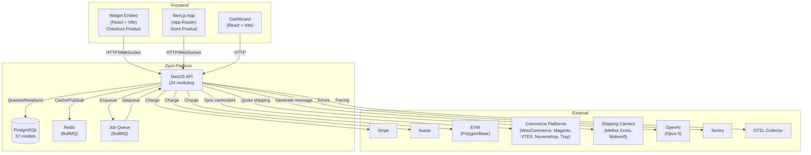

# RFC: Evolução Zyon — De Checkout Agêntico Para Plataforma de Comércio Conversacional

**Status:** Proposed  
**Data:** 2026-08-14  
**Autores:** Diego, Zyon Engineering Team  
**Reviewers:** Stakeholders, Architecture Council  

---

## 1. Resumo Executivo

Este RFC propõe a evolução da plataforma Zyon de um **checkout conversacional** (Produto 1: Zyon Agentic Checkout) para uma **plataforma completa de comércio eletrônico conversacional** (Produto 2: Zyon Agentic Store Builder).

**A premissa central:** O futuro das compras não é navegação (menus, filtros, páginas). É conversa.

A Zyon redefinirá como as pessoas compram na internet, transformando:
- Página de categoria → Pergunta natural ao agente
- Filtros → Perguntas conversacionais
- Comparação de produtos → Agente sugere e explica
- Carrinho → Estado mutável dentro da conversa
- Checkout → Continuação natural da conversa

**Dois produtos independentes, núcleo compartilhado:**

| Aspecto | Checkout | Store Builder |
|--------|----------|---|
| **Modelo** | B2B Embed (SDK widget) | B2C Storefront (custom domain) |
| **Catálogo** | Externo (Shopify, WooCommerce, etc.) | Interno (criado no dashboard) |
| **Experiência** | Conversa dentro do carrinho | Conversa É a loja |
| **Merchant** | Operador de loja existente | Empreendedor novo |
| **Entry point** | Integração via plugin/SDK | Create account → Demo em minutos |

**Outcome esperado:** Zyon passa de "ferramenta de checkout" para "plataforma de comércio" — posicionando-se como alternativa radicalmente diferente a Shopify, WooCommerce, e chatbots tradicionais.

---

## 2. Contexto Atual

### 2.1 O que Zyon É Hoje

**Zyon Agentic Checkout:** Um checkout conversacional que se integra em e-commerces de terceiros (B2B SaaS).

- Merchant configura regras, limites, políticas
- Buyer interage via widget (chat + voz) durante o checkout
- Agente negocia ofertas (descontos, frete), coleta dados, processa pagamento
- Integra com 6 plataformas de comércio (Shopify, WooCommerce, Magento, VTEX, Nuvemshop, Tray)
- 3 provedores de pagamento (Asaas PIX/Boleto, Stripe Card, EVM Crypto USDC)

### 2.2 Stack Técnico

**Monorepo TypeScript (pnpm workspaces):**
- **API:** NestJS (24 módulos + 232 specs)
- **Widget:** React 18 + Vite (Web Component)
- **Dashboard:** React 18 + Vite
- **Packages:** rules-engine, decision-engine, conversation-engine (LangGraph), shipping-engine, negotiation-engine, commerce-adapters, agentic-checkout-js
- **DB:** PostgreSQL 16 (57 models via Prisma)
- **Infra:** Redis/BullMQ, OpenTelemetry, Sentry, Prometheus, Docker Compose

### 2.3 Arquitetura Atual

**Modular monolith, Clean Architecture + DDD:**
- Multi-tenant por `merchant_id` + `global_user_id`
- Transactional outbox pattern (eventos)
- ACL entre contextos (bounded contexts isolados)
- LLM como auxiliar (nunca autoriza transações)
- Todos os motores (rules-engine, shipping-engine) são autoridade absoluta

**Decisões cristalizadas (29 ADRs):**
- ADR-0001: Modular monolith, não microsserviços
- ADR-0003: Event bus transactional outbox
- ADR-0005: Multi-tenant isolation por merchant_id
- ADR-0026: Production readiness tracker

### 2.4 O Que Funciona & É Pronto Para Produção

✅ **Engines:**
- rules-engine (discount caps, margin validation)
- decision-engine (offer orchestration)
- conversation-engine (26 specs, LLM safety)
- shipping-engine (10 specs)
- negotiation-engine (M2M buyer-merchant)

✅ **Integrações de Comércio:**
- 6 plataformas com adapters completos + unit + integration tests
- Webhook handling, cart validation, order sync

✅ **Pagamentos:**
- 3 provedores, routing, billing via BullMQ, idempotency

✅ **Buyer Accounts:**
- Phone OTP, WebAuthn FaceID, purchase history, preferences

✅ **Checkout:**
- Full conversational flow, offer negotiation, cart, checkout, fulfillment tracking

✅ **Dashboard:**
- Merchant settings, integrations, orders, customers, billing, audit log

✅ **Tests:**
- Playwright E2E (mocked + real API)
- 232 API specs (unit + integration)
- 70% coverage threshold enforced

### 2.5 Lacunas Para Store Builder

❌ **Produto interno:**
- Sem catálogo de produtos próprio (só integra externos)
- Sem SKU/variantes internas
- Sem estoque gerenciado internamente
- Sem preços próprios (só passthrough)

❌ **Experiência conversacional:**
- Sem intent detection (classifier)
- Sem conversation state machine
- Sem tool-calling orchestration
- Sem RAG para produtos/políticas

❌ **Storefront:**
- Sem frontend conversation-native (só widget embed)
- Sem Next.js app
- Sem WebSocket para chat tempo real
- Sem design tokens por merchant
- Sem deep links contextuais

❌ **Admin/Dashboard:**
- Sem gerenciamento de catálogo
- Sem CRUD de produtos
- Sem relatórios de loja
- Sem configuração de agente (personality, tone, knowledge base)
- Sem onboarding simplificado

❌ **E-commerce completo:**
- Sem categorias/coleções
- Sem reviews de produtos
- Sem sistema completo de trocas/devoluções
- Sem analytics de conversão
- Sem notificações ao buyer
- Sem domínios customizados

---

## 3. Problema

### 3.1 Mercado & Oportunidade

**Atual:** Zyon é uma ferramenta tática (reduz carrinho abandonado em checkout). É plugin de checkout, não é "loja".

**Oportunidade:** Conversa é mais natural que navegação. Lojas inteiras poderiam ser construídas sobre esse princípio — criando experiência radicalmente diferente de Shopify, Nuvemshop, WooCommerce.

**Mercado alvo:** Empreendedores, micro-negócios, marcas que querem vender por WhatsApp/chat/voz, sem complexidade de loja tradicional.

### 3.2 Por Que Não Apenas Expandir Checkout?

Checkout sozinho tem teto de mercado:
- Merchants que JÁ têm loja e querem otimizá-la
- Não atrai merchants que NÃO têm loja ainda
- Zyon é "ferramenta dentro de ferramenta" (dependência de Shopify, WooCommerce)

**Com Store Builder:**
- Zyon vira "plataforma" (loja completa)
- Merchants começam do zero em Zyon
- Zyon controla toda jornada (customer lifetime value + upsell)
- Posicionamento contra Shopify, não complementar

---

## 4. Visão do Produto

### 4.1 Conversation Is the Interface

A interface da loja é **conversação native**. Não é "chatbot lado a lado com loja tradicional".

**Não será:**
- Menu de categorias permanente
- Grade de produtos na lateral
- Página de produto convencional
- Filtros e facetas tradicionais
- Carrinho em página separada
- Checkout multi-página

**Será:**
- Área de conversa (centro)
- Agent avatar/visual
- Input de texto + voz
- Histórico da conversa (scrollável)
- Componentes comerciais renderizados NA conversa:
  - Product cards
  - Carrosséis
  - Comparações
  - Seletores de variação
  - Resumo de carrinho
  - Opções de frete
  - Componentes de pagamento
  - Rastreamento de pedido
  - Quick replies + call-to-action
- Mínima navegação (branding, ajuda, configurações)

### 4.2 Agent IS the Store

Não é "loja com um agente chatbot adicionado".

Agente não é um widget que abre em popup.

**Agente é a loja.** Tudo acontece dentro da conversa.

---

## 5. Princípios do Produto

1. **Conversation First:** Conversa é o meio de navegação, não um suplemento
2. **Deterministic Commerce:** IA recomenda. Commerce Core autoriza. Nunca IA autoriza transação.
3. **Agent as Copilot:** LLM compreende, explica, conduz. Motores (rules, shipping, decision) fazem negócio.
4. **Shared Core:** Checkout e Store compartilham mesmos engines, pagamentos, shipping. Feature flags diferem experiência.
5. **Multi-tenant Simplicity:** Merchant_id é boundary. Sem cross-tenant leakage. ACL por design.
6. **Production First:** E2E Playwright valida integração daily. Sem mocks em produção.
7. **Safe by Default:** Guardrails contra alucinação, injection, PII exposure.

---

## 6. Definição: Conversation-Native Commerce

**Conversation-native commerce** não é "e-commerce + chatbot". É arquitetura onde:

- **Conversa é a narrativa principal** — usuário não muda de contexto
- **Componentes comerciais são inseridos pelo agente** — não pelo usuário navegando
- **Ações são implícitas** — "quero ver mais" → agente renderiza, usuário não clica em link
- **Contexto é acumulativo** — agente lembra preferências, restrições, histórico
- **Fallback é determinístico** — se LLM falha, experiência não cai, usa template seguro
- **Transações são sempre confirmadas** — "confirma compra de R$X?" antes de qualquer débito

Contraste:

| Aspecto | Tradicional | Conversation-Native |
|--------|---|---|
| **Navegação** | Menus, links, filtros | Perguntas naturais |
| **Produto** | Página fixa | Card/carousel na conversa |
| **Descoberta** | Usuário busca | Agente recomenda proativamente |
| **Carrinho** | Página separada | Estado dentro da conversa |
| **Checkout** | 5-10 passos | Conversa progressiva |
| **Tempo decisão** | Rápido (sim/não) | Conversacional (perguntas, esclarecimentos) |
| **Mobile** | Difícil (muitos cliques) | Natural (voice + touch) |

---

## 7. E-commerce Tradicional vs Chatbot Comercial vs E-commerce Agêntico

| Dimensão | E-comm Tradicional | Chatbot Comercial | E-comm Agêntico |
|---|---|---|---|
| **Interface** | Páginas + filtros | Loja tradicional + chat lateral | Conversa é a interface |
| **Navegação** | Links, menus | Chat abre FAQs, linká para loja | Tudo dentro da conversa |
| **Recomendação** | Algoritmo em feed/categoria | Chat tira dúvida | Agent proativamente sugere |
| **Carrinho** | Página separada | Tradicional | Dentro da conversa |
| **Checkout** | Multi-página | Tradicional | Conversa progressiva |
| **Compra** | Rápido (1-2 min) | Rápido | Consultivo (2-10 min) |
| **Negociação** | Não existe | Não existe | Agent pode negociar |
| **Voz** | Não | Não | Primeira classe (STT/TTS) |
| **Mercado** | Imenso, maduro | Pequeno, experimental | Emergente, diferenciado |
| **Exemplo** | Shopify | Shopify + drift.com | **Zyon** |

---

## 8. Produtos: Zyon Agentic Checkout vs Store Builder

### 8.1 Zyon Agentic Checkout (Produto 1 - Atual)

**Modelo:** B2B SaaS. Embed em e-commerces de terceiros.

**Casos de uso:**
- Merchant tem loja em Shopify/WooCommerce/Magento
- Quer otimizar checkout
- Integra widget Zyon via SDK/plugin
- Buyers veem agente durante checkout

**Responsabilidades Zyon:**
- Carrinho (pode vir de Shopify, Zyon calcula descontos)
- Promoções (negocia via agente, rules-engine aprova)
- Frete (consulta shipping-engine, agente sugere)
- Pagamento (Asaas/Stripe/Crypto)
- Fulfillment (tracking)

**Responsabilidades Merchant:**
- Catálogo (em Shopify/WooCommerce)
- Estoque (em Shopify/WooCommerce)
- Preços (em Shopify/WooCommerce)

**Diferencial:** Conversa reduz abandono. Negocia frete/desconto. Aumenta AOV.

**Integração:** Plugin/SDK. Instala em minutos.

---

### 8.2 Zyon Agentic Store Builder (Produto 2 - Novo)

**Modelo:** B2C Storefront. Loja completa, conversacional.

**Casos de uso:**
- Empreendedor quer criar loja (não tem hoje)
- Quer vender por conversa (natural para ele)
- Quer tudo em um lugar (sem 3 ferramentas)
- Deploy em 24h (não em 2 meses)

**Onboarding:**
1. Criar conta + empresa
2. Definir marca (logo, cores, fontes)
3. Cadastrar produtos (15-30 itens) ou importar CSV
4. Configurar pagamentos (Pix/Boleto/Stripe)
5. Configurar frete
6. Configurar agente (personalidade, tom, regras negociação)
7. Preview + testes
8. Publicar (custom domain ou subdomain Zyon)

**Conversas esperadas:**
- "Tem camiseta preta G?"
- "Quero um presente de até R$100"
- "Qual é melhor, tênis Nike ou Adidas?"
- "Pode fazer R$50?"
- "Precisa chegar segunda?"
- "Adiciona ao carrinho"
- "Confirma aí"

**Responsabilidades Zyon:**
- Catálogo (inteiro — Zyon gerencia)
- Estoque (Zyon gerencia)
- Preços (Zyon gerencia)
- Domínio (customizado ou subdomain)
- Chat + voz
- Pagamentos
- Fulfillment
- Pós-venda (trocas, devoluções)

**Diferencial:** Merchant inicia em horas. Customer experience é radicalmente diferente (não navegação). Zyon controla tudo (retention + upsell).

---

## 9. Objetivos

### 9.1 Comerciais
- [ ] **Expandir TAM:** De checkout-only para "plataforma de comércio"
- [ ] **Simplificar onboarding:** De "configure integração" para "crie loja em 4 passos"
- [ ] **Aumentar LTV:** Zyon vira mais que checkout — vira plataforma completa
- [ ] **Diferenciar:** Posicionamento radical vs Shopify (conversa vs navegação)
- [ ] **Escala:** 10K+ lojas agênticas em 12 meses

### 9.2 Técnicos
- [ ] **Reutilizar:** Máximo reuso de engines, payment, shipping, audit (shared core)
- [ ] **Modular:** Checkout continua funcionando sem qualquer mudança
- [ ] **Escalável:** Suportar 100K concurrent conversations
- [ ] **Observável:** Tracing, metrics, alerts por loja e por agent
- [ ] **Testável:** E2E Playwright loop diário, evals de agent
- [ ] **Seguro:** LGPD compliant, PCI compliant, guardrails contra alucinação

### 9.3 Experiência
- [ ] **Conversa natural:** Agent entende contexto, faz perguntas relevantes, nunca pede informações desnecessárias
- [ ] **Voz e texto:** Ambos primeira-classe
- [ ] **Mobile:** Otimizado para toque + voz (não mouse + desktop)
- [ ] **Acessível:** WCAG 2.2 AA
- [ ] **Rápido:** Time to first message < 2s

---

## 10. Não Objetivos

- [ ] ❌ Não ser "Shopify com chat"
- [ ] ❌ Não duplicar Shopify/WooCommerce (eles já fazem bem)
- [ ] ❌ Não suportar multi-loja por merchant (v1: 1 merchant = 1 loja)
- [ ] ❌ Não ter builder visual (tipo Figma)
- [ ] ❌ Não fazer marketplace (seller/buyer, não é eBay)
- [ ] ❌ Não fazer SaaS genérico (foco: comércio conversacional)
- [ ] ❌ Não quebrar Checkout product (100% backward compatible)
- [ ] ❌ Não implementar em v1: subscriptions, digital products, marketplace, B2B pricing
- [ ] ❌ Não fazer fulfillment/warehouse management (apenas tracking)

---

## 11. Personas & Jobs to Be Done

### 11.1 Persona: Empreendedor (Buyer)

**Quem:** Maria, 28, microempreendedora de moda. Começou vendendo em grupo de WhatsApp. Quer profissionalizar.

**Frustração:**
- Shopify é caro (R$29+)
- WooCommerce é técnico (requer host, deve atualizar plugins)
- Processo de compra demorado (navegação + forms)
- Perguntas frequentes (tamanho, cor, frete, desconto)

**Job to be done:** "Quero uma loja que pareça conversa — do jeito que meus clientes já falam comigo no WhatsApp"

**Como usaria Zyon:**
- Cria conta em 5 min
- Cadastra 20 produtos (nome, preço, imagem)
- Configura Pix/Boleto
- Pública
- Compartilha link com clientes
- Clientes conversam, compram

---

### 11.2 Persona: Lojista (Merchant)

**Quem:** João, 45, dono de loja de suplementos. Tem WooCommerce desde 2015.

**Frustração:**
- Checkout abandono é 70%
- Clientes não sabem qual creatina escolher (sem sabor? com sabor? qual marca?)
- Frete é sempre surpresa (caro)
- Descontos negociados ad-hoc (muito manual)

**Job to be done:** "Quero um agente que responda perguntas, recomende produtos e finalize a compra — reduzindo abandono"

**Como usaria Zyon Checkout:**
- Integra plugin WooCommerce
- Configura regras (max 15% desconto, recomenda frete mais barato)
- Buyers veem agente durante checkout
- Negocia, compra

**Diferença Zyon vs concorrentes:** Agente usa voz, conversa natural (não menu), consegue negociar.

---

## 12. Jornada Completa do Consumidor (Store Builder)

### 12.1 Phase: Awareness

1. Cliente vê anúncio/link da loja (TikTok, Instagram, Google, referência)
2. Clica
3. Página carrega (branding, identidade visual do merchant)
4. Agente fala: "Oi! Bem-vindo à [Loja]. Vendemos [categoria]. Como posso ajudar?"

### 12.2 Phase: Discovery

5. Cliente: "Tem camiseta preta G?"
6. Agente: `searchProducts("camiseta preta G")` → busca catálogo
7. Renderiza 3 opções (cards na conversa) com imagem, preço, estoque
8. Cliente clica em uma / pede "mais detalhes"
9. Agente: `getProductDetails()` → renderiza media gallery, todas as variações, reviews

### 12.3 Phase: Consideration

10. Cliente: "Qual delas é melhor? Qual a diferença?"
11. Agente: `compareProducts()` → renderiza tabela (material, peso, acabamento, avaliações)
12. Cliente: "Pode fazer R$40?" (preço original R$50)
13. Agente: `calculatePrice()` com regras merchant → "Posso fazer R$45 (10% off)"
14. Cliente: "Fechado. Mas precisa chegar até sexta."
15. Agente: Nota restrição temporal → `quoteShipping()` → "Express sai hoje, chega quinta"
16. Cliente: "Blz, adiciona aí"

### 12.4 Phase: Cart & Checkout

17. Agente: `addItemToCart()` → "Adicionei 1x Camiseta Preta G. Quer mais algo?"
18. Cliente: "Tem óculos?"
19. Agente: Recomenda óculos complementar → "Se pegar esse óculos, você ganha 5% off no combo"
20. Cliente: "Passa."
21. Agente: "Beleza. Seu carrinho tem 1x Camiseta (R$45). Frete express (R$15). Total: R$60. Quer confirmar?"
22. Cliente: "Sim"
23. Agente: `createCheckoutSession()` → handoff para checkout conversacional Zyon
24. Agente (checkout): "Qual seu email?"
25. Cliente: "maria@email.com"
26. Agente: "Qual seu endereço?"
27. Cliente: "Rua X, 123, São Paulo"
28. Agente: `quoteShipping()` → "Frete será R$15. Confirma?"
29. Cliente: "Confirma"
30. Agente: "Agora o pagamento. Aceita Pix?"
31. Cliente: "Sim"
32. Agente: Renderiza QR code Pix
33. Cliente escaneia, paga via banco
34. Agente: `confirmOrder()` → "Compra confirmada! Pedido #12345"

### 12.5 Phase: Post-Sale

35. Agente: "Seu pedido saiu hoje. Rastreamento: [link]"
36. Cliente ao dia seguinte: Acompanha rastreamento via link (dentro da conversa)
37. Entrega chega: Agente notifica "Seu pedido foi entregue!"
38. Cliente dias depois: "Oi, o produto veio com defeito" → Agente: `requestReturn()` → gera RMA, coleta, reembolso

---

## 13. Jornada Completa do Lojista (Store Builder)

### 13.1 Onboarding

1. Acessa zyon.com/store → "Crie sua loja conversacional"
2. Form: Email, senha
3. Form: Nome loja, categoria (Moda, Suplementos, Eletrônicos, etc.)
4. Form: Logo, cores principais, fontes
5. Upload: CSV de produtos (ou cria manual no dashboard)
6. Form: Configurar pagamentos (Pix, Stripe, outros)
7. Form: Configurar frete (CEP origem, transportadoras)
8. Form: Configurar agente
   - Tom de voz: Formal, Casual, Descontraído
   - Personalidade: Prestativa, Engraçada, Profissional
   - Conhecimento (FAQ): "Quanto sai o frete para SP?"
   - Limites negociação: Máx 20% desconto, mín margem 15%
   - Quick replies padrão: "Ver mais", "Comparar", "Adicionar ao carrinho"
9. Preview (ambiente de demo)
10. Publicar (gerada URL `minhaloja.zyon.com` ou custom domain)

### 13.2 Dia a Dia

11. Acessa dashboard
    - **Visão geral:** Vendas hoje, conversas ativas, ticket médio
    - **Pedidos:** Lista, status, rastreamento
    - **Clientes:** Base (email, compras, preferências)
    - **Produtos:** Editar estoque, preços, fotos
    - **Agent performance:** Objections resolvidas, taxa conversão, tempo médio conversa
    - **Analytics:** Revenue, AOV, cart abandonment, satisfaction score

### 13.3 Operação

12. Novo pedido chega
    - Dashboard notifica
    - Lojista marca como "enviado" (manual ou integrada com transportadora)
    - Sistema auto-notifica cliente via chat: "Seu pedido saiu!"

13. Cliente pede devolvera/troca
    - Agent escalas para human (Zyon oferece handoff)
    - Ou: Lojista gerencia via dashboard (RMA, label, reembolso)

14. Lojista quer aumentar vendas
    - Cria promoção: "15% off em quem usar código VERAO"
    - Cria recomendação: "Se comprar calça, sugerye 2x camiseta por R$X"
    - Zyon agent automaticamente applica

---

## 14. Capacidades Existentes (Reusáveis)

### 14.1 Engines (100% reutilizáveis)

- ✅ **rules-engine** — Discount hard-caps, margin validation
- ✅ **decision-engine** — Offer orchestration (what to offer, when)
- ✅ **conversation-engine** — LangGraph + OpenAI, objection classification, message generation, cross-sell extraction (26 specs)
- ✅ **shipping-engine** — CEP validation, package dimensions, quote dedup, cheapest-quote selection (10 specs)
- ✅ **negotiation-engine** — M2M buyer-merchant agent protocol (2 specs)

### 14.2 Commerce Adapters (Parcialmente reutilizável)

- ✅ **commerce-adapters** — 6 platforms, shared `CommerceProviderPort`
  - Store Builder não usa adapters (tem catálogo interno)
  - Checkout continua usando (para B2B merchants)

### 14.3 Payments (100% reutilizável)

- ✅ **Asaas adapter** (PIX, Boleto)
- ✅ **Stripe adapter** (Card)
- ✅ **EVM Crypto adapter** (USDC)
- ✅ **Routing payment adapter** (dispatches to correct provider)
- ✅ **Billing module** (merchant subscription via BullMQ)

### 14.4 Infrastructure

- ✅ **Prisma schema** — 57 models, patterns proven
- ✅ **Modular monolith** — 24 modules, bounded contexts, ACL proven
- ✅ **Event bus** — Transactional outbox pattern working
- ✅ **Multi-tenancy** — merchant_id isolation proven
- ✅ **Audit logging** — MerchantAuditEvent pattern
- ✅ **API contracts** — Zod schemas

### 14.5 Testing Infrastructure

- ✅ **Playwright E2E** — Widget + dashboard configs working
- ✅ **Custom test runners** — API unit + integration patterns
- ✅ **Fixtures** — Auth, database, commerce factories

---

## 15. Gap Analysis (Matriz: Existe vs Falta)

| Capacidade | Checkout | Existe | Store Builder | Falta | Prioridade | Fase |
|---|---|---|---|---|---|---|
| **Catálogo** | Externo | ✅ | Interno | ❌ | P0 | 1 |
| **Produtos/SKUs** | Síncronizado | ✅ | CRUD próprio | ❌ | P0 | 1 |
| **Variantes** | Passthrough | ✅ | Gerenciar | ❌ | P0 | 1 |
| **Estoque** | Externo | ✅ | Gerenciar + reserva | ❌ | P0 | 1 |
| **Preços** | Passthrough | ✅ | CRUD próprio | ❌ | P0 | 1 |
| **Rules** | rules-engine | ✅ | rules-engine | ✅ | P0 | — |
| **Shipping** | shipping-engine | ✅ | shipping-engine | ✅ | P0 | — |
| **Payment** | 3 providers | ✅ | 3 providers | ✅ | P0 | — |
| **Decisioning** | decision-engine | ✅ | decision-engine | ✅ | P0 | — |
| **Conversation** | conversation-engine | ✅ | conversation-engine | ✅ | P0 | — |
| **Intent Detection** | Partial | ⚠️ | Full state machine | ❌ | P1 | 2 |
| **Tool Calling** | Partial | ⚠️ | Full orchestration | ❌ | P1 | 2 |
| **RAG (Products)** | Não | ❌ | Embeddings + search | ❌ | P2 | 3 |
| **Storefront Frontend** | Widget embed | ✅ | Next.js full app | ❌ | P0 | 3 |
| **Dashboard** | Existente | ✅ | Expandir + feature gates | ⚠️ | P0 | 2 |
| **Custom Domain** | Não | ❌ | DNS + CNAME | ❌ | P1 | 3 |
| **Categories** | Externo | ✅ | Criar + gerenciar | ❌ | P2 | 2 |
| **Collections** | Externo | ✅ | Criar + gerenciar | ❌ | P2 | 2 |
| **Reviews** | Não | ❌ | Buyer-submitted | ❌ | P2 | 2 |
| **Returns/RMA** | Fulfillment partial | ⚠️ | Full saga | ❌ | P1 | 4 |
| **Refunds** | Passthrough | ✅ | Full handling | ⚠️ | P1 | 4 |
| **Customer CRM** | Partial | ⚠️ | Full (preferences, history, wishlist) | ❌ | P2 | 2 |
| **Notifications** | Minimal | ⚠️ | Email + SMS + push | ❌ | P2 | 2 |
| **Analytics** | Funnel | ✅ | Dashboard (revenue, AOV, agent perf) | ❌ | P2 | 3 |
| **Voice (STT/TTS)** | Pilot | ⚠️ | Production | ❌ | P1 | 3 |
| **LGPD Compliance** | Partial | ⚠️ | Full (access, delete, portability) | ❌ | P1 | 1 |
| **API Docs** | Partial | ⚠️ | Complete | ⚠️ | P2 | — |

**Legend:** ✅ = implemented + tested, ⚠️ = partial, ❌ = missing

---

## 16. Escopo do MVP (Fase 0 + 1 + 2)

### 16.1 Fase 0: Descoberta & Especificação (CURRENT)

✅ **Completado:**
- [x] AS-IS inventory
- [x] Gap analysis
- [x] RFC (this document)
- [x] Event Storming (39 events, 4 flows)
- [x] ADRs 0030-0033 (product catalog, tools, dashboard, frontend)
- [x] 10 blocking questions identified

### 16.2 Fase 1: Fundação (Months 1-2)

**Goal:** Shared infrastructure, feature flags, multi-merchant isolation confirmed.

**Deliverables:**
- [ ] Feature flag system (enable/disable Store Builder per merchant)
- [ ] Internal product catalog schema (10 new Prisma models)
- [ ] Product CRUD endpoints (POST/PUT/DELETE /products)
- [ ] Stock reservation model (concurrent checkout + expiry)
- [ ] Catalog repository + use-cases
- [ ] Dashboard conditional rendering (Checkout vs Store plan views)
- [ ] E2E test harness (Playwright loop validating catalog + product flow)
- [ ] Observability instrumented (tracing, metrics)

**Risks:**
- Multi-tenant isolation at scale (need load testing)
- Stock concurrency (race condition under 1000 concurrent adds)

---

### 16.3 Fase 2: Store Builder MVP (Months 3-5)

**Goal:** Onboarding, configuration, storefront launch.

**Deliverables:**
- [ ] Onboarding flow (account, brand, catalog upload, config)
- [ ] Product import (CSV, manual, API)
- [ ] Agent configuration (personality, tone, limits, knowledge base)
- [ ] Preview environment (test before publish)
- [ ] Publish & domain management (zyon.com subdomain)
- [ ] Dashboard expanded (products, orders, customers, agent settings)
- [ ] Merchant analytics (revenue, orders, conversation metrics)
- [ ] Customer support escalation (human handoff)
- [ ] Returns/RMA basic (create RMA, generate label)

**E2E:** Create store → Upload 20 products → Configure agent → Preview → Test checkout → Publish

---

### 16.4 Post-MVP (Deferred to Phase 3+)

- [ ] Conversation state machine (advanced intent detection)
- [ ] Next.js storefront (currently using React Vite widget)
- [ ] WebSocket real-time (progressive enhancement)
- [ ] Voice (production-grade STT/TTS)
- [ ] Custom domains (DNS/CNAME setup)
- [ ] RAG for products (embeddings, semantic search)
- [ ] Advanced analytics (cohort, LTV, agent performance by intent)
- [ ] Multi-loja per merchant
- [ ] Bulk import async jobs (100K+ products)
- [ ] Marketplace (seller/buyer multi-tenant)

---

## 17. Escopo Posterior (Deferred)

### 17.1 Fase 3: Enhancements

- [ ] Next.js storefront (replace Vite widget for Store product)
- [ ] Voice (production STT/TTS, latency < 1s)
- [ ] Custom domains (auto-DNS provisioning)
- [ ] Advanced RAG (semantic product search)
- [ ] Subscription products
- [ ] Digital products (downloads, licenses)
- [ ] Gift cards

### 17.2 Fase 4: Scale

- [ ] Multi-loja per merchant
- [ ] Team members (RBAC, invite, permissions)
- [ ] Marketplace (controlled sellers, multi-tenant catalog)
- [ ] Advanced integrations (ERP, CRM, fulfillment APIs)
- [ ] White label (own branding)

### 17.3 Explicitamente NÃO em Scope

- ❌ Shopify API parity (não somos Shopify)
- ❌ Builder visual (drag-drop pages) — conversation-first only
- ❌ B2B pricing (quote workflows)
- ❌ Marketplace (eBay-like, many sellers competing)
- ❌ Warehouse management (fulfillment only)
- ❌ HR/operations features (staff scheduling, etc.)

---

## 18. Arquitetura Proposta

### 18.1 C4 Context Diagram



### 18.2 Bounded Contexts (Updated)

**Existing (unchanged):**
- `checkout` — Session, events, offers, orders, scoring
- `payment` — Intents, authorizations, webhooks
- `commerce` — Platform adapters, sync, webhooks
- `shipping` — Quotes, methods, fulfillment
- `buyer-account` — Profiles, addresses, auth, preferences
- `auth` — Merchant login, JWT
- `audit` — Event logging
- `negotiation` — M2M protocol
- `coupons` — Redemption, validation
- `cross-sell` — Promotions, suggestions

**New for Store Builder:**
- `catalog` — Internal product management, SKUs, variants, stock (NEW)
- `storefront` — Conversation orchestration, intent detection, tool calling (NEW)
- `store-settings` — Brand config, agent personality, domain management (NEW)
- `store-analytics` — Revenue, conversation metrics, agent performance (NEW)

**Feature-gated (both products):**
- `merchant-dashboard` — Conditional pages per plan (Checkout vs Store)

---

## 19. Bounded Contexts (8 Total - Refined)

### 19.1 `catalog` (NEW - Core)

**Responsabilidades:**
- Product CRUD (name, description, category, SKU)
- Variant management (color, size, weight, attributes JSON)
- Stock management (quantity, reserved, warehouse-aware)
- Media gallery (images, videos, alt text, order)
- Category & collection management
- Product reviews (buyer-submitted, moderation)
- Pricing rules (base price, cost, tax, promotion overrides)
- Bulk import (CSV → async job)

**Modelos Prisma (10 novos):**
- `Product`, `ProductVariant`, `ProductStock`, `ProductMedia`, `ProductPrice`
- `ProductCategory`, `ProductCollection`, `CollectionProduct`
- `ProductReview`, `ProductSearchVector` (pgvector para RAG)

**Use-cases:**
- add-product, update-product, delete-product
- add-variant, update-variant, reserve-stock, confirm-stock, release-stock
- search-products (full-text + semantic via pgvector)
- get-product-details, compare-products
- import-products-csv, bulk-update-stock
- add-review, approve-review, get-reviews

**Dependências:**
- `merchant` (tenant boundary)
- `audit` (MerchantAuditEvent per change)
- `rules-engine` (pricing overrides, promotions)

---

### 19.2 `storefront` (NEW - Core)

**Responsabilidades:**
- Conversation session lifecycle (WELCOME → DISCOVERY → CART → CHECKOUT → ORDER_TRACKING)
- Intent classification ("tem camiseta?" = PRODUCT_SEARCH, "pode fazer R$X?" = PRICE_NEGOTIATE)
- Tool orchestration (searchProducts, getProductDetails, compareProducts, etc.)
- Agent state machine (current phase, context accumulation)
- Message generation safety (no hallucination, no fake data, guardrails)
- Session memory (preferences, budget, history within 30 min)

**Agent Tools (deterministic, never fails silently):**
```
searchProducts(query, filters?) → Product[]
getProductDetails(productId, variantId?) → ProductFull
compareProducts(productIds[]) → ComparisonTable
getProductAvailability(productId, variantId) → {inStock, qty, shippingTime}
getProductReviews(productId, limit) → Review[]
calculatePrice(variantId, qty, couponCode?) → {price, discount, total}
addItemToCart(cartId, variantId, qty) → Cart
updateCartItem(cartId, itemId, qty) → Cart
removeCartItem(cartId, itemId) → Cart
getCart(cartId) → CartFull
quoteShipping(cartId, address, speed?) → ShippingOptions[]
applyCoupon(cartId, couponCode) → {discount, newTotal}
createCheckoutSession(cartId) → {checkoutSessionId, url}
getOrderStatus(orderId) → OrderFull
requestReturn(orderId, reason) → RMAId
requestHumanSupport() → {ticketId, queueTime}
```

**State Machine:**
- WELCOME → (DISCOVERY via product search)
- DISCOVERY → (CART via add-to-cart, or compare, or more info)
- CART → (CHECKOUT via "finaliza", or back to DISCOVERY via "quer mais?")
- CHECKOUT → (delegated to checkout module, returns ORDER_TRACKING)
- ORDER_TRACKING → (requestReturn, requestHumanSupport, or exit)

**Modelos reuso:**
- `BuyerConversation` (existing)
- `CheckoutSession` (existing)

**Use-cases:**
- start-conversation, resume-conversation, archive-conversation
- send-message, classify-intent, execute-tool, validate-tool-output
- render-blocks (ProductCard, CartSummary, QuickReplies, etc.)
- escape-to-human (handoff to support)

**Dependências:**
- `catalog` (search, details, availability, reviews)
- `checkout` (cart, checkout session)
- `coupons` (apply-coupon)
- `conversation-engine` (LLM message generation)
- `decision-engine` (what to offer)
- `rules-engine` (discount approval)

---

### 19.3 `store-settings` (NEW - Configuration)

**Responsabilidades:**
- Brand configuration (logo, colors, fonts, mission)
- Agent personality (tone, persona, knowledge base FAQ)
- Negotiation rules (max discount %, min margin %, coupon limits)
- Domain management (primary domain, custom CNAME, SSL)
- Webhook configuration (third-party integrations)
- Feature flag overrides (enable/disable returns, voice, analytics)
- Notification preferences (email, SMS, push, by event)
- API keys & webhooks (developer integrations)

**Modelos Prisma (6 novos):**
- `MerchantStore`, `MerchantTheme`, `MerchantAgent`
- `MerchantNegotiationRules`, `MerchantDomain`, `MerchantWebhook`, `MerchantNotification`

**Use-cases:**
- get-store-settings, update-store-settings
- get-agent-config, update-agent-config
- get-negotiation-rules, update-negotiation-rules
- register-custom-domain, verify-domain, delete-domain
- register-webhook, test-webhook, delete-webhook

---

### 19.4 `inventory` (NEW - Stock & Reservations)

**Responsabilidades:**
- Stock quantity tracking (per warehouse, per variant)
- Reservation lifecycle (add → confirm → release/expire after 30 min)
- Stock adjustments (manual, import, returns)
- Inventory forecasting (low-stock alerts)
- Multi-warehouse support (future)

**Modelos Prisma (5 novos):**
- `InventoryWarehouse`, `InventoryItem`, `InventoryReservation`
- `InventoryAdjustment`, `InventoryAlert`

**Use-cases:**
- reserve-stock (on add-to-cart)
- confirm-stock (on order completion)
- release-stock (on checkout abort, auto-expire after 30 min)
- adjust-stock (manual, import)
- forecast-reorder (alert merchant when low)

**Dependências:**
- `catalog` (variant validation)
- `checkout` (reserve on add-to-cart)

---

### 19.5 `returns` (NEW - RMA & Refunds - Full Saga)

**Responsabilidades (7-step saga with compensating transactions):**
1. Create RMA (buyer initiates return reason)
2. Generate shipping label (Melhor Envio or manual)
3. Item received & scanned (merchant scans barcode)
4. Item inspected (pass/fail/partial condition)
5. Refund processed (payment provider processes)
6. Inventory restored (stock increased)
7. Compensation issued (if damaged/lost)

**Modelos Prisma (6 novos):**
- `Return`, `ReturnItem`, `ReturnLabel`
- `ReturnInspection`, `ReturnRefund`, `ReturnCompensation`

**Saga Events:**
- ReturnRequested, ReturnLabelGenerated, ReturnShipped
- ReturnReceived, ReturnInspected (PASS | FAIL | PARTIAL)
- RefundProcessed (or RefundFailed → retry + escalate)
- InventoryRestored, CompensationIssued

**Compensating Transactions:**
- Step 2 fails: Escalate to human, manual label generation
- Step 5 fails: Retry queue (3 attempts), then human escalation
- Step 6 fails: Audit event, manual inventory adjustment

**Dependências:**
- `checkout` (find original order)
- `catalog` (inventory restoration)
- `payment` (refund processing)
- `shipping` (label generation)

---

### 19.6 `store-analytics` (NEW - Reporting)

**Responsabilidades:**
- Conversation metrics (count, duration, resolution rate, CSAT)
- Revenue metrics (orders, AOV, LTV, repeat rate)
- Agent performance (objection resolution rate, conversion by intent)
- Product performance (best-sellers, low-conversion, review scores)
- Funnel analysis (discovery → cart → checkout → payment → order)
- Cohort analysis (weekly, monthly retention)

**Modelos Prisma (denormalized read models - 5 novos):**
- `StoreConversationMetric`, `StoreOrderMetric`, `StoreAgentMetric`
- `StoreProductMetric`, `StoreFunnelMetric`

**Use-cases:**
- get-revenue-summary (today, week, month)
- get-conversation-metrics (by intent, product)
- get-agent-performance (resolution rate, conversion lift)
- get-product-performance (best-sellers, low-conversion)
- get-funnel-analysis (drop-off by stage)
- export-analytics (CSV, PDF)

**Data Collection:**
- Events from `checkout` module (order placed)
- Events from `storefront` module (tool calls, intent)
- Aggregated nightly via BullMQ job

---

### 19.7 `merchant-dashboard` (Enhanced - UI)

**Changes for Store Builder:**
- New pages (conditional if MERCHANT_PLAN = STORE):
  - `/dashboard/store` (brand, agent config, domain)
  - `/dashboard/catalog` (products, variants, stock)
  - `/dashboard/customers` (full CRM, not just sync)
  - `/dashboard/analytics` (storefront metrics)
- Hidden tabs (if STORE plan):
  - Integrations, Checkout Settings, Commerce Connections
- Shared tabs (both plans):
  - Orders (different views per plan)
  - Billing, Team Members

---

### 19.8 `buyer-accounts` (Existing - Enhanced)

**New for Store:**
- Wishlist (save products for later)
- Purchase history per store (not just global)
- Preferences per store (budget, favorite categories, allergies)
- Notification preferences (email, SMS, push)
- Saved addresses (auto-populate shipping)
- Saved payment methods (tokenized)

---

## 20. Modelo de Domínio (Key Aggregates)

### 20.1 Product Aggregate

```
Product (AggregateRoot)
├── ProductId
├── MerchantId (tenant boundary)
├── Name
├── Description
├── Category
├── CreatedAt
│
└── Variants[] (value objects)
    ├── Variant
    │   ├── VariantId
    │   ├── SKU
    │   ├── Attributes (JSON: size, color, etc.)
    │   ├── Price
    │   ├── Cost
    │   ├── TaxPercent
    │   └── Media[]
    │       └── MediaId, URL, Alt, Type (image/video)
    │
    └── Stock[]
        └── StockId, Quantity, Reserved, Warehouse
```

**Invariants:**
- `Quantity >= Reserved` (at all times)
- `SKU` is unique per merchant
- `Price > Cost` (or margin-negative, flagged)
- At least one variant per product

---

### 20.2 Conversation Aggregate

```
Conversation (AggregateRoot)
├── ConversationId
├── StoreId
├── BuyerId (global_user_id)
├── Cart[] (references CheckoutSession)
│   └── CartItem (ProductId, VariantId, Qty, Price, Discount)
│
├── Messages[]
│   ├── MessageId
│   ├── Role (customer | agent)
│   ├── Text
│   ├── Blocks[] (product_card, quick_replies, etc.)
│   ├── ToolCalls[] (if agent message)
│   │   └── Tool, Input, Output, Success
│   └── CreatedAt
│
├── State
│   ├── CurrentPhase (WELCOME, DISCOVERY, COMPARISON, CART, CHECKOUT, ORDER_TRACKING)
│   ├── Intent (PRODUCT_SEARCH, COMPARE, PRICE_NEGOTIATE, ADD_CART)
│   ├── Context (budget, shipping_constraint, size_needed, etc.)
│   └── LastToolCall
│
├── Preferences
│   ├── BudgetMax
│   ├── ShippingSpeed (standard | express | overnight)
│   ├── PaymentMethod
│   └── SavedAddresses[]
│
└── ExpiresAt (30 min idle)
```

**Invariants:**
- Only one unfinalized checkout per conversation
- Cart total = sum(item prices) - discounts + shipping + tax
- Tool calls are deterministic (no side effects until checkout)
- Cart item qty <= product stock (or reserved)

---

### 20.3 Store Aggregate

```
Store (AggregateRoot)
├── StoreId
├── MerchantId (tenant boundary)
├── Name
├── Brand
│   ├── Logo
│   ├── Colors (primary, secondary, accent)
│   ├── Fonts (heading, body)
│   └── LogoUrl
│
├── Agent
│   ├── Personality (formal, casual, fun)
│   ├── Tone (helpful, professional, playful)
│   ├── KnowledgeBase (FAQ, product specs, policies)
│   ├── QuickReplies[]
│   ├── NegotiationLimits
│   │   ├── MaxDiscountPercent
│   │   ├── MinMarginPercent
│   │   └── MaxCouponValue
│   └── SupportEscalation (human handoff rules)
│
├── Domain
│   ├── PrimaryDomain (custom or zyon.com subdomain)
│   ├── CustomDomainVerified (boolean)
│   └── DnsRecords[]
│
├── Integrations
│   ├── PaymentMethods[] (pix, card, crypto)
│   ├── ShippingCarriers[] (melhor envio, etc.)
│   └── NotificationChannels[] (email, sms, push)
│
└── FeatureFlags
    ├── VoiceEnabled
    ├── ReturnsEnabled
    ├── NotificationsEnabled
    └── AnalyticsEnabled (premium)
```

**Invariants:**
- One primary domain
- At least one payment method
- Store must be published before public access

---

## 21-40: [CONTINUAR NA PARTE 2 - Veja RFC-agentic-commerce-platform-part2.md]

---

## Próximas Etapas

1. **Aprovação do RFC** — Staff review, decisões sobre 10 bloqueantes
2. **Fase 1 Sprint** — Catalogo internal, feature flags, stock reservation
3. **E2E Loop** — Playwright daily validation
4. **Parallelização** — 8-10 engineers em contextos diferentes (API, Dashboard, Catalog, Storefront, Ops)

**Objetivo:** MVP Store Builder live em produção dentro de 5 meses.

