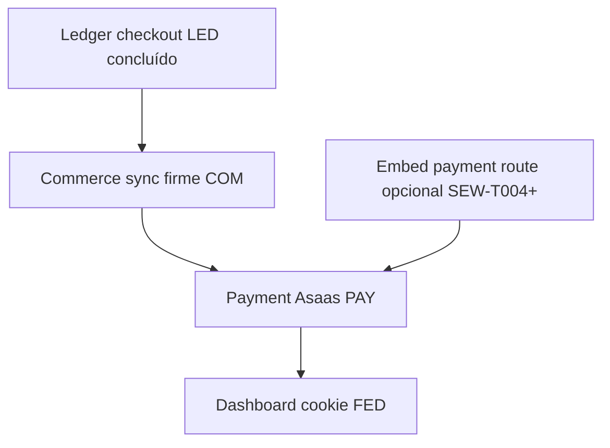

# AACP · Dashboard de Progresso dos Módulos (estado real do repo)

> **For agentic workers:** REQUIRED SUB-SKILL: Use superpowers:subagent-driven-development (recommended) ou superpowers:executing-plans para continuar trabalho nos módulos abaixo.

**Goal:** Um único sítio com **progresso numérico**, **lista de tasks por plano em `plans/modules/`** e marcação contra o que **existem mesmo** em código (Nest, Prisma, widget, dashboard).

**Architecture:** Estado cruza **`docs/superpowers/plans/modules/*.md`** (IDs de Task) + inventário efectivo **`apps/api/src/modules`** + **`packages/*`** + **`apps/widget`** + **`apps/dashboard`**. Este ficheiro **não** substitui `STATE.md`; convém eventualmente alinhar a secção *Deferred* de `.specs/project/STATE.md` (vários itens lá estão já superados pela implementação embed/negociação).

**Tech Stack:** já descrito nos planos por módulo (`mvp-gap-overview.md`).

**Última auditoria rápida de código/repo:** **2026-05-04** — Ledger checkout (LED) integrado em API + docs; foco seguinte **Commerce sync (COM)**.

---

## Contadores globais (tarefas planeadas só nos docs `plans/modules`)

| Métrica | Valor |
|--------|-------|
| Ficheiros de plano modular | **8** em `docs/superpowers/plans/modules/` |
| Tasks explícitas (IDs `*-T*` nos headings) **somatório** | **52** |
| Tasks **implementadas ou substancialmente cobertas** no código atual | **~27** (**~52%** do backlog modular planeado) |
| “Módulos” com **≥1 task em aberto relevante MVP** | **5** |

> Nota percentual: apenas **plans/modules** são contadas; excludes “fundação” já entregue (checkout, auth, …) — ver secção seguinte.

---

## Fundação do produto (entregue; *não* está nos 8 planos modulares)

Estas áreas aparecem no `2026-05-03-mvp-gap-overview.md` e **estão efectivamente no codebase** (`apps/api/src/modules/checkout`, `auth`, `merchant`, `agent-rules`, `checkout-settings`, `buyer-purchase-history`, motores em `packages/`, …).

**Estado consolidado:** **100% MVP documental inicial** conforme lista “Implementado” do overview — manutenção apenas.

---

## Estado por módulo (truth table)

Legenda **`done / planned`**: contagens de IDs de task nos respetivos `.md` vs código.

| Módulo | Plano | % rollout | Tasks | Real no repo |
|--------|-------|-----------|-------|----------------|
| **Secure embed widget** | [secure-embed-widget-implementation-plan.md](modules/secure-embed-widget-implementation-plan.md) | ~83–90% | 5–6 / 6 | ✅ Token, sessões JWT, `/embed/start|track|chat|offers/apply`, testes segurança. ⚠️ Sem `/embed/payment/start`; e2e global parcial vs nome SEW-T007. |
| **Machine negotiation continuation** | [machine-negotiation-continuation-implementation-plan.md](modules/machine-negotiation-continuation-implementation-plan.md) | ~95% | 5 / 5 | ✅ Policy, prefs, sessão + ledger, apply-checkout; MN-T008 SKIP. |
| **Payment Asaas** | [payment-asaas-implementation-plan.md](modules/payment-asaas-implementation-plan.md) | 0% | 0 / 9 | ❌ Sem `modules/payment`. |
| **Commerce sync** | [commerce-sync-implementation-plan.md](modules/commerce-sync-implementation-plan.md) | ~45–60% | ~4–5 / 6 | ✅ COM-T002 ports; COM-T003 `ValidateCartForPaymentUseCase`; COM-T004 `SyncPendingOrderUseCase` + `InMemoryPendingCommerceOrderIndex` + `COMMERCE_ORDER_PORT`. ⚠️ Shopify `applyShopifyOffer`. ❌ COM-T005 webhook + COM-T006 adapter fake + COM-T007 Woo |
| **Billing Asaas** | [billing-asaas-implementation-plan.md](modules/billing-asaas-implementation-plan.md) | 0% | 0 / 7 | ❌ Sem billing planeado. |
| **Checkout intervention ledger** | [checkout-intervention-ledger-implementation-plan.md](modules/checkout-intervention-ledger-implementation-plan.md) | ~100% | 6 / 6 | ✅ Porta `CheckoutInterventionLedgerPort`, política pura, ledger in-memory + Prisma, `TrackCheckoutEvent` / `GetDecision` com gate; `checkout.module` provider; specs + E2E `checkout.intervention-ledger.e2e-spec.ts`; int-spec Prisma opcional (`AACP_RUN_PRISMA_TESTS`). |
| **Outbox + RabbitMQ** | [infrastructure-outbox-rabbitmq-implementation-plan.md](modules/infrastructure-outbox-rabbitmq-implementation-plan.md) | ~15% | ~0–1 / 6 | ✅ Outbox Prisma. ❌ Rabbit publisher/inbox OUT-T002+. |
| **Frontend widget + dashboard** | [frontend-widget-dashboard-implementation-plan.md](modules/frontend-widget-dashboard-implementation-plan.md) | ~35–45% | ~3 / 7 | ✅ Widget FEW-* grandes linhas; ❌ Dashboard FED-*; default API dashboard ainda `:3000`. |

---

## Lista condensada de tasks por módulo (marcação)

Usa ✅ = detectado no código; ⬜ = não detectado.

### Secure embed (`SEW-T002` … `SEW-T007`)

- ✅ `SEW-T002` Domínio + serviço token (`embed-token.service.ts` + specs)
- ✅ `SEW-T003` `POST /embed-sessions` + use case (`issue-embed-session`)
- ✅ ~`SEW-T004` Rotas públicas tokenizadas (sem `/embed/payment/*`)
- ✅ `SEW-T005` Widget modo token (`main.tsx`, `embed-client.ts`, demo prod)
- ✅ `SEW-T006` Cenários guard (`embed-security.scenarios.spec.ts`)
- ⚠️ `SEW-T007` E2E “stub”: coberto por `embed.checkout-flow.e2e-spec.ts` (+ specs afins); não clone exacto naming do plano

### Machine negotiation (`MN-T004` … `MN-T008`)

- ✅ `MN-T004` Merchant policy HTTP + persistence
- ✅ `MN-T005` Buyer-agent preferences HTTP + persistence
- ✅ `MN-T006` Sessão + ledger (via store + record use case / Prisma opcional env)
- ✅ `MN-T007` Apply agreement → checkout authorized offer
- ➖ `MN-T008` Live M2M opcional — ficheiro SKIP (aceitável como placeholder)

### Payment Asaas (`PAY-T002` … `PAY-T010`)

- ⬜ todas

### Commerce sync (`COM-T002` … `COM-T007`)

- ✅ `COM-T002` `packages/commerce-adapters/src/ports.ts` + `ports.spec.ts` (contratos alinhados ao plano COM)
- ✅ `COM-T003` `ValidateCartForPaymentUseCase` + specs
- ✅ `COM-T004` `SyncPendingOrderUseCase` + `InMemoryPendingCommerceOrderIndex` + specs (idempotência por merchant+session)
- ⬜ `COM-T005` `mark-commerce-order-paid` + webhook Asaas
- ⚠️ `COM-T006` Parcial (Shopify apply existente; não matriz completa do plano)
- ⬜ `COM-T007` Woo notas only

### Billing Asaas (`BIL-T002` … `BIL-T008`)

- ⬜ todas

### Intervention ledger (`LED-T001` … `LED-T006`)

- ✅ `LED-T001` Porta + entidade + specs
- ✅ `LED-T002` Política `decideInterventions` + matriz de testes
- ✅ `LED-T003` Ledger in-memory + integração `TrackCheckoutEventUseCase` + spec cap
- ✅ `LED-T004` Integração `GetDecisionUseCase` + spec max interventions
- ✅ `LED-T005` Modelo Prisma + repositório + int-spec opcional
- ✅ `LED-T006` E2E HTTP `checkout.intervention-ledger.e2e-spec.ts`

### Outbox / RabbitMQ (`OUT-T001` … `OUT-T006`)

- ⬜ `OUT-T001`–`OUT-T006` excepto persistência outbox já existente no checkout

### Frontend (`FEW-T001`–`T003`, `FED-T001`–`T003`)

- ✅ `FEW-T001` Vitest widget
- ⬜ `FEW-T001` dashboard Vitest
- ✅ `FEW-T002` Cliente embed (funções equivalentes ao snippet do plano)
- ✅ `FEW-T003` Web component atributos + remount observers
- ⬜ `FED-T001`–`T003`

---

## Ordem recomendada (MVP pragmático, alinha `mvp-gap-overview`)



1. ~~**`LED`**~~ ✅ — enforcement de cooldown/max interventions na API (`Track` / `GetDecision` / Prisma opcional).
2. **`COM`** **(foco atual — TLC Execute)** validação carrinho + ordens — prerequisite antes de PAY.
3. **`PAY`** — pagamento buyer + webhook.
4. **`FED`** — operação merchant via dashboard.
5. **`BIL`** e **`OUT`** em paralelo com pilot.

---

## Gates de actualização automática recomendados

```bash
pnpm typecheck
pnpm --filter @aacp/commerce-adapters build
pnpm --filter @aacp/commerce-adapters test
pnpm --filter @aacp/api build
pnpm --filter @aacp/api test
pnpm --filter @aacp/widget test
```

PostgreSQL opcional:

```bash
pnpm --filter @aacp/api test:prisma
```

---

## Self-review (skill writing-plans)

1. **Cobertura por spec:** Todas os 8 markdown em `plans/modules/` têm entrada na tabela; fundação refere overview.
2. **Placeholders:** Nenhuma task listada apenas como “TBD” sem ID.
3. **Consistência de IDs:** Nomes dos tasks igual aos headings `# Task XX-TYYY` nos ficheiros fonte dos planos.

---

**Plan saved:** `docs/superpowers/plans/2026-05-03-aacp-module-progress-dashboard.md`.

**TLC Execute (2026-05-04):** **COM** — concluídos **COM-T004**; seguinte **COM-T005** (`mark-commerce-order-paid` idempotente + `HandleAsaasWebhookUseCase` quando existir módulo PAY).

**Orchestração agentica:** Subagent-Driven por task (recomendado) **ou** Inline com checkpoints executing-plans. **PAY / FED** ficam atrás de COM+PAY segundo o fluxo MVP acima.
