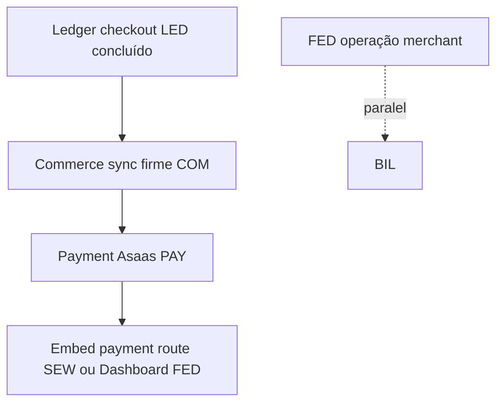

# AACP · Dashboard de Progresso dos Módulos (estado real do repo)

> **For agentic workers:** REQUIRED SUB-SKILL: Use superpowers:subagent-driven-development (recommended) ou superpowers:executing-plans para continuar trabalho nos módulos abaixo.

**Goal:** Um único sítio com **progresso numérico**, **lista de tasks por plano em `plans/modules/`** e marcação contra o que **existem mesmo** em código (Nest, Prisma, widget, dashboard).

**Architecture:** Estado cruza **`docs/superpowers/plans/modules/*.md`** (IDs de Task) + inventário efectivo **`apps/api/src/modules`** + **`packages/*`** + **`apps/widget`** + **`apps/dashboard`**. Este ficheiro **não** substitui `STATE.md`; convém eventualmente alinhar a secção *Deferred* de `.specs/project/STATE.md` (vários itens lá estão já superados pela implementação embed/negociação).

**Tech Stack:** já descrito nos planos por módulo (`mvp-gap-overview.md`).

**Última auditoria rápida de código/repo:** **2026-05-07** — **`apps/dashboard`**: cliente `api-client.ts` (`dashboardFetch` / `credentials: "include"` + `vitest`), default API **`localhost:3001`**, páginas **Visão demo** (`/dashboard/*`), **Regras JWT** (`/merchants/me/rules`), **Checkout settings**, **Negociação técnica** (`/negotiations/evaluate`). **Widget** já com botão PIX embed. **`POST /embed/payment/intents`** + ACJ intactos. Foco seguinte: **BIL** / **OUT** ou polimento **FED-T003** (Playwright).

---

## Contadores globais (tarefas planeadas só nos docs `plans/modules`)

| Métrica | Valor |
|--------|-------|
| Ficheiros de plano modular | **8** em `docs/superpowers/plans/modules/` |
| Tasks explícitas (IDs `*-T*` nos headings) **somatório** | **52** |
| Tasks **implementadas ou substancialmente cobertas** no código atual | **~43** (**~83%** do backlog modular planeado) |
| “Módulos” com **≥1 task em aberto relevante MVP** | **2** (BIL; OUT) — **FED** núcleo entregue; **FEW**/SEW só refinamentos opcionais |

> Nota percentual: apenas **plans/modules** são contadas; excludes “fundação” já entregue (checkout, auth, …) — ver secção seguinte.

---

## Fundação do produto (entregue; *não* está nos 8 planos modulares)

Estas áreas aparecem no `2026-05-03-mvp-gap-overview.md` e **estão efectivamente no codebase** (`apps/api/src/modules/checkout`, `auth`, `merchant`, `agent-rules`, `checkout-settings`, `buyer-purchase-history`, `payment`, motores em `packages/`, …).

**Estado consolidado:** **100% MVP documental inicial** conforme lista “Implementado” do overview — manutenção apenas.

---

## Estado por módulo (truth table)

Legenda **`done / planned`**: contagens de IDs de task nos respetivos `.md` vs código.

| Módulo | Plano | % rollout | Tasks | Real no repo |
|--------|-------|-----------|-------|----------------|
| **Secure embed widget** | [secure-embed-widget-implementation-plan.md](modules/secure-embed-widget-implementation-plan.md) | **~95–100%** | **6 / 6** | ✅ Token, sessões, `/embed/start|track|chat|offers/apply`, **`/embed/payment/intents`**, `embed-payment-intents.e2e-spec.ts`, `@aacp/agentic-checkout-js` `createPaymentIntent`. Widget: **`CHECKOUT_EMBED_PATHS.paymentIntents`** + botão demo “Gerar cobrança (PIX)” em `main.tsx`. |
| **Machine negotiation continuation** | [machine-negotiation-continuation-implementation-plan.md](modules/machine-negotiation-continuation-implementation-plan.md) | ~95% | 5 / 5 | ✅ Policy, prefs, sessão + ledger, apply-checkout; MN-T008 SKIP. |
| **Payment Asaas** | [payment-asaas-implementation-plan.md](modules/payment-asaas-implementation-plan.md) | **~100%** | **9 / 9** | ✅ Domínio + repo memory + Prisma (`PaymentIntent`, `PaymentProviderEvent`, `buyer_facing`). ✅ Port `PaymentProviderPort` + Fake + **`AsaasPaymentAdapter`** (+ `asaas-env` sandbox/prod). ✅ **`POST /payment/intents`** + **`POST /webhooks/asaas`**. ✅ **`CheckoutPaymentPort`** → `CompleteOrderUseCase`; falhas → `payment_failed`. ✅ **`payment.checkout.e2e-spec.ts`** (fluxo intent + webhook). ✅ `PaymentModule` em **`app.module`**. ➖ modelo `PaymentAttempt` omitido MVP (opcional ao plano). |
| **Commerce sync** | [commerce-sync-implementation-plan.md](modules/commerce-sync-implementation-plan.md) | ~85–95% | 6 / 7 | ✅ COM-T002–T006. ⚠️ `applyShopifyOffer` fora do sync. ⬜ COM-T007 README Woo. Opcional: `CommerceModule` Nest. **Módulo considerado OK por agora.** |
| **Billing Asaas** | [billing-asaas-implementation-plan.md](modules/billing-asaas-implementation-plan.md) | 0% | 0 / 7 | ❌ Sem billing planeado. |
| **Checkout intervention ledger** | [checkout-intervention-ledger-implementation-plan.md](modules/checkout-intervention-ledger-implementation-plan.md) | ~100% | 6 / 6 | ✅ Porta `CheckoutInterventionLedgerPort`, política pura, ledger in-memory + Prisma, `TrackCheckoutEvent` / `GetDecision` com gate; `checkout.module` provider; specs + E2E `checkout.intervention-ledger.e2e-spec.ts`; int-spec Prisma opcional (`AACP_RUN_PRISMA_TESTS`). |
| **Outbox + RabbitMQ** | [infrastructure-outbox-rabbitmq-implementation-plan.md](modules/infrastructure-outbox-rabbitmq-implementation-plan.md) | ~15% | ~0–1 / 6 | ✅ Outbox Prisma. ❌ Rabbit publisher/inbox OUT-T002+. |
| **Frontend widget + dashboard** | [frontend-widget-dashboard-implementation-plan.md](modules/frontend-widget-dashboard-implementation-plan.md) | **~58–62%** | **~6 / 7** | ✅ Widget FEW-*; ✅ Vitest também em **dashboard**; ✅ **FED-T001** `api-client` + `api-client.spec.ts`; ✅ **FED-T002** abas (**demo overview**, **`/merchants/me/rules`**, **`/checkout-settings`**, **`/negotiations/evaluate`**); login `POST /auth/login` cookie; base default **`:3001`**. ⬜ **FED-T003** Playwright smoke opcional. |

---

## Lista condensada de tasks por módulo (marcação)

Usa ✅ = detectado no código; ⬜ = não detectado.

### Secure embed (`SEW-T002` … `SEW-T007`)

- ✅ `SEW-T002` Domínio + serviço token (`embed-token.service.ts` + specs)
- ✅ `SEW-T003` `POST /embed-sessions` + use case (`issue-embed-session`)
- ✅ `SEW-T004` Rotas públicas tokenizadas incl. **`POST /embed/payment/intents`**
- ✅ `SEW-T005` Widget modo token (`main.tsx`, `embed-client.ts`, demo prod)
- ✅ `SEW-T006` Cenários guard (`embed-security.scenarios.spec.ts`)
- ✅ `SEW-T007` E2E embed + payment: `embed.checkout-flow.e2e-spec.ts` + **`embed-payment-intents.e2e-spec.ts`** (intent após `start` com token)

### Machine negotiation (`MN-T004` … `MN-T008`)

- ✅ `MN-T004` Merchant policy HTTP + persistence
- ✅ `MN-T005` Buyer-agent preferences HTTP + persistence
- ✅ `MN-T006` Sessão + ledger (via store + record use case / Prisma opcional env)
- ✅ `MN-T007` Apply agreement → checkout authorized offer
- ➖ `MN-T008` Live M2M opcional — ficheiro SKIP (aceitável como placeholder)

### Payment Asaas (`PAY-T002` … `PAY-T010`)

- ✅ `PAY-T002` `payment-intent.entity.ts` + specs (buyer-facing + `acceptedOfferId`; `markRequiresAction` opcional provider id)
- ✅ `PAY-T003` porta + **`InMemoryPaymentRepository`** (+ dedupe webhook events, **`getIntentById`**) + specs
- ✅ `PAY-T004` Prisma `PaymentIntent`, `PaymentProviderEvent`, migração, **`prisma-payment.repository.ts`**, **int-spec** (PaymentAttempt opcional omitido)
- ✅ `PAY-T005` `payment-provider.port.ts` + **`FakePaymentProvider`**
- ✅ `PAY-T006` **`asaas-payment.adapter.ts`** (+ **`asaas-env.ts`**: `ASAAS_SANDBOX` / `ASAAS_API_KEY[_SANDBOX]`, URL prod `api.asaas.com`) + **`asaas-payment.adapter.spec.ts`**
- ✅ `PAY-T007` **`handle-asaas-webhook.use-case.ts`**, **`asaas-webhook.controller.ts`** + specs (token `asaas-access-token`; idempotência `PaymentProviderEvent`)
- ✅ `PAY-T008` **`checkout-payment.port`** + **`CheckoutPaymentAdapter`** (aprovação → `CompleteOrderUseCase`; histórico de compras já via use case existente)
- ✅ `PAY-T009` webhook falhas → **`recordPaymentFailure`** (`payment_failed` checkout)
- ✅ `PAY-T010` **`presentation/http/payment.checkout.e2e-spec.ts`** (happy path + `PAYMENT_DELETED` sem ordem — em **memória**, CI default; opcional repetir contra Prisma se quiser parity com `checkout.controller.prisma-e2e-spec`)

### Commerce sync (`COM-T002` … `COM-T007`)

- ✅ `COM-T002` — `packages/commerce-adapters` contratos (`ports`)
- ✅ `COM-T003` Validate cart for payment use case + specs
- ✅ `COM-T004` Sync pending order + índices + specs
- ✅ `COM-T005` Mark paid + dedup webhook + specs
- ✅ `COM-T006` Shopify commerce adapter + spec
- ⬜ `COM-T007` Woo notas doc only

### Billing Asaas (`BIL-T002` … `BIL-T008`)

- ⬜ todas

### Intervention ledger (`LED-T001` … `LED-T006`)

- ✅ `LED-T001`–`LED-T006` (ver secção estado por módulo)

### Outbox / RabbitMQ (`OUT-T001` … `OUT-T006`)

- ⬜ `OUT-T001`–`OUT-T006` excepto persistência outbox já existente no checkout

### Frontend (`FEW-T001`–`T003`, `FED-T001`–`T003`)

- ✅ `FEW-T001` Vitest widget **e** Vitest dashboard (`vitest.config.ts`, `pnpm --filter @aacp/dashboard test`)
- ✅ `FEW-T002` Cliente embed
- ✅ `FEW-T003` Web component + observers
- ✅ `FED-T001` `api-client.ts` sempre `credentials: "include"` + specs
- ✅ `FED-T002` Páginas orientadas aos módulos (nav + stubs funcionais contra API)
- ⬜ `FED-T003` Playwright smoke (documentar apenas; não automatizado no repo)

---

## Ordem recomendada (MVP pragmático, alinha `mvp-gap-overview`)



1. ~~**`LED`**~~ ✅  
2. ~~**`COM`**~~ ✅ (runtime; COM-T007 doc Woo opcional)  
3. ~~**`PAY`**~~ ✅ (**API** completa PAY-T010 em memória; hardening opcional Prisma+E2E HTTP Asaas sandbox)  
4. ~~**`SEW`**~~ ✅ — **`POST /embed/payment/intents`** + cliente npm; **FEW** opcional: UI pagamento no widget.  
5. ~~**`FED`**~~ ✅ (dashboard merchant núcleo: api client + páginas) · próximo **`BIL`** / **`OUT`** em paralelo com piloto.

---

## Gates de actualização automática recomendados

```bash
pnpm typecheck
pnpm --filter @aacp/commerce-adapters build
pnpm --filter @aacp/commerce-adapters test
pnpm --filter @aacp/api build
pnpm --filter @aacp/api test
pnpm --filter @aacp/widget test
pnpm --filter @aacp/agentic-checkout-js test
pnpm --filter @aacp/dashboard test
```

PostgreSQL opcional:

```bash
pnpm --filter @aacp/api test:prisma
```

---

## Self-review (skill writing-plans)

1. **Cobertura por spec:** Todos os 8 markdown em `plans/modules/` têm entrada na tabela; fundação refere overview.
2. **Placeholders:** Nenhuma task listada apenas como “TBD” sem ID.
3. **Consistência de IDs:** Nomes dos tasks igual aos headings `# Task XX-TYYY` nos ficheiros fonte dos planos.

---

**Plan saved:** `docs/superpowers/plans/2026-05-03-aacp-module-progress-dashboard.md`.

**TLC Execute (suíte actual):** (**A**) **`BIL`** Asaas merchant billing (**B**) **OUT-T002+** Rabbit (**C**) **FED-T003** Playwright smoke opcional (**D**) PAY hardening HTTP real + Prisma E2E opcional.

**Orchestração agentica:** Subagent-Driven por task recomendado; **OUT-T002+** quando houver infra Rabbit.
