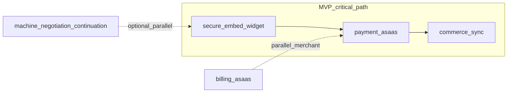

# MVP Gap Overview — AACP

> **For agentic workers:** REQUIRED SUB-SKILL: Use `superpowers:subagent-driven-development` (recommended) or `superpowers:executing-plans` to implement module plans task-by-task. Steps in module files use checkbox (`- [ ]`) syntax.

**Goal:** Consolidar o estado atual do repositório versus o MVP funcional (checkout owned + embed seguro + pagamento buyer + sync commerce + dashboard/widget), e apontar para plans TDD por módulo.

**Architecture:** Monólito modular NestJS com ports/adapters, Prisma/PostgreSQL atrás de repositórios por bounded context, pacotes puros em `packages/` para motores determinísticos. Implementação segue TDD (`node:test` na API) com gates `pnpm --filter @aacp/api test`, `test:prisma` e `pnpm typecheck`.

**Tech Stack:** NestJS, TypeScript, Prisma 7, PostgreSQL, pnpm workspaces, pacotes `@aacp/*`, React+Vite (widget/dashboard).

---

## Implementado (verificado em `.specs/project/STATE.md`)

> **Progresso modular (tasks `plans/modules` vs código):** ver [2026-05-03-aacp-module-progress-dashboard.md](2026-05-03-aacp-module-progress-dashboard.md).

| Área | Estado |
|------|--------|
| Checkout | Domínio, use cases, Prisma, e2e, AI safety battery, integração checkout-settings e agent context |
| Auth / Merchant | JWT (Bearer + cookie HttpOnly), scrypt, rate limit login, Prisma |
| Agent Rules | CRUD regras por merchant, contexto seguro, Prisma |
| Checkout Settings | Domínio validado, rotas protegidas, Prisma, wiring em track/decision/conversation |
| Buyer Purchase History | Domínio, Prisma, API `GET .../context`, metering, integração checkout/conversation |
| Negociação (motor) | `@aacp/negotiation-engine`, `POST /negotiations/evaluate` |
| conversation-engine | Providers OpenAI/DeepSeek, validação de output |

**Frontend:** `apps/widget` e `apps/dashboard` existem como esqueletos Vite/React — funcionalidade de produto ainda mínima.

---

## Pendente (crítico MVP vs pós-MVP)

| Módulo / tema | Doc TDD | Tasks de referência |
|---------------|---------|---------------------|
| Secure embed widget | [modules/secure-embed-widget-implementation-plan.md](modules/secure-embed-widget-implementation-plan.md) | SEW-T002–T007 |
| Payment Asaas | [modules/payment-asaas-implementation-plan.md](modules/payment-asaas-implementation-plan.md) | PAY-T002–T010 |
| Commerce sync | [modules/commerce-sync-implementation-plan.md](modules/commerce-sync-implementation-plan.md) | COM-T002–T007 |
| Billing Asaas | [modules/billing-asaas-implementation-plan.md](modules/billing-asaas-implementation-plan.md) | BIL-T002–T008 |
| Machine negotiation (continuação) | [modules/machine-negotiation-continuation-implementation-plan.md](modules/machine-negotiation-continuation-implementation-plan.md) | MN-T004–T008 |
| Checkout intervention ledger | [modules/checkout-intervention-ledger-implementation-plan.md](modules/checkout-intervention-ledger-implementation-plan.md) | Novo (STATE: cooldown / max interventions) |
| Outbox + RabbitMQ | [modules/infrastructure-outbox-rabbitmq-implementation-plan.md](modules/infrastructure-outbox-rabbitmq-implementation-plan.md) | modular-ddd-foundation Group C |
| Frontend widget + dashboard | [modules/frontend-widget-dashboard-implementation-plan.md](modules/frontend-widget-dashboard-implementation-plan.md) | Roadmap |

---

## Diagrama de dependências sugeridas (MVP)

---

## Blockers externos

- Integração commerce real: credenciais app Shopify/WooCommerce.
- Pagamento buyer: credenciais Asaas + webhooks.
- Faturação merchant: credenciais Asaas billing + webhooks.
- LLM opcional: `OPENAI_API_KEY` ou `DEEPSEEK_API_KEY`.

---

## Deferido explícito (STATE / ROADMAP)

- RabbitMQ topology completa e publisher outbox exceto como plano em `modules/infrastructure-outbox-rabbitmq-implementation-plan.md`.
- Shopify OAuth install flow.
- Recovery channels (WhatsApp/email).
- A/B testing e holdout attribution.
- Intervention ledger planejado no doc dedicado — implementação código ainda pendente.

---

## Gates de verificação

- `pnpm typecheck`
- `pnpm build`
- `pnpm --filter @aacp/api test`
- `pnpm --filter @aacp/api test:prisma` (PostgreSQL Docker quando aplicável)

Referência: `.specs/codebase/TESTING.md`.

---

## Nota: `.specs/features/modular-ddd-foundation/tasks.md`

Os grupos **Group B: Prisma Persistence** e parte do **Group A** correspondem já a estado implementado neste repo (checkout, auth, merchant, agent-rules, checkout-settings, buyer purchase history). Manter **Group C** como backlog de infraestrutura assíncrona; ver `modules/infrastructure-outbox-rabbitmq-implementation-plan.md`.

---

## Próximo passo após documentação

1. **Subagent-driven** — subagente por tarefa, revisão entre tarefas.
2. **Inline execution** — lote com checkpoints (`executing-plans`).

---

## Checklist de auto-revisão (esta entrega documental)

1. **Cobertura de REQ:** cada módulo com `spec.md` em `.specs/features/*` relacionado está representado pelo plan correspondente (`secure-embed-widget`, `payment-asaas`, `commerce-sync`, `billing-asaas`, `machine-negotiation` continuação, ledger checkout, outbox MVP, frontend).
2. **Placeholders:** nenhuma secção “TBD” ou “implementar depois”; tarefas concretizam nomes de ficheiros, tipos ou exemplos executáveis.
3. **Consistência:** nomes de ports e fluxos alinhados a `.specs/features/*/design.md` e `.specs/project/STATE.md`; `modular-ddd-foundation/tasks.md` Group B reconhecido como já satisfeito no código atual.
4. **Gates:** planos citam `pnpm --filter @aacp/api test` / `test:prisma` / builds de apps onde aplicável.

**Nota sobre modular-foundation:** O Group B (“Prisma persistence”) está obsoleto face ao estado atual do repositório; persistência Prisma já cobre vários bounded contexts — ver secção correspondente mais acima.
